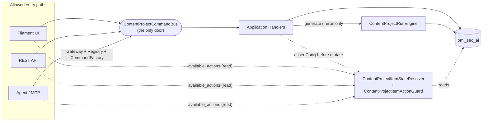

> Status: Historical
> Not canonical
> Archived on: 2026-08-01
> Superseded by: ../../modules/CONTENT_PROJECTS.md
> Purpose: implementation history only
# Content Project Backend — Freeze V1 (Handoff)

**Status:** FROZEN baseline after Batches A–E; **freeze closure verified 2026-07-31** (local workspace grep + contract tests). This is the contract new code must follow. Deviations require updating this doc, not silently bypassing it.
**Companion:** [`CONTENT_PROJECT_CANONICAL_ARCHITECTURE.md`](CONTENT_PROJECT_CANONICAL_ARCHITECTURE.md) has the full rationale/flows; this doc is the compact handoff/freeze checklist.

---

## 1. Diagram



---

## 2. Authoritative Classes (Single Source of Truth)

| Concern | Authoritative class | Notes |
|---|---|---|
| All business command execution | `App\Addons\SeoContentAi\Services\ContentProject\Application\ContentProjectCommandBus` | No other class mutates Content Project business columns |
| Item lifecycle / state / available actions | `App\Addons\SeoContentAi\Support\ContentProject\ContentProjectItemStateResolver` | Facade: `ContentProjectLifecycle` |
| Item action eligibility (read + write gate) | `App\Addons\SeoContentAi\Support\ContentProject\ContentProjectItemActionGuard` | Same class used by read model and by handler `assertCan()` |
| Task status normalization | `App\Addons\SeoContentAi\Support\ContentProject\ContentProjectTaskStatusNormalizer` | No raw string comparison elsewhere for lifecycle purposes |
| Article review state machine | `App\Addons\SeoContentAi\Services\ArticleReviewService` | `articles.review_status` is the only column read/written for review |
| Run lifecycle + article dispatch | `App\Addons\SeoContentAi\Services\RunEngine\ContentProjectRunEngine` | Only caller of `RunContentProjectArticleJob` dispatch |
| Run seeding (start/queue/consolidate) | `App\Addons\SeoContentAi\Services\SeoProjectWorkflowRunService` | Called only from Engine + the 3 generate/rerun handlers |
| Rerun eligibility (full + step) | `App\Addons\SeoContentAi\Services\ContentProject\Application\Support\ContentProjectRerunEligibilityGuard` | Runs before any run/queue mutation |
| Item/project archive execution | `App\Addons\SeoContentAi\Services\SeoProjectArchiveService` (items), `App\Addons\SeoContentAi\Services\ArchiveContentProjectService` (project) | Called only from their respective handlers |
| Capability schema/exposure | `App\Addons\SeoContentAi\Services\ContentProject\Application\Capabilities\ContentProjectCapabilityRegistry` + `CanonicalCapabilityRegistry` | Single source for MCP tool list + Agent write exposure |
| Agent command construction | `App\Addons\SeoContentAi\Services\ContentProject\Agent\ContentProjectAgentCommandFactory` | Only place that turns `(capability, input)` into a `ContentProjectCommand` |
| Result/error contract | `App\Addons\SeoContentAi\Services\ContentProject\Application\ContentProjectActionResult` + `ContentProjectActionCodes` | Callers branch on `code`, not `message` |
| Business audit | `App\Addons\SeoContentAi\Services\ContentProject\Application\Support\ContentProjectBusinessAuditor` | Never stores AI prompt/output |
| Operation log | `App\Addons\SeoContentAi\Services\ContentProject\Application\Support\ContentProjectOperationLogger` | One entry per `dispatch()`, keyed by `operation_id` |

---

## 3. Allowed Entry Paths

1. **Filament UI** — builds a `ContentProjectCommand` and calls `ContentProjectCommandBus::dispatch()` directly (via handler-resolving container binding).
2. **REST API** — `ContentProjectApiController` (and siblings), same pattern as UI.
3. **Agent / MCP** — `ContentProjectAgentMcpController` → `ContentProjectMcpServer` → `ContentProjectAgentGateway::execute()` → `CanonicalCapabilityRegistry` (schema/policy/scope) → `ContentProjectAgentCommandFactory::build()` → `ContentProjectCommandBus::dispatch()`.
4. **Scheduler/cron internal** — `content_project.process_scheduled_publish` and `content_project.sync_items` are dispatched from internal/scheduled code paths only; they are not reachable from any of the above three public paths.

No other path is allowed. Automation (`Automation/Actions/*`) does **not** currently dispatch Content Project commands — the workflow map (`AutomationWorkflowMapDefinitions`) is presentation-only. If/when Automation gains a real execution action for `content_project.generate`/`rerun`, it must go through the same `ContentProjectCommandBus::dispatch()` call as everything else — do not add a parallel execution path.

---

## 4. Forbidden Bypasses

- Do **not** call `SeoProjectWorkflowRunService::startRun()` / `prepareRunQueue()` / `execute()` from a controller, Filament action, or Agent code directly — only from inside a `ContentProjectCommandBus` handler or `ContentProjectRunEngine`.
- Do **not** call `ContentProjectRunEngine::start()` / `resume()` / `requestStop()` from anywhere except a Command Bus handler (generate/rerun-full/rerun-step) or the run's own recovery/CLI tooling (`ContentProjectRunRecoverCommand`, `ContentProjectRunStatusCommand`).
- Do **not** write `seo_project_tasks.status` as a raw string comparison for lifecycle decisions — always go through `ContentProjectTaskStatusNormalizer`.
- Do **not** re-derive item lifecycle from raw columns (`publish_queue_status`, `status`, `archived_at`, `review_status`) anywhere outside `ContentProjectItemStateResolver`. New UI/API/Agent surfaces must call the resolver (or `ContentProjectLifecycle` facade).
- Do **not** treat `articles.is_reviewed` as a live column — it is dropped. Do not reintroduce a parallel boolean review flag.
- Do **not** treat `content_archived_at` and `review_status = archived` as the same signal — see canonical doc §6.
- Do **not** gate item lifecycle on `seo_projects.status` in new code — it is Class A/B project-level only (canonical doc §14). If a new consumer needs `status`, classify it (A/B/C) and record it in `ContentProjectStatusDecision::consumerClass()`.
- Do **not** add a new MCP tool or Agent capability without a `cap()` entry in `ContentProjectCapabilityRegistry` **and** a matching arm in `ContentProjectAgentCommandFactory::build()` — a capability with no factory arm throws at runtime.
- Do **not** expose `stop_execution` / `resume_execution` / `sync_items` / `process_scheduled_publish` as MCP tools. Enforced via `ContentProjectCapabilityRegistry::isMcpWriteExposed()` (`MCP_EXCLUDED_NAMES` + `MCP_EXCLUDED_PREFIXES`); `sync_items` is also blocked at `isAgentWriteExposed()` (`false`). `process_scheduled_publish` is not registered as a capability.
- Do **not** wire an item-level restore action — Option B: content-archived items expose no actions (`available_actions = []`); only project-level `content_project.restore` exists. `ContentProjectItemAction::Restore` enum case **removed** at freeze closure.
- Do **not** bypass `ContentProjectCommandBus` idempotency/audit/operation-log wrapping by calling a handler's `handle()` method directly from a controller — always go through `dispatch()`.

---

## 5. Source of Truth (SoT) Table

| State | SoT column/class | Not SoT (do not read for this) |
|---|---|---|
| Article review status | `articles.review_status` (`ArticleReviewStatus` enum) via `ArticleReviewService` | `articles.is_reviewed` (dropped), `content_archived_at` |
| Content archive (item/project) | `seo_project_tasks.archived_at` / normalized `status=archived`, `seo_projects.archived_at` | `articles.review_status = archived` |
| Item lifecycle bucket | `ContentProjectItemStateResolver::resolve()->lifecycleState` | Any single raw column read in isolation |
| Item available actions | `ContentProjectItemActionGuard::availableActions()` | Ad-hoc per-page action lists |
| Task status | `seo_project_tasks.status` (raw string) normalized via `ContentProjectTaskStatusNormalizer` | Assuming canonical enum values are the only values present in DB |
| Run lifecycle | `seo_project_runs.status` mapped via `ContentProjectRunStatusMapper` to `ContentProjectRunSemanticStatus` | Alpine/JS `isRunning` / `stopRequested` client state (legacy, disabled under PHP engine) |
| Run item / article execution status | `seo_project_run_items.status` (`SeoProjectRunItemStatus`) | Legacy `seo_project_runs.items` JSON mirror (reader-only, XOR) |
| Project-level workflow flag | `seo_projects.status` — **non-authoritative for item lifecycle** (project-level only, Class A/B in canonical doc §14) | Item phase/counters |
| Publish state | `seo_project_tasks.publish_queue_status` + `publish_published_at` + `scheduled_publish_at` | Assuming `status` alone implies publish state |
| Command result | `ContentProjectActionResult.code` (`ContentProjectActionCodes`) | `ContentProjectActionResult.message` (human text, do not branch on it) |

---

## 6. Public Capability Matrix (compact)

Full matrix with commands/handlers: canonical doc §12. Compact policy summary:

| Capability group | MCP | Agent |
|---|---|---|
| Core CRUD (`create`, `update`, `add_items`, `update_item`) | Yes | Yes |
| `generate`, `rerun` (full) | Yes | Yes |
| Rerun step (`RerunProjectItemStepCommand`) | No dedicated MCP tool | Yes (app path) |
| Review (`start_review`, `approve`) | Yes | Yes |
| Publish lifecycle (`schedule`, `auto_schedule`, `unschedule`, `move_schedule`, `publish_now`, `retry_publish`, `skip_publish`, `cancel_publish`) | Yes | Yes |
| Project archive/restore (`archive`, `restore`) | Yes | Yes |
| Item archive (`archive_items`) | Yes | Yes |
| `stop_execution` / `resume_execution` | No (`isMcpWriteExposed()` excludes) | Yes |
| `sync_items` | No | No (internal only) |
| `process_scheduled_publish` | No | No (internal/scheduler only) |
| `keyword_intelligence.*` writes (public) | Yes — only caps with `agent_exposed=true` **and** a Factory arm | Yes — same subset, via Agent `execute()` by capability name |
| `keyword_intelligence.*` writes (internal) | No | No — 8 KI caps demoted (`agent_exposed=false`, `mcp_exposed=false`); CommandBus handlers may exist but are not Agent/MCP-advertised |
| `serp_intelligence.*` / `gsc_intelligence.*` writes | No (`MCP_EXCLUDED_PREFIXES`) | Yes — all registered SERP/GSC writes have Factory arms; Agent-executable by capability name. Skills: SERP partial (5 skills); GSC skills file empty (hidden from skill catalog) |

**Public capability without Factory arm:** **0** among agent-exposed, non-internal `content_project.*` + `keyword_intelligence.*` writes (verified 2026-07-31).

---

## 7. Freeze Closure Proof (verified 2026-07-31)

Workspace grep + contract tests at freeze closure. Counts exclude migrations, tests, and cutover tooling unless noted.

| Check | Result |
|---|---|
| Agent-exposed `content_project.*` / `keyword_intelligence.*` writes missing Factory arm | **0** |
| `articles.is_reviewed` runtime references (excl. migrations/tests/cutover tooling) | **0** hits (`is_reviewed_only` KI filter name collision remains in 2 files — not the dropped column) |
| `ContentProjectItemAction::Restore` in production code | **0** (enum case removed; tests assert absence) |
| `ContentProjectBulkRerunService` in production code | **0** (file deleted; tests assert absence) |
| `ContentProjectStepRerunService` / `RerunArticlePipelineJob` production callers | **0** (job class deleted; leftover mentions only in tests asserting absence) |
| Filament `ContentProjectRunEngine::start` direct calls | **0** |
| Item restore action without handler (archived `available_actions=[]`) | **0** |

**KI caps demoted to internal** (`agent_exposed=false`, `mcp_exposed=false`; merge/split removed from `KeywordIntelligenceSkills`): `analyze_keywords`, `cancel_analysis`, `exclude_keywords`, `update_keyword`, `merge_clusters`, `split_cluster`, `move_keywords`, `review_cannibalization`. `sync_items` was already internal.

**`archive_items` wiring verified:** scope `content_project.archive_items`; confirmation `true` (registry + `assertConfirmationToken`); `tenantGuard.assertCanAccessProject`; `ContentProjectItemActionGuard::assertCan(Archive)`; Factory arm + `ArchiveProjectItemsHandler`; CommandBus auditor/`logOperation` on dispatch; `idempotencySupport: true`; MCP + Agent exposed. Contract: `ContentProjectPublicCapabilityContractTest::test_archive_items_...`.

**Stop/resume policy:** Agent-only, not MCP — MCP tool surface must not control mid-flight run lifecycle (stop/resume are ops/automation controls). Agent + Automation workflows need them for assisted runs. Enforced via `MCP_EXCLUDED_NAMES` + `mcp_exposed=false`.

---

## 8. Migration Checklist

```text
[ ] Confirm target DB is omi_seo_ai (connection set on migration: protected $connection = 'omi_seo_ai')
[ ] Backup articles table (or full omi_seo_ai DB) before running the cutover migration
[ ] Run: php artisan migrate --path=app/Addons/SeoContentAi/database/migrations
     -> 2026_07_31_120000_cutover_drop_articles_is_reviewed.php
[ ] Review migration stdout: "Cutover is_reviewed stats: {...}" JSON — check counts against
    ArticleReviewCutoverRules rule buckets (A_valid_approved_preserve, B_valid_archived_preserve,
    C_null_invalid_mirror_true_to_approved, D_null_invalid_mirror_false_to_draft,
    E_draft_pending_mirror_true_to_approved, F_archived_mirror_true_preserve, preserve_other)
[ ] Confirm articles.is_reviewed column no longer exists (schema()->hasColumn === false)
[ ] Spot-check a sample of rows in rule E (conflict: draft/pending_review but is_reviewed=true)
    and rule C/F (archived but is_reviewed mirror mismatch) for business sanity
[ ] down() only re-adds the boolean column (default false) — it does NOT restore original per-row
    values. Treat as one-way; do not rely on down() for real rollback of data.
```

---

## 9. Retained Debt

Known gaps **after freeze closure (2026-07-31)**. Closed at closure (do not re-list): `archive_items` full wiring, MCP stop/resume exclusion, Option B item restore (`Restore` enum removed), `ContentProjectBulkRerunService` deleted, `ContentProjectStepRerunService` absent, `RerunArticlePipelineJob` deleted.

| # | Gap | Current behavior | Notes |
|---|---|---|---|
| 1 | 8 KI caps on CommandBus as internal/unavailable publicly | `analyze_keywords`, `cancel_analysis`, `exclude_keywords`, `update_keyword`, `merge_clusters`, `split_cluster`, `move_keywords`, `review_cannibalization` — `agent_exposed=false`, `mcp_exposed=false`; Factory arms **not** added | Handlers may exist; not Agent/MCP-advertised. Re-expose only with Factory arms + contract tests |
| 2 | Redirect-only Filament run pages | `ViewSeoProjectRun` / `ViewSeoProjectRunStep` redirect to project workspace | URL compat only; not primary UI |
| 3 | Class C `seo_projects.status` consumers | `KeywordResource`, `ArticleResource` create, `CreateSeoProject`, `SeoProjectArchiveService::restore`, `SeoProjectTaskMoveService` still read/write `STATUS_MANUAL` etc. | Valid **project-level** flag use — not item lifecycle |
| 4 | `KeywordReviewSource::Restore` enum | Unrelated to Content Project item actions | Optional cleanup; not CP item restore |
| 5 | Deleted `RerunArticlePipelineJob` | Class removed from disk | On deploy: `queue:restart` — ensure no pending jobs reference the deleted class |
| 6 | Extension SDK / unrelated redesign | Out of scope for Batch E freeze | — |

---

## 10. Deploy Checklist

**Path A — `is_reviewed` migration already applied:**

```text
[ ] Deploy code (handlers, resolver, normalizer, engine)
[ ] composer dump-autoload -o
[ ] php artisan optimize:clear
[ ] php artisan config:clear
[ ] php artisan queue:restart
[ ] Smoke + PHPUnit filters (see below)
```

**Path B — migration not yet applied:**

```text
[ ] Stop queue workers FIRST
[ ] Run cutover migration 2026_07_31_120000_cutover_drop_articles_is_reviewed.php
    (php artisan migrate --path=app/Addons/SeoContentAi/database/migrations — see §8)
[ ] Deploy new code
[ ] composer dump-autoload -o
[ ] php artisan optimize:clear
[ ] Start workers / php artisan queue:restart
[ ] Smoke + PHPUnit filters (see below)
```

Never leave old workers running after the column drop (Path B).

**Verification (both paths, remote `$PHP_BIN` — not `php artisan test`):**

```text
$PHP_BIN vendor/bin/phpunit app/Addons/SeoContentAi/tests/Unit/ContentProjectIsReviewedCutoverMigrationTest.php
$PHP_BIN vendor/bin/phpunit app/Addons/SeoContentAi/tests/Unit/ContentProjectItemStateContractTest.php
$PHP_BIN vendor/bin/phpunit app/Addons/SeoContentAi/tests/Unit/ContentProjectItemStateResolverTest.php
$PHP_BIN vendor/bin/phpunit app/Addons/SeoContentAi/tests/Unit/ArticleReviewServiceTest.php
$PHP_BIN vendor/bin/phpunit app/Addons/SeoContentAi/tests/Unit/ContentProjectApprovalSotTest.php
$PHP_BIN vendor/bin/phpunit app/Addons/SeoContentAi/tests/Unit/ContentProjectRerunUnifyTest.php
$PHP_BIN vendor/bin/phpunit app/Addons/SeoContentAi/tests/Unit/ContentProjectRunEnginePhase1Test.php
$PHP_BIN vendor/bin/phpunit app/Addons/SeoContentAi/tests/Unit/ContentProjectPublicCapabilityContractTest.php
```

Manual scenarios: small generate end-to-end (engine, no JS orchestration); approve after review-archive requires reopen; item archive blocked while Generating / publish-queue active.

---

## 11. Rollback

- **Code:** revert the deploy; handlers/resolver/engine changes are additive/refactor and safe to roll back independently of the migration as long as the migration has not run yet.
- **Migration:** the cutover migration's `down()` only re-adds `articles.is_reviewed` (`boolean default false`) — it does **not** restore original per-row values. Once `up()` has run against production data, treat the migration as one-way. If a real rollback of the review distribution is required, restore `articles.review_status`/`is_reviewed` from a pre-migration backup, not via `down()`.
- **Run Engine:** `CONTENT_PROJECT_PHP_ENGINE` feature flag (default varies by environment — check `config('seo-content-ai.content_project.php_engine')`) can be turned off to fall back to the legacy JS orchestration loop for runs not yet using the engine; see `CONTENT_PROJECT_RUN_ENGINE_REFACTOR.md` §24 for the exact rollback steps (already-`cancelled`/`stopping` runs remain readable either way).
- **Command Bus / handlers:** no flag — these are the only path and were the only path before this freeze too (Batches A–E consolidated call sites, they did not introduce an alternate path that needs toggling off).

---

## 12. Extension Rules

- New Content Project write capability → must be added in **three** places, in this order: (1) `ContentProjectCapabilityRegistry::cap()` entry (schema, risk level, confirmation), (2) `ContentProjectCommandBusRegistrar` (`Command::class => Handler::class`), (3) `ContentProjectAgentCommandFactory::build()` match arm. Missing (3) causes a runtime `InvalidArgumentException` on first Agent/MCP call.
- New Content Project **read** capability (MCP) → add to `ContentProjectMcpToolCatalog::readToolDefinitions()`; reads never go through `ContentProjectCommandBus`, they go through `ContentProjectAgentReadService` (or the equivalent Filament/API read model), which itself must call `ContentProjectItemStateResolver` for any lifecycle-derived field.
- Internal-only capability (never Agent/MCP) → register in the Capability Registry as usual (for CommandBus/internal callers and schema reuse). For MCP exclusion add the name to `MCP_EXCLUDED_NAMES` or a prefix to `MCP_EXCLUDED_PREFIXES` in `ContentProjectCapabilityRegistry`, and ensure `isMcpWriteExposed()` returns false. For full Agent exclusion also special-case `isAgentWriteExposed()` to return `false` (mirror `sync_items`).
- New item lifecycle dimension or transition rule → add to `ContentProjectItemStateResolver` (and `ContentProjectItemState`/relevant enum), never as a parallel computation elsewhere. Update `ContentProjectItemActionGuard::availableActions()` in the same change if it affects which actions are surfaced.
- New task status value → add to `SeoProjectTaskStatus` enum and to `ContentProjectTaskStatusNormalizer::LEGACY_MAP` if any legacy string needs to map onto it; never compare `seo_project_tasks.status` to a literal string outside the normalizer.
- New `seo_projects.status` consumer → classify it (A/B/C) in `ContentProjectStatusDecision::consumerClass()` in the same change; Class C is discouraged for new code — prefer deriving from `ContentProjectItemStateResolver`/aggregate item state instead.
- New generate/rerun variant → must still go through `ContentProjectBusinessLock::projectGenerate($projectId)` → `startRun()` + `prepareRunQueue()` → `ContentProjectRunEngine::start()`, in that order, inside a Command Bus handler. Do not introduce a fourth generate/rerun-like handler that skips the eligibility guard (`ContentProjectItemActionGuard` for generate, `ContentProjectRerunEligibilityGuard` for rerun).

---

## 13. Forbidden Patterns (quick list)

1. Controller/Filament action mutating `SeoProject` / `SeoProjectTask` / `SeoArticle` / `SeoProjectRun` business columns directly instead of dispatching a Command.
2. Any new code path calling `SeoProjectWorkflowRunService::startRun()`/`prepareRunQueue()` or `ContentProjectRunEngine::start()` outside a Command Bus handler.
3. Re-deriving item lifecycle/available-actions from raw columns instead of `ContentProjectItemStateResolver`/`ContentProjectItemActionGuard`.
4. Comparing `seo_project_tasks.status` to a raw string literal for lifecycle logic instead of `ContentProjectTaskStatusNormalizer`.
5. Treating `articles.is_reviewed` as live, or adding a new parallel boolean review flag.
6. Conflating `content_archived_at` with `review_status = archived`.
7. Gating item-level behavior on `seo_projects.status` in new code.
8. Adding a capability to the registry without a matching `ContentProjectAgentCommandFactory::build()` arm (or vice versa — a factory arm with no registry entry).
9. Exposing `sync_items` / `process_scheduled_publish` / `stop_execution` / `resume_execution` as MCP tools.
10. Adding an item-level restore action or reintroducing `ContentProjectItemAction::Restore` (Option B: content-archived items have empty `available_actions`; enum case removed at closure).
11. Branching business logic on `ContentProjectActionResult.message` instead of `.code`.
12. Calling a handler's `handle()` directly, bypassing `ContentProjectCommandBus::dispatch()` (loses idempotency, audit, and operation logging).
13. Adding orchestration logic back into `project-run-queue.js` instead of `ContentProjectRunEngine`.
14. Storing AI prompt/output content in the business audit trail (`ContentProjectBusinessAuditor`).
