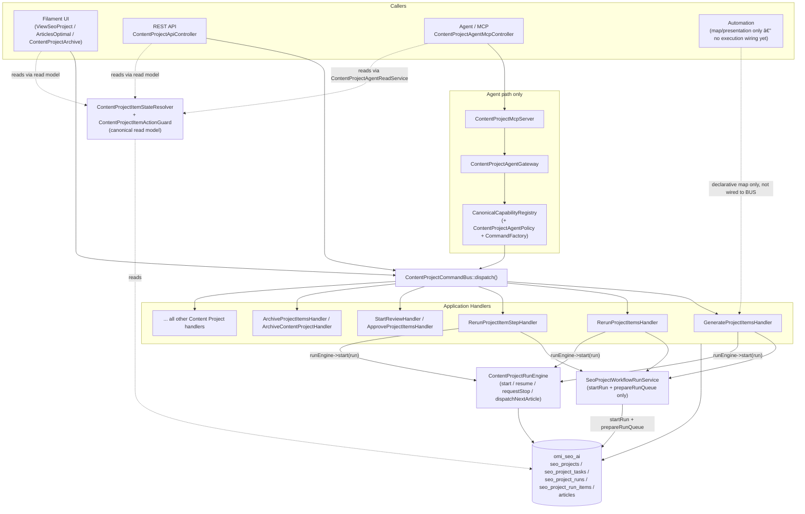

> Status: Historical
> Not canonical
> Archived on: 2026-08-01
> Superseded by: ../../modules/CONTENT_PROJECTS.md
> Purpose: implementation history only
# Content Project — Canonical Architecture (Batches A–E)

**Status:** CURRENT — implemented architecture after Batches A–E; **freeze closure verified 2026-07-31**.
**Scope:** `app/Addons/SeoContentAi/**` Content Project domain (generate, rerun, review, publish, archive) — SEO Content AI addon on `omi_seo_ai` connection.
**Related:** [`CONTENT_PROJECT_BACKEND_FREEZE_V1.md`](CONTENT_PROJECT_BACKEND_FREEZE_V1.md) (handoff/freeze), [`CONTENT_PROJECT_RUN_ENGINE_REFACTOR.md`](CONTENT_PROJECT_RUN_ENGINE_REFACTOR.md) (Run Engine internals/phases), `docs/CONTENT_PROJECT_MCP_TOOLS.md`, `docs/CONTENT_PROJECT_AGENT_CAPABILITIES.md`, `docs/CONTENT_PROJECT_AGENT_GATEWAY.md`.

---

## 1. Scope

This document is the canonical reference for **who is allowed to do what** to a Content Project and its items, and **which class is the single source of truth (SoT)** for each piece of state. It covers:

- Execution entry paths (Filament UI, REST API, Agent/MCP, Automation, CLI/queue-internal).
- Generate / rerun (full + step) orchestration.
- Article review lifecycle (`articles.review_status`).
- Item-level and project-level archive.
- The canonical multi-dimension item state model and precedence rules.
- `seo_project_tasks.status` normalization.
- Publish lifecycle touch points.
- Error/result contract.
- The public capability matrix (MCP / Agent / Automation / internal).
- Business audit trail.
- `seo_projects.status` classification.
- Legacy paths that are removed/dead as of Batch E.

It does **not** cover Keyword Intelligence / SERP Intelligence / GSC Intelligence domain logic in depth (see their dedicated docs) — only how their write capabilities are exposed alongside Content Project on the same Command Bus / Agent Gateway / MCP surface.

---

## 2. Canonical Execution Flow

**Single rule: every business mutation goes through `ContentProjectCommandBus::dispatch()`.** Filament UI, REST API, Agent Gateway, and Automation must all build an `App\Addons\SeoContentAi\Services\ContentProject\Application\Contracts\ContentProjectCommand` and dispatch it — no caller mutates `SeoProject` / `SeoProjectTask` / `SeoArticle` / `SeoProjectRun` business columns directly.



Key points:

- `ContentProjectCommandBus` (`Services/ContentProject/Application/ContentProjectCommandBus.php`) is a thin dispatcher: idempotency replay, handler invocation, exception→`ContentProjectActionResult` normalization, business audit (`ContentProjectBusinessAuditor`), and operation logging (`ContentProjectOperationLogger`). It has no business logic of its own.
- The Agent/MCP path is the only caller that goes through an extra layer (`ContentProjectAgentGateway` → `CanonicalCapabilityRegistry` → `ContentProjectAgentCommandFactory`) before reaching the same `ContentProjectCommandBus`. Filament and the REST API build commands directly and dispatch.
- Automation (`Automation/Presentation/Workflow/AutomationWorkflowMapDefinitions.php`) currently only **describes** `content_project.generate` / `content_project.rerun` as workflow-map nodes for the Automation UI. There is no `Automation/Actions/*` job that dispatches these commands today — see §12 capability matrix "Automation" column.
- `ContentProjectRunEngine` (`Services/RunEngine/ContentProjectRunEngine.php`) owns run lifecycle and article dispatch once a run row exists; it never runs AI/workflow steps itself (delegates to `RunContentProjectArticleJob` → existing executors). Full internals/state machine: [`CONTENT_PROJECT_RUN_ENGINE_REFACTOR.md`](CONTENT_PROJECT_RUN_ENGINE_REFACTOR.md).

---

## 3. Generate

**Entry:** `GenerateProjectItemsCommand` → `ContentProjectCommandBus` → `GenerateProjectItemsHandler`.

Canonical sequence inside the handler (`Services/ContentProject/Application/Handlers/GenerateProjectItemsHandler.php`):

1. Resolve project, tenant guard, reject if project archived (`archived_at` or `isArchive()`).
2. Validate via `PipelineResolver::resolve('article')->validate()`.
3. Resolve target item IDs — explicit `item_refs`, or "generate pending" via `ContentProjectItemGenerationClassifier::preview()` (fail-closed when the pending set would silently re-run the whole project unless `technicalConfirmFullRerun`).
4. `ContentProjectItemActionGuard::assertCan(Generate, ...)` per task (canonical eligibility gate, not a duplicate hand-rolled check).
5. Inside `ContentProjectBusinessLock::projectGenerate($projectId)`:
   - `SeoProjectWorkflowRunService::startRun($project, $mode, $settings)` — creates the `seo_project_runs` row.
   - `SeoProjectWorkflowRunService::prepareRunQueue($project, $run, $limit)` — seeds `seo_project_run_items` (pending). **`startRun` alone creates an empty run; `prepareRunQueue` is required or nothing is queued.**
   - Dispatch `ContentProjectGenerationRequested` domain event after commit.
6. Outside the lock: `ContentProjectRunEngine::start($run)` — idempotent kick that reserves + dispatches the first article job. Web request returns immediately; no provider/AI call happens synchronously.
7. On engine-start failure, the run/queue rows still exist (`engine_started: false` in result metadata) — caller can retry `runEngine->start()`, it is safe to call again.

**Canonical rule:** `Generate = CommandBus → GenerateProjectItemsHandler → startRun + prepareRunQueue → ContentProjectRunEngine::start`. No caller is allowed to call `SeoProjectWorkflowRunService::startRun()` / `prepareRunQueue()` or `ContentProjectRunEngine::start()` directly outside a Command Bus handler.

---

## 4. Rerun (Full & Step)

Rerun has two commands, both **CommandBus-only** (no direct service calls from UI/API/Agent):

| Command | Handler | Eligibility guard |
|---|---|---|
| `RerunProjectItemsCommand` (full) | `RerunProjectItemsHandler` | `ContentProjectRerunEligibilityGuard::validateFull()` |
| `RerunProjectItemStepCommand` (from a specific step) | `RerunProjectItemStepHandler` | `ContentProjectRerunEligibilityGuard::validateStep()` |

Both handlers share the same shape as Generate:

1. Reject archived project.
2. Require explicit `item_refs` (rerun never has an implicit "all pending" mode).
3. `ContentProjectGenerationRecoveryService::recoverTaskIfStale()` per item before eligibility check (heals stuck rows first).
4. **Validate eligibility before any run/queue mutation** (`validateFull()` / `validateStep()`) — rejected items are returned in `metadata.rejected`, never partially started.
5. Inside `ContentProjectBusinessLock::projectGenerate($projectId)`: re-check `hasConflictingActiveExecution()` under the lock, then `startRun()` + `prepareRunQueue()` (identical to Generate).
6. `ContentProjectRunEngine::start($run)` outside the lock.

Step rerun additionally carries `rerun_from_step`, `rerun_include_downstream`, and optional `source_article_id` / `rerun_sync` into `settings` for the workflow runner. Full rerun sets `rerun_scope = 'full'`.

**Canonical rule:** Rerun (full or step) = **CommandBus only**. There is no "direct" rerun entry point outside `RerunProjectItemsHandler` / `RerunProjectItemStepHandler`.

---

## 5. Review

**Single source of truth: `articles.review_status`.** The legacy `articles.is_reviewed` boolean column has been dropped (migration `2026_07_31_120000_cutover_drop_articles_is_reviewed.php`, cutover rules in `App\Addons\SeoContentAi\Support\ArticleReviewCutoverRules`).

- `ArticleReviewService` (`Services/ArticleReviewService.php`) is the single service for the review state machine: `draft → pending_review → approved → archived`, with `reopen` (`archived → approved`) and `unapprove` (`approved → pending_review`).
- `ArticleReviewService::isCanonicallyApproved()` is the only correct way to ask "is this article approved" — **only `review_status = approved`** counts; `archived` is a terminal review state and is **not** approved.
- `ArticleReviewService::resolveStatus()` defaults to `Draft` when `review_status` is null/unrecognized — it explicitly does **not** fall back to `content_archived_at` (see §6, content archive ≠ review archive).
- Content Project's own approve path (`ApproveProjectItemsHandler` → `content_project.approve`) calls `ArticleReviewService::ensureApproved()` (idempotent bulk approve, does not emit the single-article `ContentProjectItemsApproved`-adjacent review event) rather than duplicating the transition logic.
- `StartReviewHandler` (`content_project.start_review`) only flips `seo_project_tasks.status` to `reviewing` for tasks currently `completed`/`pending`; it does not touch `articles.review_status` directly — the article-level submit/approve/archive/reopen transitions are owned exclusively by `ArticleReviewService::performAction()`.
- "Article Reopen" (`ArticleReviewActionType::Reopen`, `archived → approved`) is the only reopen semantic that exists. There is no separate "item restore" concept for review — reopening an archived article's review restores project task links that were detached by the legacy per-article archive flow (`reopenReviewKeepingProjectLinks()`); it does not restore a content-archived item (see §15).

---

## 6. Archive

Three distinct archive concepts exist and must not be conflated:

| Concept | Column / flag | Owner | Command |
|---|---|---|---|
| Article review archive ("hoàn tất duyệt") | `articles.review_status = archived` | `ArticleReviewService::performAction(Archive)` | none (Filament review action) |
| Content Project **item** archive | `seo_project_tasks.archived_at` / `status = archived` | `ArchiveProjectItemsHandler` → `SeoProjectArchiveService` | `content_project.archive_items` |
| Content Project **project** archive | `seo_projects.archived_at` + AI Workspace destroy | `ArchiveContentProjectHandler` → `ArchiveContentProjectService` | `content_project.archive` |

**`content_archived_at` ≠ `review_status = archived`.** These are independent flags on independent lifecycles:

- `content_archived_at` (project- or task-level "content archive") drives `ContentProjectItemArchiveState::ContentArchived` in the canonical resolver (§7) and is checked first in lifecycle precedence.
- `review_status = archived` only means "review has been finalized" for that article; it does **not** imply the item or project is content-archived, and vice versa. `ArticleReviewService::completeReviewWithoutDetaching()` explicitly does **not** set `content_archived_at`, detach the task, or create a standalone archive record — the only place a real archive record (`SeoProjectArchive` / `SeoProjectArchiveItem`) is created is `ArchiveContentProjectService` (project-level "Destroy AI Workspace").

Item archive (`ArchiveProjectItemsHandler`) keeps the WordPress post; it only cleans workspace artifacts. Eligibility is gated the same way as read-model `available_actions` (both call `ContentProjectItemActionGuard::assertCan(Archive, ...)`), so archive is blocked while generation or the publish queue is busy for that item.

Project archive (`ArchiveContentProjectService`) = **Destroy AI Workspace**: keeps the business article + planning metadata, deletes AI Workspace / Prompt History / Execution / local media / SaaS revisions. Confirmation preview (dry-run) must state this explicitly (see `CONTENT_PROJECT_AGENT_GATEWAY.md`).

---

## 7. State Dimensions (Canonical Item State)

`App\Addons\SeoContentAi\Support\ContentProject\ContentProjectItemStateResolver::resolve()` is the **only** place that computes the multi-dimension item state. Nothing else (UI, API, Agent read model, dashboard buckets) is allowed to re-derive lifecycle from raw columns independently — they must call this resolver (directly, or via `ContentProjectLifecycle`, which is a thin facade over it).

`ContentProjectItemState` (`Support/ContentProject/ContentProjectItemState.php`) carries these independent dimensions:

| Dimension | Enum | Meaning |
|---|---|---|
| `lifecycleState` | `ContentProjectLifecyclePhase` | UI-facing bucket: `draft, generating, review, approved, waiting_publish, published, failed, archived` |
| `generationState` | `ContentProjectItemGenerationState` | Derived from `seo_project_tasks.status` via the normalizer (§9) |
| `reviewState` | `ContentProjectItemReviewState` | Derived from `articles.review_status` only |
| `publishState` | `ContentProjectItemPublishState` | Derived from `publish_queue_status` / `publish_published_at` / `scheduled_publish_at` |
| `executionState` | `ContentProjectItemExecutionState` | Running / Succeeded / Failed / Idle — for progress UI, not lifecycle |
| `archiveState` | `ContentProjectItemArchiveState` | `None` / `ContentArchived` (project- or task-level `archived_at`, or normalized `status = archived`) |
| `availableActions` | `list<ContentProjectItemAction>` | Computed by `ContentProjectItemActionGuard::availableActions()` from the other dimensions |
| `blockingReason` | `?string` | Human-readable reason an action set is empty/restricted |
| `currentError` / `currentErrorSource` | `?string` / `ContentProjectItemErrorSource` | Latest relevant error, attributed to `generation`/`publish`/`execution`/`none` |
| `hasPublishedRevision` | `bool` | Sticky — once true, generation/rerun failure no longer regresses lifecycle out of `Published` |

`ContentProjectItemActionGuard` is the single authority for both:

- **Read model** `available_actions` (what the UI/API/Agent shows as clickable).
- **Command-time assertion** (`assertCan()`), used by handlers (`GenerateProjectItemsHandler`, `ArchiveProjectItemsHandler`, `StartReviewHandler`, `ApproveProjectItemsHandler`, …) as the actual authorization gate before mutating.

This guarantees the read model and the write path can never disagree about whether an action is currently allowed.

UI/API row flags `can_generate` / `can_regen` (e.g. `ContentProjectItemOperationsReadModel`) are derived **only** from `availableActions` — `Generate` / `Rerun` membership — not from ad-hoc status heuristics.

---

## 8. Precedence Rules

`ContentProjectItemStateResolver::resolveLifecycle()` applies this precedence, highest first (see inline docblock on the class):

1. **Content archive** (`archiveState = ContentArchived`) → `Archived`, unconditionally.
2. **Published revision** (`hasPublished` sticky flag, or `publishState = Published`) → `Published`, even while a rerun is currently `Generating`/`Failed` — a rerun failure never regresses a previously-published item.
3. **Active publish queue / scheduled** (`Queued` or `Scheduled`) → `WaitingPublish`.
4. **Publish failed** (only reachable when never published) → `Failed`.
5. **Active generation** (`Writing`/`Processing`) → `Generating`.
6. **Generation failed** (only when never published) → `Failed`.
7. **Approved review** → `Approved`.
8. **Pending review / generation completed awaiting review / review archived** → `Review` (review-archived items with no publish/generation activity still show as `Review` for Content Project purposes — review archive is a review-lifecycle terminal state, not a Content Project lifecycle terminal state).
9. Otherwise → `Draft`.

`blockingReason` is derived from the same inputs: content-archived, generation running, or publish queue active — in that priority order.

---

## 9. Task Status (`seo_project_tasks.status`)

**No Eloquent enum cast.** `SeoProjectTask::status` remains a plain string column (`Model vẫn lưu string; không auto-cast Eloquent sang enum` — see docblock on `SeoProjectTaskStatus`). Canonical values live in `App\Addons\SeoContentAi\Enums\SeoProjectTaskStatus` (`draft, pending, writing, processing, reviewing, completed, failed, archived, cancelled`) and legacy/`STATUS_*` string constants on `SeoProjectTask` continue to be written directly by existing services.

`App\Addons\SeoContentAi\Support\ContentProject\ContentProjectTaskStatusNormalizer` is the only place that maps a raw/legacy string (`waiting`, `queued`, `running`, `in_review`, `done`, `success`, `error`, `canceled`, `skipped`, …) to the canonical enum:

- `tryNormalize()` — best-effort, returns `null` on unknown input.
- `normalizeOrFail()` — fail-closed, throws `InvalidArgumentException` on unknown input.

`ContentProjectItemStateResolver` and `ContentProjectItemStateResolver::resolveArchive()` / `resolveGeneration()` both go through the normalizer rather than comparing raw strings — this is what keeps the resolver tolerant of legacy status spellings still present in older rows.

---

## 10. Publish

Publish state/queue is read from `seo_project_tasks.publish_queue_status` (`ContentProjectPublishQueueStatus` enum: `none, waiting, processing, retrying, published, failed, cancelled, skipped`) plus `publish_published_at` / `scheduled_publish_at` timestamps. Write commands (`ScheduleProjectItemsCommand`, `AutoScheduleProjectItemsCommand`, `UnscheduleProjectItemsCommand`, `MoveProjectItemScheduleCommand`, `PublishProjectItemsNowCommand`, `RetryProjectItemPublishingCommand`, `SkipProjectItemPublishingCommand`, `CancelProjectItemPublishingCommand`) all go through `ContentProjectCommandBus` → their respective handlers, which call `ContentProjectItemActionGuard` for eligibility (schedule/publish-now blocked while `Archived`/`Generating`/`Draft`/`Failed`; unschedule/cancel/skip available while queued/waiting/retrying/processing).

`content_project.process_scheduled_publish` is the scheduler-only sweep command — it is **not** a registered Agent/MCP capability (no `cap()` entry exists for it in `ContentProjectCapabilityRegistry`); it runs from the scheduled command/cron path only.

---

## 11. Errors / Result Contract

Every handler returns `ContentProjectActionResult` (`success`, `code`, `message`, `projectId`, `affectedItemIds`, `warnings`, `errors`, `metadata`). Callers (Filament/API/Agent) are expected to branch on `code`, not parse `message`. Canonical codes live in `ContentProjectActionCodes` (`Services/ContentProject/Application/ContentProjectActionCodes.php`) — notable ones:

| Code | Meaning |
|---|---|
| `project.archived` | Blocked — project is archived (also used as `PROJECT_ARCHIVED_BLOCK`) |
| `items.not_found` | No eligible items matched the request |
| `validation.failed` | Input/eligibility validation failed (`metadata.rejected` / `metadata.preview` often populated) |
| `confirmation.required` / `confirmation.invalid` / `confirmation.expired` / `confirmation.stale` | Two-step confirm-token flow for destructive/publish actions |
| `concurrency.lock_busy` | `ContentProjectBusinessLock` contention |
| `quota.denied` | `ContentProjectQuotaGuard` rejection |
| `idempotent.replay` | Idempotency store returned a cached result for the same `idempotency_key` |
| `failed` | Unclassified exception (message carries `$e->getMessage()`, `metadata.exception` carries the class) |

`GenerateProjectItemsHandler` / `RerunProjectItemsHandler` / `RerunProjectItemStepHandler` additionally distinguish "queue prepared but engine start failed" (`engine_started: false` in metadata, code `failed`) from a full validation failure — the run/queue rows are not rolled back in that case, so retrying `ContentProjectRunEngine::start()` (via `resume`/another `generate`/`rerun` call) is safe.

---

## 12. Capability Matrix

Exposure surfaces: **MCP** (tool exposed via `ContentProjectMcpToolCatalog::listTools()`), **Agent** (executable through `ContentProjectAgentGateway::execute()` — a superset of MCP; MCP tools are always a subset of Agent-executable capabilities, but not vice versa), **Automation** (wired into an `Automation/Actions/*` execution path — currently none for Content Project; workflow maps are presentation-only), **internal** (CommandBus-registered but never Agent/MCP-executable).

| Capability | MCP | Agent | Automation | internal | scope | confirmation | command | handler |
|---|---|---|---|---|---|---|---|---|
| `content_project.create` | Yes | Yes | No (map only) | — | `content_project.create` | No | `CreateContentProjectCommand` | `CreateContentProjectHandler` |
| `content_project.update` | Yes | Yes | No | — | `content_project.update` | No | `UpdateContentProjectCommand` | `UpdateContentProjectHandler` |
| `content_project.sync_items` | **No** | **No** (`isAgentWriteExposed()` hard-coded `false`) | No | Yes | `content_project.sync_items` | No | `SyncContentProjectItemsCommand` | (internal sync handler) |
| `content_project.add_items` | Yes | Yes | No | — | `content_project.add_items` | No | `AddContentProjectItemsCommand` | `AddProjectItemsHandler` |
| `content_project.update_item` | Yes | Yes | No | — | `content_project.update_item` | No | `UpdateContentProjectItemCommand` | `UpdateContentProjectItemHandler` |
| `content_project.generate` | Yes | Yes | No (map only) | — | `content_project.generate` | No | `GenerateProjectItemsCommand` | `GenerateProjectItemsHandler` |
| `content_project.rerun` (MCP tool name `rerun_items`) | Yes | Yes (hard-coded `isAgentWriteExposed=true`) | No (map only) | — | `content_project.rerun` | No | `RerunProjectItemsCommand` | `RerunProjectItemsHandler` |
| *(step rerun)* | No dedicated MCP tool | Yes, via `RerunProjectItemStepCommand` app path | No | — | — | No | `RerunProjectItemStepCommand` | `RerunProjectItemStepHandler` |
| `content_project.start_review` | Yes | Yes | No | — | `content_project.start_review` | No | `StartReviewCommand` | `StartReviewHandler` |
| `content_project.approve` | Yes | Yes | No | — | `content_project.approve` | No | `ApproveProjectItemsCommand` | `ApproveProjectItemsHandler` |
| `content_project.schedule` | Yes | Yes | No | — | `content_project.schedule` | Dry-run preview | `ScheduleProjectItemsCommand` | `ScheduleProjectItemsHandler` |
| `content_project.auto_schedule` | Yes | Yes | No | — | `content_project.auto_schedule` | No | `AutoScheduleProjectItemsCommand` | `AutoScheduleProjectItemsHandler` |
| `content_project.unschedule` | Yes | Yes | No | — | `content_project.unschedule` | No | `UnscheduleProjectItemsCommand` | `UnscheduleProjectItemsHandler` |
| `content_project.move_schedule` | Yes | Yes | No | — | `content_project.move_schedule` | No | `MoveProjectItemScheduleCommand` | `MoveProjectItemScheduleHandler` |
| `content_project.publish_now` | Yes | Yes | No | — | `content_project.publish_now` | Yes | `PublishProjectItemsNowCommand` | `PublishProjectItemsNowHandler` |
| `content_project.retry_publish` | Yes | Yes | No | — | `content_project.retry_publish` | No | `RetryProjectItemPublishingCommand` | `RetryProjectItemPublishingHandler` |
| `content_project.skip_publish` | Yes | Yes | No | — | `content_project.skip_publish` | Yes | `SkipProjectItemPublishingCommand` | `SkipProjectItemPublishingHandler` |
| `content_project.cancel_publish` | Yes | Yes | No | — | `content_project.cancel_publish` | Yes | `CancelProjectItemPublishingCommand` | `CancelProjectItemPublishingHandler` |
| `content_project.archive` (project) | Yes | Yes | No | — | `content_project.archive` | Yes | `ArchiveContentProjectCommand` | `ArchiveContentProjectHandler` |
| `content_project.restore` (project) | Yes | Yes | No | — | `content_project.restore` | Yes | `RestoreContentProjectCommand` | `RestoreContentProjectHandler` |
| `content_project.archive_items` (item) | Yes | Yes (`ContentProjectAgentCommandFactory` arm → `ArchiveProjectItemsCommand`) | No | — | `content_project.archive_items` | Yes | `ArchiveProjectItemsCommand` | `ArchiveProjectItemsHandler` |
| `content_project.stop_execution` | **No** (`ContentProjectCapabilityRegistry::isMcpWriteExposed()` excludes via `MCP_EXCLUDED_NAMES`) | Yes (`CommandFactory` builds `StopProjectExecutionCommand`) | No | — | `content_project.stop_execution` | Yes | `StopProjectExecutionCommand` | `StopProjectExecutionHandler` |
| `content_project.resume_execution` | **No** (same `isMcpWriteExposed()` exclusion) | Yes (`CommandFactory` builds `ResumeProjectExecutionCommand`) | No | — | `content_project.resume_execution` | No | `ResumeProjectExecutionCommand` | `ResumeProjectExecutionHandler` |
| `content_project.process_scheduled_publish` | No (not registered) | No (not registered) | No | Yes | — | — | — | scheduler/cron sweep |
| `keyword_intelligence.*` writes (public) | Yes — caps with `agent_exposed=true` and Factory arm | Yes | No | — | per-capability | varies | various | various |
| `keyword_intelligence.*` writes (internal) | **No** | **No** | No | Yes | per-capability | varies | various | various |
| `serp_intelligence.*` writes | **No** — MCP catalog lists SERP **read** tools only | Yes — all registered writes have Factory arms; Agent `execute()` by capability name | No | — | per-capability | varies | various | various |
| `gsc_intelligence.*` writes | **No** — MCP catalog lists GSC **read** tools only | Yes — all registered writes have Factory arms; Agent `execute()` by capability name | No | — | per-capability | varies | various | various |

Notes:

- MCP write surface is a **strict subset** of Agent writes. `ContentProjectMcpToolCatalog::listTools()` includes only capabilities where `ContentProjectCapabilityRegistry::isMcpWriteExposed($name)` is true. That helper excludes: `sync_items`, `stop_execution`, `resume_execution`, `process_scheduled_publish`, `rerun_step` (`MCP_EXCLUDED_NAMES`), and any name under `serp_intelligence.*` / `gsc_intelligence.*` (`MCP_EXCLUDED_PREFIXES`).
- **Stop/resume Agent-only policy:** MCP tool surface must not control mid-flight run lifecycle — stop/resume are ops/automation controls. Agent + Automation workflows need them for assisted runs. Enforced via `MCP_EXCLUDED_NAMES` + `mcp_exposed=false`.
- **`archive_items` fully wired (verified):** registry (`confirmation: true`, scope `content_project.archive_items`, `idempotencySupport: true`) + `isMcpWriteExposed()` + `ContentProjectAgentCommandFactory` arm + `ArchiveProjectItemsHandler` (tenant guard, `ActionGuard::assertCan(Archive)`, `assertConfirmationToken`, CommandBus audit/`logOperation`). MCP + Agent exposed. Contract: `ContentProjectPublicCapabilityContractTest::test_archive_items_...`.
- **`sync_items` internal only:** `isAgentWriteExposed('content_project.sync_items')` hard-coded `false`; `isMcpWriteExposed()` also excludes it. Internal CommandBus callers only.
- **8 KI caps demoted to internal** (`agent_exposed=false`, `mcp_exposed=false`; merge/split removed from `KeywordIntelligenceSkills`): `analyze_keywords`, `cancel_analysis`, `exclude_keywords`, `update_keyword`, `merge_clusters`, `split_cluster`, `move_keywords`, `review_cannibalization`. CommandBus handlers may exist; Factory arms not added — not Agent/MCP-advertised (freeze doc §9 retained debt).
- **SERP/GSC writes:** all registered writes have Factory arms and are Agent-executable by capability name. MCP hidden via prefix exclusion. Skills: SERP partial (5 skills in catalog); GSC skills file empty (hidden from skill catalog; still Agent-executable by name if policy allows).
- **Public capabilities without Factory arm:** **0** among agent-exposed, non-internal `content_project.*` + `keyword_intelligence.*` writes (verified 2026-07-31).

### 12.1 Freeze Closure Proof (verified 2026-07-31)

| Check | Result |
|---|---|
| Agent-exposed `content_project.*` / `keyword_intelligence.*` writes missing Factory arm | **0** |
| `articles.is_reviewed` runtime (excl. migrations/tests/cutover tooling) | **0** hits |
| `ContentProjectItemAction::Restore` production | **0** (enum removed) |
| `ContentProjectBulkRerunService` production | **0** (file deleted) |
| `ContentProjectStepRerunService` / `RerunArticlePipelineJob` production callers | **0** |
| Filament `ContentProjectRunEngine::start` | **0** |
| Item restore without handler (archived `available_actions=[]`) | **0** |

See [`CONTENT_PROJECT_BACKEND_FREEZE_V1.md`](CONTENT_PROJECT_BACKEND_FREEZE_V1.md) §7 for full closure notes and deploy paths.

---

## 13. Audit

Every `ContentProjectCommandBus::dispatch()` call is recorded twice, independent of success/failure:

1. **Business audit** — `ContentProjectBusinessAuditor::record($actor, $action, $result)`, keyed by actor/action/result; used for compliance/history surfaces. Does not store AI prompt/output payloads (see `CONTENT_PROJECT_AGENT_CAPABILITIES.md` "Forbidden": *AI prompt/output in business audit*).
2. **Operation log** — `ContentProjectOperationLogger::info()`, one structured entry per dispatch with: `operation_id`/`operation_ref` (UUID, generated per-dispatch), `request_id`, `command_class`, `command_payload` (public properties, `Carbon` serialized to ISO-8601), `success`, `affected_item_refs` (public refs only, never numeric IDs), `duration_ms`, `actor_type`/`actor_id`, `tenant_ref`, `project_ref`, `item_ref`, and `idempotent_replay` when applicable.

`operation_id`/`operation_ref` is attached to every `ContentProjectActionResult.metadata` (via `withOperationMeta()`), so Agent/API callers can poll `content_project.get_operation` for any dispatched command, including idempotent replays.

Idempotency: when `actor->idempotencyKey` is set, `ContentProjectIdempotencyStore::begin()`/`complete()` wraps the handler call — a replayed call with the same `(tenant, action, idempotency_key)` returns the previously-computed result (flagged `idempotent_replay: true`) without re-running the handler.

---

## 14. `seo_projects.status`

**Decision: non-authoritative for item lifecycle.** Item phase, counters, and MCP/Agent item state are derived exclusively from `ContentProjectItemStateResolver` (§7) — never from `seo_projects.status`. The column is retained as a **project-level workflow flag** (`ContentProjectStatusDecision::MODE = 'project_level_flag_non_authoritative_for_items'`), not decorative — it still drives some project-level behavior.

Consumer classification (`ContentProjectStatusDecision::consumerClass()`):

| Class | Meaning | Consumers |
|---|---|---|
| **A** — authoritative project-level workflow behavior (not item lifecycle) | Legitimate current use | `ApproveProjectItemsHandler` (stamps `STATUS_APPROVED` after item approve), `CreateContentProjectHandler` (initial status), `EditSeoProject` (preserves Approved vs Manual on save) |
| **B** — compatibility / display only | Safe to keep, does not gate item behavior | `SeoProjectResource` badges, `SeoOverviewStats` (counts `STATUS_RUNNING` projects), `WpSyncStatusTable`, `ArchiveContentProjectService` (gates on `archived_at`/run/queue state, **not** `status`) |
| **C** — legacy heuristic (should not drive item lifecycle; migrate later) | Retained debt, do not extend | `KeywordResource` active-project filter, `ArticleResource` create `STATUS_MANUAL`, `CreateSeoProject`, `SeoProjectArchiveService::restore` (writes `STATUS_MANUAL` on restore), `SeoProjectTaskMoveService` |

`ContentProjectStatusDecision::isAuthoritativeForItems()` returns `false` — any new code that needs item lifecycle must call `ContentProjectItemStateResolver`, not read `seo_projects.status`.

---

## 15. Removed / Dead Legacy

- **`articles.is_reviewed`** — dropped column (migration `2026_07_31_120000_cutover_drop_articles_is_reviewed.php`). `articles.review_status` is the sole review SoT. **0** runtime references outside migrations/tests/cutover tooling (verified 2026-07-31). `is_reviewed_only` KI filter name collision remains in 2 files — not the dropped column.
- **JS orchestration loop** (`project-run-queue.js` `startQueue`/`processQueue`/`runSingleTask`/autorun) — superseded by `ContentProjectRunEngine`. Disabled whenever `orchestration = php` (see `CONTENT_PROJECT_RUN_ENGINE_REFACTOR.md` §29). Do not add new orchestration logic to that file.
- **`ViewSeoProjectRun::runItemQueued` / `beginRunQueue` / `completeRunQueue` sync execution** — no-op/blocked when the PHP engine owns a run; `ContentProjectRunEngine` is the sole owner of dispatch/finalize.
- **Item-level `Restore` action (Option B — closed)** — content-archived items get `available_actions = []` from `ContentProjectItemActionGuard`; no item-level restore command on `ContentProjectCommandBus`. Project-level restore is `content_project.restore` only. **`ContentProjectItemAction::Restore` enum case removed** at freeze closure.
- **`ContentProjectBulkRerunService`** — **deleted** at freeze closure. Filament bulk/step rerun uses `ContentProjectRerunFromStep` + `RerunProjectItemStepCommand`.
- **`ContentProjectStepRerunService`** — absent; **0** production callers.
- **`RerunArticlePipelineJob`** — class deleted from disk; **0** production callers. Deploy: `queue:restart` to clear pending jobs referencing the deleted class.
- **Redirect-only Filament run pages** — `ViewSeoProjectRun` / `ViewSeoProjectRunStep` are URL-compat redirects to the project workspace; not primary navigation targets.
- **Standalone per-article archive record on review-archive** — `ArticleReviewService::completeReviewWithoutDetaching()` explicitly does not create a standalone archive record, does not detach the task, and does not set `content_archived_at`. The only archive record path is `ArchiveContentProjectService` (project-level Destroy AI Workspace).
- **`content_project.process_scheduled_publish` as an Agent/MCP capability** — never existed as a registered capability; it is cron/scheduler-only. Do not add it to the registry as an Agent-exposed command.

---

## 16. Compatibility

- `SeoProjectWorkflowRunService` remains the seed/consolidate service (`startRun`, `prepareRunQueue`, `completeRunQueue`) called *by* `ContentProjectRunEngine` and the three generate/rerun handlers — it is not itself an entry point for new callers; new callers go through the handlers.
- `TaskWorkflowTestRunner`, `PromptRunnerService`, `CreateArticlesFromTaskService`, `SeoProjectWorkflowStepRetryService` — unchanged executors, invoked from `RunContentProjectArticleJob` / `ContentProjectRunEngine`; not touched by Batch A–E.
- `SeoProjectRunItemService`, `SeoProjectRunItemsReader`, display presenters — unchanged read-side helpers for run items.
- Existing Filament routes/pages for Content Project are unchanged; only their internal calls were realigned onto the Command Bus + canonical resolver.
- Prompt History / Editor / Automation catalog surfaces are unaffected by the review SoT cutover or the state-resolver consolidation — they read article/task rows the same way, just through the canonical resolver where lifecycle is needed.

---

## 17. Deploy Order

**Path A — `is_reviewed` migration already applied:**

```text
1. Deploy code (handlers, resolver, normalizer, engine).
2. composer dump-autoload -o
3. php artisan optimize:clear
4. php artisan queue:restart
5. Smoke + PHPUnit filters (§18 / freeze doc §10).
```

**Path B — migration not yet applied:**

```text
1. Stop queue workers FIRST.
2. Run: php artisan migrate --path=app/Addons/SeoContentAi/database/migrations
   -> 2026_07_31_120000_cutover_drop_articles_is_reviewed.php
   -> backfills articles.review_status from (review_status, is_reviewed) per ArticleReviewCutoverRules::decide(),
      then drops articles.is_reviewed.
3. Deploy new code.
4. composer dump-autoload -o
5. php artisan optimize:clear
6. Start workers / php artisan queue:restart
7. Smoke + PHPUnit filters (§18 / freeze doc §10).
```

Never leave old workers running after the column drop (Path B).

The migration is a **hard cutover with a `down()` that only re-adds the column** (does not restore original boolean values) — treat it as one-way in practice. Run `ReportIsReviewedCutoverCommand` before migrating to snapshot the pre-cutover distribution if an audit trail of the mirror decision is needed.

---

## 18. Troubleshooting

| Symptom | Likely cause | Where to look |
|---|---|---|
| Generate/rerun returns `engine_started: false` | `ContentProjectRunEngine::start()` threw after run+queue were created | Run/queue rows already exist — retry `runEngine->start($run)`; check `RuntimeLogger` for `content_project.generate_engine_start` / `rerun_engine_start` / `rerun_step_engine_start` |
| Item stuck `Generating` with no active job | Stale `active_dispatch` in `seo_project_runs.settings.php_engine` | `ContentProjectRunEngine::recoveryPlan($run)` / `healthCheck($run)`; see `CONTENT_PROJECT_RUN_ENGINE_REFACTOR.md` §Phase 1.5 |
| Item shows `Failed` lifecycle after a successful publish in the past | Should not happen — published is sticky. If seen, check `hasPublished` inputs (`publish_published_at`, `articleLooksPublished()`, queue status) for a data inconsistency | `ContentProjectItemStateResolver::resolveLifecycle()` |
| Approve rejected with "reopen before approve" | Article `review_status = archived` — approve requires reopening the review first | `ArticleReviewService::ensureApproved()` / `performAction(Reopen)` |
| Content-archived item shows empty `available_actions` | Expected (Option B) — restore is project-level `content_project.restore` only | `ContentProjectItemActionGuard` content-archived branch |
| Agent/MCP call to demoted KI caps (`merge_clusters`, `split_cluster`, `move_keywords`, etc.) | Capability is internal (`agent_exposed=false`); not Agent/MCP-advertised | Freeze doc §9; re-expose only with Factory arms + contract tests |
| Rerun/generate silently no-ops on a project item | Check `seo_projects.archived_at` / `isArchive()` first (blocks all three), then `ContentProjectItemActionGuard` eligibility, then `ContentProjectRerunEligibilityGuard` (`hasConflictingActiveExecution`) for rerun specifically | §3/§4 |
| Task status shows an unexpected lifecycle bucket | Raw `seo_project_tasks.status` string not recognized | `ContentProjectTaskStatusNormalizer::tryNormalize()` — check `LEGACY_MAP`; unknown values return `null` and the resolver falls back to `Idle`/`Draft` |
