> Status: Historical
> Not canonical
> Archived on: 2026-08-01
> Superseded by: ../../modules/SEO_AUDIT_AND_KEYWORDS.md
> Purpose: implementation history only
# SeoContentAi — Article SEO Audit

[← Quay lại Bản đồ tổng](SUPER_MAP_INDEX.md)

**Liên quan:** [React Editor & EditArticle](MAP_SEO_EDITOR.md) · [SEO Scoring](MAP_SEO_EDITOR_SCORING.md) · [Content Projects & Workflow](MAP_SEO_PROJECTS.md) · [WordPress sync](MAP_SEO_WP.md) · [Team & Phân quyền](MAP_SEO_TEAM.md)

---

## 1. Tổng quan

**Article SEO Audit** là trang Filament Livewire giúp content team **quét và lọc** các bài viết chưa đạt chuẩn SEO kỹ thuật, **phân vào Content Project** để viết lại/tối ưu, và **xem lại danh sách bài đã duyệt**.

| Thông tin | Giá trị |
|-----------|---------|
| **URL panel** | `/seo/articles/optimal` |
| **Slug** | `articles/optimal` |
| **Livewire page** | `Filament/Pages/ArticlesOptimal.php` |
| **View** | `resources/views/filament/pages/articles-optimal.blade.php` |
| **Navigation** | SEO Workspace → Articles → **SEO audit** (sort `2`, icon `heroicon-o-magnifying-glass-circle`) |
| **Quyền** | `ArticleResource::canViewAny()` |
| **DB** | `omi_seo_ai.articles` (+ join logic `seo_project_tasks`) |

Trang **không** dùng React/Vite — toàn bộ UI là Blade + Alpine.js + Livewire.

### Nguyên tắc bản ghi Laravel vs WordPress

Bài trên Laravel là **bản tạm** để đồng bộ / sửa chữa SEO. Thao tác local (trash, xóa soft-delete, đổi draft) **được phép trên Laravel**. Outbound sync **không** được xóa / move-to-trash / hạ draft bài đã tồn tại trên WordPress. Bỏ bài khỏi audit dùng meta `skip_seo_audit`, không demote WP. Chi tiết outbound: [MAP_SEO_WP.md](MAP_SEO_WP.md).

---

## 2. Kiến trúc UI (2 tab)

Tab chuyển **client-side** (Alpine `activeTab`), không gọi Livewire chỉ để toggle.

```mermaid
flowchart TB
    PAGE["ArticlesOptimal<br/>/seo/articles/optimal"]

    PAGE --> TABS["Tab Bar<br/>Alpine activeTab"]
    TABS --> AUDIT["Tab: SEO Audit"]
    TABS --> REVIEWED["Tab: Reviewed"]

    AUDIT --> FILTERS["Section Filters<br/>domain, language, 6 checkbox"]
    AUDIT --> SCAN["runScan() → hasScanned=true"]
    AUDIT --> RESULTS["Bảng kết quả + pagination"]
    AUDIT --> SIDEBAR["Sidebar Content Project<br/>fixed 30% phải"]

    REVIEWED --> STATS["4 stat cards<br/>Today / Week / Month / Total"]
    REVIEWED --> TOOLBAR["Search + Date / Status / Sort<br/>Alpine client-side"]
    REVIEWED --> CARDS["Day cards theo reviewed_at"]
    CARDS --> LIST["Article list items<br/>View + Edit"]
```



| Tab | Key Alpine | Ná»™i dung |
|-----|------------|----------|
| **SEO Audit** | `audit` (mặc định) | Bộ lọc, nút Quét, bảng cảnh báo SEO, bulk assign, sidebar project |
| **Reviewed** | `reviewed` | Dashboard: stat cards, toolbar lọc client-side, day cards accordion, list bài đã duyệt |

Sidebar Content Project **chỉ hiện** khi `activeTab === 'audit'`.

---

## 3. Backend — `ArticlesOptimal.php`

### 3.1 State & URL query

Các filter SEO Audit được persist qua `#[Url]`:

| Property | URL key | Mô tả |
|----------|---------|-------|
| `filterSiteId` | `site` | Lọc theo `site_id` (phạm vi — AND) |
| `selectedScoringRuleKeys` | `rules` | Danh sách rule key từ `SeoScoringSettingsService::auditFilterDefinitions()` |
| `filterLowSeoScore` | `low` | Aggregate: điểm SEO `< SeoScoringRulesRegistry::AUDIT_LOW_SCORE_THRESHOLD` (60) |
| `filterTechnicalSeoScore` | `tech` | Aggregate: điểm kỹ thuật `< AUDIT_LOW_SCORE_THRESHOLD` |
| `filterLanguage` | `lang` | Ngôn ngữ bài viết (phạm vi — AND) |
| `filterPostType` | `post_type` | Post type từ union `articles.type` trong scope site (empty = all) |
| `hasScanned` | `scan` | Đã bấm Quét ít nhất một lần (hoặc auto-load mặc định khi mở trang) |

**Kết quả mặc định (keyword review):** `mount()` → `loadDefaultAuditResults()` load bài có keyword `review_status` warning/danger qua `SeoAuditKeywordFlagService::resolveResultArticleIds()` — không cần bấm Quét.

**UNION fix (quan trọng):** Khi user chọn scoring rules / aggregate rồi Quét, `paginateMergedResults` **không** UNION keyword_review Warning/Danger. Chỉ trả bài khớp rule SQL đã chọn. `missing_focus_keyword` ≠ keyword_review (bài đã có keyword canonical nhưng warning/danger **không** match thiếu keyword).

Canonical thiếu keyword: `SeoAuditScanService::applyMissingFocusKeywordScope` / `hasCanonicalFocusKeyword` — `seo_focus_keyword` meta (NULL/empty/whitespace) **hoặc** không có `keyword_meta` MainArticleId + phrase.

Nguồn hiển thị: `audit_sources` = `keyword_review` (default) | `seo_rules` (khi chọn rule).

State khác (không URL): `selectedArticleIds`, `sidebarProjectId`, `sidebarCollapsed` (persist Livewire + Alpine `@entangle`, tránh remorph reset drawer), `scanState` (`idle\|scanning\|completed\|empty\|failed`), `scanError`, `cachedScanRows`.

### 3.2 Computed properties

| Property | Method | Khi nào chạy |
|----------|--------|--------------|
| `resultsPaginator` | `getResultsPaginator()` | Tab Audit — sau `hasScanned=true` |
| `reviewedArticlesGrouped` | `getReviewedArticlesGrouped()` | Má»—i render trang (tab Reviewed) |

### 3.3 Public actions (Livewire)

| Method | Mô tả |
|--------|-------|
| `runScan()` | Phân tích toàn bộ scope → cache `cachedScanRows`, set `scanState`, try/catch/finally |
| `getScoringRuleFilterDefinitions()` | Checkbox quy tắc chấm điểm (enabled + filterable từ registry) |
| `getAggregateFilterDefinitions()` | Checkbox điểm tổng hợp (ngưỡng từ registry) |
| `skipSeoAudit($articleId)` | Set `article_meta.skip_seo_audit=1` — loại khỏi audit, **không** đổi status / **không** sync WP; `skipRender()` + toast |
| `skipSelectedSeoAudit($articleIds?)` | Bulk skip (IDs từ Alpine); `skipRender()` + toast |
| `assignFromSidebar($articleIds, $data)` | Assign qua sidebar; trả `{project_id, remaining}`; cảnh báo capacity ≤2; `skipRender()` |
| `assignArticleToContentProject` | Assign 1 bài qua `ArticleResource::assignArticlesFromFormData` |
| `assignArticleToSelectedProject` | Assign 1 bài vào `sidebarProjectId` |
| `assignSelectedArticlesToSelectedProject` | Bulk assign `selectedArticleIds` |
| `quickCreateSidebarProject` | Tạo project nhanh qua `ArticleResource::quickCreateContentProject` |
| `selectSidebarProject` | Cập nhật `sidebarProjectId`; `skipRender()` |

---

## 4. Tab SEO Audit — pipeline quét

### 4.1 Phạm vi query (`baseArticleQuery`)

Chỉ lấy bài **cần audit**:

```text
articles
  WHERE countsTowardSeoScore()     -- skip_seo_score = false/null
    AND type NOT IN (category, product_category)
    AND status != trash
    AND (is_reviewed = false OR is_reviewed IS NULL)
    AND NOT EXISTS (seo_project_tasks WHERE article_id = articles.id)
    AND NOT EXISTS (article_meta WHERE meta_key = skip_seo_audit AND meta_value = 1)
  [+ filter site_id / language / post_type nếu có]
  ORDER BY updated_at DESC
```

Sau khi load collection, **loại thêm** trong PHP (không nằm trong SQL):

- `is_reviewed = true`
- `ArticleResource::articleIsInContentProject($article)` — đã có task trong Content Project

### 4.2 Query cache SEO — không analyze HTML trong request (`SeoAuditScanService`)

Kiến trúc **cache + queue** (2026-07):

| Nguồn cache | Cột/meta |
|-------------|----------|
| Violations | `article_meta.seo_rule_violations` (JSON array `rule_key`) |
| Score | `articles.seo_score` |
| Trạng thái queue | `article_meta.seo_scoring_status` (`pending` / `processing` / `completed` / `failed`) |
| Fingerprint đổi nội dung | `article_meta.seo_scoring_fingerprint` |

| Service | Vai trò |
|---------|---------|
| `SeoArticleScoringQueueService` | Dispatch `AnalyzeArticleSeoJob`, backfill domain, `domainProgress()` |
| `AnalyzeArticleSeoJob` | Gọi `SeoAnalyzerService::analyze()` → persist violations + score (unique per article) |
| `SeoAuditScanService` | `buildFilteredQuery()` + `paginateResults()` — filter SQL (`JSON_CONTAINS`, `seo_score`) |
| `SeoRuleViolationsResolver` | Đọc cache violations (format mới + legacy) |
| `SeoAuditRuleMatcher` | OR semantics cho checkbox; scope AND qua `baseArticleQuery()` |
| `SeoScoringRulesRegistry` | Source of truth rule keys + audit filter definitions |

**Không còn** `scanWithHtmlAnalysis()` / `SeoEngineService::analyzeHtml()` trong request Audit.

Trigger populate cache:

- WP sync (`SyncDomainContentService::importSingleSyncItem`) → `dispatchIfSyncItemChanged()`
- Editor save (`ArticleEditorPersistService`) → `dispatchForArticle(force: true)`
- Domain actions (`GeneralDomain`) → queue missing / retry failed / requeue all

Output mỗi row (map từ DB, không parse body):

| Key | Mô tả |
|-----|-------|
| `id`, `title`, `domain` | Thông tin cơ bản |
| `permalink` | Từ `article_metas.meta_key = wp_permalink` |
| `edit_url` | `ArticleResource::getUrl('edit', …)` |
| `score` | Từ `articles.seo_score` + `SeoScoringCalculator` |
| `matched_rule_keys` / `reason_labels` | Từ cache `seo_rule_violations` (active rules only) |

### 4.3 Logic filter (`SeoAuditRuleMatcher`)

- **Phạm vi** (`site`, `lang`): AND qua SQL `baseArticleQuery()`.
- **Không chọn rule/aggregate nào** → mọi bài trong scope hiển thị.
- **Quy tắc chấm điểm** (`selectedScoringRuleKeys`): match **ANY** — canonical rule key từ `SeoScoringRulesRegistry::activeViolations()`.
- **Aggregate** (`low`): so sánh `articles.seo_score` với `AUDIT_LOW_SCORE_THRESHOLD` (60). Checkbox **technical score đã ẩn** — hệ thống chỉ cache một `seo_score` tổng.
- Rule **disabled** tại `/settings/scoring`: không filter, không badge, không trừ điểm runtime; violation cũ trong DB bị bỏ qua.

Checkbox UI sinh từ `SeoScoringSettingsService::auditFilterDefinitions()` — label threshold (vd. độ dài bài) lấy từ `SeoPromptSettingsService`, không hard-code 600.

### 4.4 Scan state & pagination

- `runScan()` chỉ validate filter + đếm cache status; **không** analyze HTML.
- `getResultsPaginator()` → `SeoAuditScanService::paginateResults()` — pagination SQL.
- `scanState`: `idle` → `scanning` → `completed` \| `empty` \| `failed`; `scanNotice` khi còn bài pending queue.
- Bài chưa có cache: empty state + nút «Chấm SEO còn thiếu» (domain filter) hoặc action trên GeneralDomain.
- Đổi filter → `invalidateScanResults()` (phải quét lại).

### 4.5 Bảng kết quả & hành động

| Cá»™t | Ná»™i dung |
|-----|----------|
| Checkbox | Bulk select (Alpine `selectedArticleIds` ↔ Livewire entangle) |
| Title | Link permalink WP (nếu có) |
| Domain | `site.domain` |
| Warnings | Danh sách `reason_labels` |
| Score | Màu theo ngưỡng: `<50` đỏ, `50–70` vàng, `>70` xanh |
| Actions | Edit · Skip audit · Assign project |

**Skip audit:** Alpine `hideRows()` ẩn row ngay → `$wire.skipSeoAudit` / `skipSelectedSeoAudit` ngầm (`skipRender()`). Toast Filament khi xong. Không overlay chặn trang.

**Assign project:** Icon folder mở sidebar; `submitSidebarAssign()` ẩn row + xóa focus keyword → `$wire.assignFromSidebar` ngầm. Nút **Phân bài** disable khi chưa chọn bài (`canSubmitAssign()`). Delegate `ArticleResource::assignArticlesFromFormData` — xem [MAP_SEO_PROJECTS.md](MAP_SEO_PROJECTS.md).

**Project capacity:** Sau assign, `remaining ≤ 2` → toast cảnh báo (`articles_optimal.project_capacity_*`); `remaining = 0` → Alpine `hideFullProject()` xóa option khỏi select. Options ban đầu từ `ArticleResource::contentProjectOptions()` (chỉ project `canRegisterMoreTasks()`).

---

## 5. Sidebar Content Project

Fixed panel phải (~30% width). `sidebarCollapsed` sync Livewire + Alpine — drawer không bị reset sau skip/assign.

| Thành phần | Nguồn dữ liệu |
|------------|---------------|
| Dropdown project | `getContentProjectOptions()` → `ArticleResource::contentProjectOptions($siteId)`; label có `còn N` |
| Nút tạo nhanh | Modal → `quickCreateSidebarProject` |
| Form assign | Loại bài, rewrite mode, focus keyword (khi thiếu), nút Phân bài |

Assign: chọn bài (checkbox hoặc icon folder) → mở sidebar → chọn project → Phân bài. Không còn block «Bài viết trong dự án» dưới form.

**i18n:** Chuỗi sidebar dùng `lang/*/filament.php` → `articles_optimal.*` (UTF-8).

Skip/assign dùng `skipRender()` — không remorph DOM, sidebar giữ trạng thái mở.

---

## 6. Tab Reviewed — dashboard bài đã duyệt

### 6.1 Query (`getReviewedArticlesGrouped`) — không đổi

```text
articles
  WHERE is_reviewed = true
    AND reviewed_at IS NOT NULL
    AND type NOT IN (category, product_category)
    AND status != trash
  [+ scope site theo SeoAccessControl nếu non-admin]
  ORDER BY reviewed_at DESC
```

Nhóm theo `reviewed_at->toDateString()` (Y-m-d). Payload mỗi group:

| Field | Nguồn |
|-------|--------|
| `date`, `date_label` | Ngày nhóm |
| `count` | Số bài trong ngày |
| `articles[]` | `id`, `title`, `reviewed_time` (H:i), `edit_url` |

Blade enrich thêm (chỉ UI, không đổi API PHP):

| Field | Cách tính |
|-------|-----------|
| `first_review` | `reviewed_time` của bài duyệt sớm nhất trong ngày |
| `last_review` | `reviewed_time` của bài duyệt muộn nhất trong ngày |
| `is_today` | `date === today` (server timezone) |

`reviewedUiContext` (JSON Alpine): `today`, `weekStart`, `weekEnd`, `monthStart`, `monthEnd` — dùng cho stat cards và date filter.

### 6.2 Layout UI (Ahrefs/Semrush-style)

| Khối | Mô tả |
|------|--------|
| **Stat cards** (4) | Today / This Week / This Month / Total Reviewed — đếm client-side từ `reviewedGroups` |
| **Toolbar** | Search (`reviewedSearch`), Date filter, Status (Reviewed), Sort (newest/oldest) |
| **Day cards** | Bo góc 12px, badge số bài, meta First/Last Review, chevron + `x-collapse` |
| **Article list** | Icon file, title, dot xanh + «Reviewed» + giờ; nút View (tab mới) + Edit |

Responsive: stats 4→2→1 cột; toolbar stack trên mobile.

### 6.3 Alpine state (tab Reviewed)

| Key / method | Vai trò |
|--------------|---------|
| `reviewedGroups` | Copy JSON từ `reviewedGroupsEnriched` |
| `reviewedSearch` | Lọc title — **không** gọi Livewire |
| `reviewedDateFilter` | `all` \| `today` \| `week` \| `month` |
| `reviewedStatus` | `reviewed` (readonly select, chuẩn bị mở rộng) |
| `reviewedSort` | `newest` \| `oldest` — sắp xếp day groups |
| `expandedDates` | Mặc định chỉ ngày mới nhất; toggle `toggleDate()` |
| `filteredReviewedGroups()` | Search + date filter + sort — trả groups để `x-for` |
| `reviewedStatToday/Week/Month/Total()` | Đếm bài theo khoảng ngày |

Tab Reviewed **không** lọc domain/ngôn ngữ ở backend (chỉ scope quyền tenant). Mọi filter/search chạy **client-side** trên dữ liệu đã load.

### 6.4 Style

Inline CSS class prefix `reviewed-*` trong `articles-optimal.blade.php`: nền trắng, border `#E5E7EB`, radius 12px, shadow nhẹ, hover `#F9FAFB`, gap section 24px.

---

## 7. Vòng đời «Đã duyệt» (`is_reviewed`)

| Cá»™t | Migration | Cast |
|-----|-----------|------|
| `is_reviewed` | `2026_06_03_090000_add_review_fields_to_articles_table` | `boolean` |
| `reviewed_at` | cùng migration | `datetime` |

| Hành động | Nơi gọi | Kết quả |
|-----------|---------|---------|
| Duyệt bài | `ArticleResource::markArticleReviewed()` | `is_reviewed=true`, `reviewed_at=now()`, xóa local media |
| Bỏ duyệt | `ArticleResource::markArticleUnreviewed()` | `is_reviewed=false`, `reviewed_at=null` |
| Staff submit (content manager) | `ArticleResource::submitStaffEditingComplete()` → `SeoProjectApprovalService` | Flow project — không set trực tiếp `is_reviewed` trên audit page |
| Editor UI | `EditArticle` + `publish-sidebar.blade.php` | Nút review theo role |

Bài đã duyệt **biến mất** khỏi tab SEO Audit (cả SQL filter lẫn PHP skip).

---

## 8. Phân quyền & tenant scope

| Layer | Logic |
|-------|-------|
| Truy cập trang | `ArticleResource::canViewAny()` |
| Site filter options | `Site::query()` — max 5 domain; scope `user_id` nếu `SeoAccessControl::shouldScopeToAccountOwner()` |
| `accessibleArticleQuery()` | `whereIn(site_id, …)` cùng tập site accessible |
| Assign / skip audit | `findAccessibleArticle()` qua `accessibleArticleQuery()` |

Chi tiết RBAC: [MAP_SEO_TEAM.md](MAP_SEO_TEAM.md).

---

## 9. Frontend stack (không React)

| Layer | File / công nghệ |
|-------|------------------|
| View chính | `articles-optimal.blade.php` |
| Tab SEO Audit | Inline CSS `articles-optimal-tabs-bar` (tone Media Library) |
| Tab Reviewed dashboard | Inline CSS `reviewed-*` (stat cards, toolbar, day cards, list items) |
| Tab toggle | Alpine `activeTab` |
| Reviewed filter/search | Alpine only — `filteredReviewedGroups()`, không Livewire |
| Checkbox bulk | Alpine `removedIds` + `@entangle('selectedArticleIds')` (không `.live`) |
| Sidebar assign | Alpine `hideRows`, `canSubmitAssign`, `hideFullProject`; `@entangle('sidebarCollapsed')` |
| Modals quick create | Alpine `quickCreateOpen` |
| Loading | Chỉ `runScan` / `queueMissingScoring` dùng `wire:loading`; skip/assign **không** overlay toàn trang |
| i18n | `lang/{en,vi}/filament.php` → key `articles_optimal.*` |

---

## 10. Bản đồ file

| Vai trò | Đường dẫn |
|---------|-----------|
| Page class | `app/Addons/SeoContentAi/Filament/Pages/ArticlesOptimal.php` |
| Blade | `app/Addons/SeoContentAi/resources/views/filament/pages/articles-optimal.blade.php` |
| Model | `app/Addons/SeoContentAi/Models/SeoArticle.php` |
| Assign / review helpers | `app/Addons/SeoContentAi/Filament/Resources/ArticleResource.php` |
| SEO engine | `app/Services/SeoEngineService.php` |
| Quality assessment | `app/Addons/SeoContentAi/Services/SeoArticleQualityAssessmentService.php` |
| Audit scan strategies | `app/Addons/SeoContentAi/Services/SeoAuditScanService.php` |
| Keyword-flag merge / UNION gate | `app/Addons/SeoContentAi/Services/SeoAuditKeywordFlagService.php` (`resolveResultArticleIds`) |
| Agent read `/audit-list` | `Services/SeoAudit/Agent/SeoAuditAgentReadService.php` + capability `seo_audit.list` (Gateway READ; reuse Web query) |
| Agent skill / presenter | `Services/AgentWorkspace/Skills/SeoAuditSkills.php`, `Execution/Presentation/AuditListPresenter.php`, `Execution/Rendering/SeoAuditResultRenderer.php` |
| SEO scoring queue | `app/Addons/SeoContentAi/Services/SeoArticleScoringQueueService.php` |
| Analyze job | `app/Addons/SeoContentAi/Jobs/AnalyzeArticleSeoJob.php` |
| Scoring status meta | `app/Addons/SeoContentAi/Support/SeoScoringStatus.php` |
| Audit filter matcher | `app/Addons/SeoContentAi/Services/SeoAuditRuleMatcher.php` |
| Scoring registry / filters | `app/Addons/SeoContentAi/Support/SeoScoringRulesRegistry.php` |
| Analyzer | `app/Addons/SeoContentAi/Services/SeoAnalyzerService.php` |
| Skip audit meta | `ArticleResource::META_SKIP_SEO_AUDIT` (`skip_seo_audit`) — set bởi `ArticlesOptimal::skipSeoAudit` |
| Migration review fields | `app/Addons/SeoContentAi/database/migrations/2026_06_03_090000_add_review_fields_to_articles_table.php` |
| Translations | `app/Addons/SeoContentAi/lang/{en,vi}/filament.php` → `articles_optimal` |
| Tests | `SeoAuditScoringIntegrationTest.php`, `SeoAuditScanServiceTest.php`, `SeoAuditCacheArchitectureTest.php`, `SeoAuditMissingFocusKeywordAuditFilterTest.php` |

---

## 11. Hướng dẫn prompt — SEO Audit

### Mở rộng filter / cảnh báo mới

```
Page: Filament/Pages/ArticlesOptimal.php
View: resources/views/filament/pages/articles-optimal.blade.php
Thêm checkbox: bật `filterable` + metadata trong `SeoScoringRulesRegistry::ruleCatalog()` — UI tự sinh qua `auditFilterDefinitions()`. Match qua `SeoAuditRuleMatcher` + canonical rule key, không hard-code trong Blade.
Phân tích: mapArticleRow() → SeoEngineService::analyzeHtml()
i18n: lang/{en,vi}/filament.php articles_optimal.*
```

### Thêm cột hoặc action trên bảng Audit

```
mapArticleRow() trả thêm key → foreach $paginator trong articles-optimal.blade.php
Action server: public method trên ArticlesOptimal + authorize qua accessibleArticleQuery()
Skip audit: skipSeoAudit() → article_meta.skip_seo_audit=1 (không sync WP)
```

### Tab Reviewed — UI / filter client-side

```
Data: getReviewedArticlesGrouped() — không đổi signature
Blade enrich: first_review, last_review, is_today + reviewedUiContext
Alpine: reviewedSearch, reviewedDateFilter, reviewedSort, filteredReviewedGroups()
Stat cards: reviewedStatToday/Week/Month/Total()
Edit link: article.edit_url (View = tab mới, Edit = cùng tab)
i18n: articles_optimal.reviewed_* trong lang/{en,vi}/filament.php
```

### Liên kết với Content Project

```
Assign: ArticleResource::assignArticlesFromFormData()
Sidebar options: ArticleResource::contentProjectOptions($siteId)
Bài đã assign: articleIsInContentProject() → loại khỏi audit scan
Chi tiết project: docs/MAP_SEO_PROJECTS.md
```

---

## 12. Giới hạn & lưu ý vận hành

| Chủ đề | Chi tiết |
|--------|----------|
| **Performance** | Audit chỉ query cache DB; scoring chạy qua `AnalyzeArticleSeoJob` (sync/save/domain actions) |
| **Trùng filter điểm** | `filterLowSeoScore` và `filterTechnicalSeoScore` cùng điều kiện `< 60` |
| **Category** | Loại `category`, `product_category` khỏi cả Audit và Reviewed |
| **Đã trong project** | Có row `seo_project_tasks` → loại khỏi SQL audit query |
| **Tests** | `SeoAuditScoringIntegrationTest` — registry filters, disabled rules, matcher ANY/aggregate |
