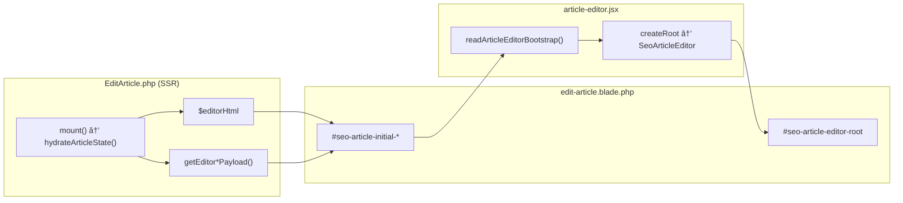
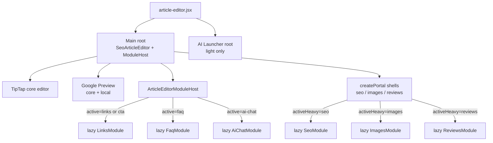
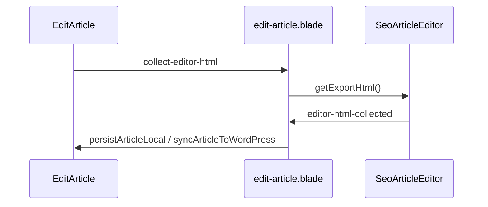
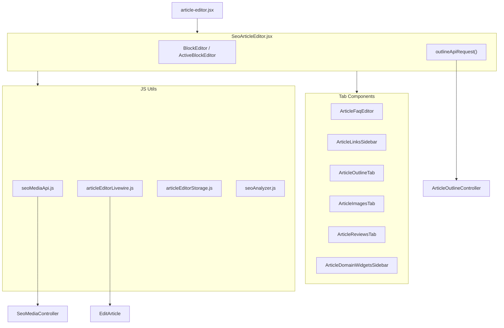

> Status: Historical
> Not canonical
> Archived on: 2026-08-01
> Superseded by: ../../modules/ARTICLE_EDITOR.md
> Purpose: implementation history only
# SeoContentAi — React Editor & EditArticle

[← Quay lại Bản đồ tổng](SUPER_MAP_INDEX.md)

**Liên quan:** [Media / upload](MAP_SEO_MEDIA.md) · [WordPress sync](MAP_SEO_WP.md) · [Content Projects & Workflow](MAP_SEO_PROJECTS.md) · **[SEO Scoring (Rules + Violations)](MAP_SEO_EDITOR_SCORING.md)**

---

## 2.4 Danh sách bài viết (ListArticles)

| Thông tin | Giá trị |
|-----------|---------|
| **URL panel** | `/seo/{connection_hash}/articles` |
| **Resource** | `Filament/Resources/ArticleResource.php` |
| **Page** | `Filament/Resources/ArticleResource/Pages/ListArticles.php` |
| **View** | `resources/views/filament/resources/article-resource/pages/list-articles.blade.php` |

**Tab ná»™i dung** (`?tab=`):

| Tab | Constant | Query mặc định |
|-----|----------|----------------|
| Bài viết | `ListArticles::TAB_POSTS` (`posts`) | `type` post/product; **`is_reviewed = 0`**; **loại `skip_seo_audit`** |
| Danh mục | `TAB_CATEGORIES` (`categories`) | `type` category/product_category; **`is_reviewed = 0`**; **loại `skip_seo_audit`** |
| Hàng đợi WP | `TAB_QUEUE` (`queue`) | Meta `wp_sync_queue`; **`is_reviewed = 0`**; **loại `skip_seo_audit`**; badge `getSyncQueueBadgeCount()` + CSS `seo-internal-tabs__queue` / `__queue-badge` (amber + pulse khi count > 0; `domain-overview.css`) |
| Đã duyệt | `TAB_REVIEWED` (`reviewed`) | `is_reviewed = 1` + `reviewed_at` not null — partial `reviewed-articles-tab.blade.php`; **loại `skip_seo_audit`** |
| Bỏ qua | `TAB_SKIPPED` (`skipped`) | Chỉ bài có `article_meta.skip_seo_audit=1` (ẩn khỏi các tab kia + SEO Audit) |

**Skip list/audit:** action hàng `toggle_skip_seo_audit` → `ArticleResource::toggleSkipSeoAudit()` ghi `article_meta.skip_seo_audit`. Bulk: `skip_seo_audit` (ẩn khỏi tab thường) / `unskip_seo_audit` (chỉ tab **Bỏ qua**, via `isArticlesSkippedTab()`). Scope: `applyExcludeSkipSeoAuditScope` / `applyOnlySkipSeoAuditScope`. Reviewed group UI: `buildReviewedArticlesGrouped()` cũng loại skip. Cùng flag với SEO Audit skip. Khôi phục từ tab **Bỏ qua**.

**Filter mặc định (tab Bài viết):** `language=vi`, `post_type=post` — `SelectFilter::default()` + `ListArticles::ensureDefaultPostsTableFilters()`; URL tương đương `?tableFilters[language][value]=vi&tableFilters[post_type][value]=post`. Có `tableFilters` trên query thì không ghi đè. Link tab Posts (`getContentTabUrl`) bổ sung default nếu thiếu. **Mount:** chỉ ghi `$this->tableFilters` — không gọi `getTableFiltersForm()` / `handleTableFilterUpdates()` (tránh `$table` chưa init trước `bootedInteractsWithTable`).

**Cột bảng:** không có cột **Reviewed** (`is_reviewed`) — trạng thái duyệt chỉ xem ở tab **Reviewed**. Cột `reviewed_at` vẫn toggle ẩn mặc định.

**Route liên quan:** `/seo/{connection_hash}/articles/queue` (`ListArticleSyncQueue`), `/seo/{connection_hash}/articles/{id}/edit` (`EditArticle`).

---

## 2.5 Cấu trúc chi tiết EditArticle (React Component Graph)

> MCP `search_graph` (`SeoArticleEditor`, out_degree **112**), `search_code` (`callEditArticleLivewire`). Files: `article-editor.jsx`, `edit-article.blade.php`, `EditArticle.php`.

### 2.5.1 Component React chính


| Vai trò          | File                                           | Ghi chú                                                                                          |
| ---------------- | ---------------------------------------------- | ------------------------------------------------------------------------------------------------ |
| **Vite entry**   | `resources/js/article-editor.jsx`              | Bundle `article-editor`. Phase 3: **1 main React root** (+ optional light AI launcher root). |
| **Editor chính** | `resources/js/components/SeoArticleEditor.jsx` | Core TipTap + editor-hosted heavy modules (seo/images/reviews) one-at-a-time via `activeHeavyModule`. |
| **Module host**  | `resources/js/components/ArticleEditorModuleHost.jsx` | Links / FAQ / CTA / AI Chat — dynamic import + portal + AbortController. |
| **Blade host**   | `resources/views/.../edit-article.blade.php`   | `#seo-article-editor-root` (`wire:ignore`) + `#seo-article-core-bootstrap`. |
| **Backend page** | `Filament/.../EditArticle.php`                 | Livewire `/seo/articles/{record}/edit`. SSR core bootstrap + lazy `/editor/*`. Menu **Viết lại toàn bộ bài hiện có** → `queueEditorFullRewrite()` → `TaskTestInputResolver::resolveEditorFullRewrite` → `ArticleWritingExecutionService` (`existing_article`, DirectGenerate). Không Publish graph. |

**Image block picker:** `ImageBlockPickerBox` chờ 2×`requestAnimationFrame` mới enable nút. `handleClickOutside` giữ block active khi click trong slot block đang chọn; guard ~360ms sau activate/insert image; whitelist outline rail, media/generate modal. Outline focus clear khi click ra ngoài heading (`headingCommand.action=clear`).

**Paste Ctrl+V ảnh:** `processClipboardImagePaste` → `uploadSeoMediaFromFile` (`source=clipboard`) → server slug random `paste-{hex}` (tránh `image.png` cache). `ImageBlockEditor.applyUploadedImageToBlock` xóa `wpAttachmentId`/`wpSrc` cũ khi paste local mới (tránh rename WP bằng ID stale). `shouldRenameSlugOnWordPress` / `isImageReadyForWpSlugFix` chỉ tin ID qua `resolveImageRefIds` — không fallback `rawWp`. Chi tiết: [MAP_SEO_MEDIA.md](MAP_SEO_MEDIA.md), [MAP_SEO_WP.md](MAP_SEO_WP.md) §rename.

**Featured image sidebar:** `articleFeaturedImageStorage.saveFeaturedImage()` lưu localStorage rồi dispatch `seo-featured-image-updated`; Alpine trong `edit-article.blade.php` nhận `onFeaturedImageUpdated()` để cập nhật `featuredImageDraft` ngay (không chờ reload). Clear vẫn dùng `seo-featured-image-cleared`.

**Đổi `post_type` (Article tab, không sync WP ngay):** `publish-sidebar` `applyPostType()` → event `seo-publish-post-type-changed` + `pushToWire()` (`EditArticle::applyPublishBoxFromClient`, `skipRender`). UI Featured/Album/Reviews **không** phụ thuộc `@if supportsProductGallery()` SSR: luôn render cả panel ảnh đại diện + album + Reviews; Alpine `supportsProductGalleryUi` + `data-assistant-requires-(non-)product` gate chip/panel. `seoAssistantNavigator.applyEditorPostType()` rediscover dock. React `SeoArticleEditor` giữ `supportsProductGallery` state theo event (Make Featured / Reviews / distribute gallery).


**Luồng bootstrap (không REST lúc mở trang):**




### 2.5.2 Cây component React (mount graph) — Phase 3 + post-Phase-4 stabilization

**Roots:** 1 main (`#seo-article-editor-root` = `SeoArticleEditor` + `ArticleEditorModuleHost`) + 1 light optional (`#seo-article-ai-launcher-root` = FAB). Không còn `createRoot` riêng cho Links / FAQ / AI Chat.

**Policy:** tối đa **1** heavy sidebar module mounted. Switch = unmount + cleanup (không giữ React tree bằng CSS hide). **Một SEO widget** (`SeoModule` trong SEO Assistant portal). CTA = cùng `LinksModule` (`domain_cta_list` từ `/editor/links`).

**Google Preview:** paint từ `#seo-article-core-bootstrap` (title/slug/metaDescription/permalink*) + local field state — **không** chờ `/editor/seo-summary`.

**Adapters:** `utils/articleEditorPayloadAdapters.js` — `normalizeSeoSummary` / `normalizeFaqPayload` / `normalizeLinksPayload` / `normalizeCtaPayload` / `normalizeReviewStatus`.



| Module | Chunk | Mount when | Fetch | Unmount |
| --- | --- | --- | --- | --- |
| SEO | `modules/SeoModule.jsx` | default + panel SEO | `/editor/seo-summary` (+ settings); loading always ends | leave panel |
| Images | `modules/ImagesModule.jsx` | panel Images | `/editor/images` + `/meta` + AbortController | leave → abort |
| Reviews | `modules/ReviewsModule.jsx` | panel Reviews | WP reviews + `product-review-status` when active | leave → clear list |
| Links / CTA | `modules/LinksModule.jsx` | links/cta | `/editor/links`; suggestions on button | leave → unmount |
| FAQ | `modules/FaqModule.jsx` | `article-editor:module-open` (+ compat `seo-faq-panel-activate`) | `/editor/faqs` → normalize `{cached,items,count}` — never null | leave → drop rows |
| AI Chat | `modules/AiChatModule.jsx` | FAB open | module-owned | close → unmount |
| Publishing | Blade/Alpine | open publishing | `$wire.getPublishCategoryOptions` | N/A React |

**Events (official):** `seo-assistant-switch-panel`, `seo-editor-active-module`, `seo-faq-panel-activate`, `seo-assistant-link-section`, `seo-editor-seo-summary-loaded`, `seo-editor-links-updated`.

**Guards:** `__seoArticleEditorNavigatedBound`, `__seoArticleLivewireBridgeRegistered`, `__seoMountedLivewireId`, `pageCleanups` abort idle fetches.

**Regression matrix:** `docs/audits/ARTICLE_EDITOR_POST_PHASE4_REGRESSIONS.md`.

### 2.5.2b Phase 4 — client utilities

**Canonical document (session):** editor `blocks[]` (per-block HTML). TipTap instance per active block. Full HTML chỉ tại boundary: local draft flush, Save, Preview, Sync WP (`getExportHtml`).

**Utility scheduler:** `utils/articleEditorUtilityScheduler.js` — `schedule` / `cancel` / `cancelAll` / version gate; stale task bỏ kết quả.

| Utility | Source | When | Server? | Debounce |
| --- | --- | --- | --- | --- |
| Outline display/nav | `buildClientOutlineTree(blocks)` | heading fingerprint đổi | **No** GET | 400ms idle |
| Outline AI / duplicate check | existing API | explicit button | Yes | — |
| Word count (section) | `countWordsFromHtmlLight` | section stats | No | via stats memo |
| Find/Replace | block plain-text scan | toolbar | No | 350ms |
| SERP preview | local title/slug/meta | field edit | No (save SEO riêng) | local |
| Content hash | `hashContent` = SHA-256(trim HTML) | draft/save only | No | draft interval |

**Outline:** `ArticleOutlineTab` `preferClientSource` + `clientOutline`. Jump dùng `block_id` / `client:{blockId}`. Endpoint `/outline` **giữ** cho generate / check-duplicates / compare bài khác — không gọi lúc mở editor.

**Local draft:** schema v2 HTML-only (không lưu blocks + TipTap JSON trùng).

**Modal tạo ảnh AI (**`.seo-generate-image-modal`**):** `GenerateImageModal.jsx` — mở qua event `seo-open-generate-image-modal` (`target: 'product-gallery'` từ album sidebar). Chế độ product gallery: layout 2 cột (form + preview).

**Editor media AI (queue):** `ArticleEditorMediaAiService` resolve Prompt|Workflow từ `SeoSettingsWorkflows` → `GenerateMediaJob` (`source=prompt|workflow`). Workflow full graph: `EditorWorkflowExecutionService` + `TaskWorkflowTestRunner::run()`; BC `extract_last_prompt_bc`. Image routing qua `ImageRoutingStrategy` (Gemini major ≥ 3). Typography: `TypographyPipelineService` + metadata `validation_model`/`render_model` trong history.


| Phần preview   | Hành vi                                                                                                      |
| -------------- | ------------------------------------------------------------------------------------------------------------ |
| Image preview  | Album hiện tại + ảnh AI đã kết nối bài (`connected`); ảnh kết nối không bị xóa khỏi preview                  |
| Split grid     | Chọn thumbnail có `seo_media_id` → `ImageSplitterPanel` inline; sau split giữ ảnh gốc, append mảnh vào album |
| Prompt preview | Render prompt workflow qua `preview-generate-article-image-prompt`                                           |


Split toàn trang (eraser/splitter tab): [MAP_SEO_MEDIA.md §2.2](MAP_SEO_MEDIA.md) — `/seo/media-image-editor`.

**FAQ manager vs content:** block `[omi_faq]` trong TipTap = compact shortcode card (count / Create|Edit). Không placeholder «FAQ chưa tải» dưới editor. `ArticleFaqEditor` lazy qua ModuleHost khi: click shortcode / SEO action Generate FAQ (`article-editor:module-open`). Count nhẹ từ core `faqCount` hoặc `GET .../editor/faqs/count` — không fetch full FAQ rows lúc mount. FAQ đã bỏ khỏi assistant tags và Links accordion.

**FAQ persist / sync (Phase 2 anti-wipe):** `article-editor.jsx` luôn `initialFaqs={[]}`. `utils/articleEditorApi.js` → `resolveFaqsPersistPayload()` + `faqs_source` (`editor`|`panel`|`none`). Module FAQ chưa hydrate → **không** gửi `faqs:[]`. `ArticleEditorBundleApplyService` / `EditArticle` skip wipe DB khi `faqs:[]` + source ≠ `editor` mà bài vẫn có `seo_faqs`. `SeoArticle::resolveFaqs()` không tin relation rỗng stale; `SeoFaqPersistenceService` `unsetRelation('faqs')` sau delete.

**SEO idle auto-analysis:** content đổi → `seoStale` → debounce **4000ms** (`seo-idle-analyze` qua utility scheduler). Gõ tiếp = cancel prior (same task id). Single-flight + document version guard. Không loop 150ms. Module SEO đóng vẫn cập nhật summary (score/violations) vì analysis sống ở `SeoArticleEditor`.

**SEO violation action map:** `utils/seoViolationActions.js` — `faq_missing` → Generate FAQ (flow `generate-article-faqs` cũ); `featured_snippet_missing` → Create prompt (`FeaturedSnippetPromptModal`, hook `article.featured_snippet.generate`). Không hardcode action rải JSX.

**Existing links vs suggestions:** client scan document (`existingLinkScanner` + debounce 750ms). Links base/suggestions **không** ghi đè existing links (`source: links-base|links-suggestions`). Domain catalog riêng — chưa insert thì không tính internal.

**FAQ heading detection:** source of truth = `SeoOverviewSettingsService::KEY_FAQ_CATCH_KEYWORDS` (`faq_catch_keywords`, UI SeoSettingsEditor → Nhận diện FAQ). Matcher canonical: `Support/FaqHeadingMatcher` (`keywords()`, `matches()`) qua `faqHeadingMatcher()`. `WorkflowParserService` dùng matcher cho mọi path (Markdown/HTML extract, `[omi_faq]` strip/cut). Normalize match-only (UTF-8 lower, trim, collapse space, decode entity, bỏ emphasis / prefix số / trailing `:`); token-boundary tránh false positive. Trong khối FAQ: bóc `Q:` / bullet+bold / `ul>li` / H3+; đóng block ở heading cùng cấp hoặc cao hơn. Default song ngữ VI+EN khi setting trống — không ghi đè giá trị đã lưu.

**FAB:** `ArticleAiFloatingLauncher` — light; mở AI → ModuleHost dynamic import `AiChatModule`.

### 2.5.3 Backend phục vụ EditArticleExcept

**A. Load (SSR) — Phase 2: core bootstrap + lazy `/editor/*` endpoints**

Blade **chỉ** embed `#seo-article-core-bootstrap` = `EditArticle::getEditorCoreBootstrap()` (identity + `content` + conflict tokens + `endpoints` map + `faqCount` + settings tối thiểu — **không** scoring rules/messages). Không còn script `initial-html` / `initial-seo` / `editor-settings` / `meta` / `initial-images` / `initial-faqs` trên render shell. `#seo-article-faq-root` rỗng — không placeholder «Tải FAQ». Media picker chỉ còn `window.__SEO_ARTICLE_MEDIA_PICKER__` minimal.

| Nguồn                                  | Method                                          | Dữ liệu                           |
| --------------------------------------- | ------------------------------------------------ | --------------------------------- |
| `EditArticle::mount()`                  | `hydrateArticleState()` local only                | **No** remote WP HTTP; body/featured từ meta; `productGallery=[]`; `wordpressMetadataStale` nếu có `wp_post_id` |
| `ArticleResource::resolveRecordRouteBinding()` | `getRecordRouteBindingEloquentQuery()` (`includeGlobalSiteScope: false`) | Edit/view **không** 404 khi global domain ≠ `article.site_id`. List vẫn filter qua `getEloquentQuery()`. |
| `#seo-article-core-bootstrap` (SSR duy nhất) | `getEditorCoreBootstrap()`                   | `articleId`, `connectionHash`, `siteId`, `title`, `slug`, `content`, `status`, `postType`, conflict tokens, `featuredImageUrl`, `faqCount`, `endpoints.*`, `settings` (autosave/permission flags — không rules) |
| `getBootstrapEditorHtml()`              | protected bootstrap                               | Initial HTML once — **not** Livewire public snapshot |
| `GET .../editor/seo-summary`            | `ArticleEditorSeoPayloadService::forEditorSeoSummary()` | score/focus keyword/title/desc — meta score only, không SERP, không catalogs |
| `GET .../editor/links`                  | `ArticleEditorLinksPayloadService::base()`        | domain/CTA catalogs — existing links từ **client document scan** |
| `POST .../editor/links/suggestions`     | `ArticleEditorLinksPayloadService::withSuggestions()` / `withFallbackOnly()` | «Tạo gợi ý liên kết»: `mode=full` (primary + content-keyword fallback nếu internal < `target_internal_suggestions`); nút debug «Tạo gợi ý bổ sung»: `mode=fallback`. Content = HTML editor (`seo-editor-document-html-request`) → `resolveScoringContentForArticle` (body / `wp_post_content`) — **không** chỉ `articles.body`. GET cùng path vẫn còn (compat). |
| `GET .../editor/images` + `/editor/meta`| post images + product gallery/supplemental        | fetch **khi mở Images panel** |
| `GET .../editor/faqs`                   | FAQ rows `{cached,items,count,can_generate}`      | fetch **khi mở FAQ module** (tab / shortcode / SEO action) |
| `GET .../editor/faqs/count`             | light count only                                  | shortcode badge khi cần |
| `GET .../editor/settings`               | scoring rules/messages                            | idle sau mount (cùng SEO summary) |
| `GET .../editor/media-picker-config`    | minimal picker config                             | full picker config on demand |
| `GET .../editor-seo-payload` (legacy)   | `forArticle()`                                    | Links **không** dùng path này |
| `ArticleMetaMap`                        | request meta index                                | 1 load `articleMetas`, reuse |
| `ArticleEditorPerfDebug`                | bootstrap + Livewire snapshot estimate            | khi `ARTICLE_EDITOR_PERF_DEBUG=true` |

**Sizes (fixture, xem [ARTICLE_EDITOR_PHASE2_BOOTSTRAP_SIZES.md](audits/ARTICLE_EDITOR_PHASE2_BOOTSTRAP_SIZES.md)):** core bootstrap (trừ `content`) ≈ **1.5 KB** so với tổng script Phase 1 (trừ `content`) ≈ **25.2 KB** → giảm ~94%. Production: `storage/logs/article_editor_bootstrap_sizes.json` + log `article_editor_livewire_snapshot_estimate` trên channel **web_app**.

### 2.5.3b Web vs cron logging

**Vấn đề production:** cron/root sở hữu `storage/logs/laravel.log` (+ `queue-cron.log`, `watchdog.log`). PHP-FPM (`www`) ghi `laravel.log` → `Permission denied` (vd. Save SEO fields).

**Giải pháp:** channel HTTP riêng — **không** đổi cron, **không** `chown` / rename log root.

| Runtime | Channel | File thực tế |
|---------|---------|--------------|
| HTTP / PHP-FPM (editor, SEO panel, REST, Livewire, API trình duyệt) | `web_app` | `storage/logs/web-app-YYYY-MM-DD.log` (daily; user `www` tạo lần đầu) |
| CLI / cron / queue / watchdog | `logging.default` (`stack` → `single`) | `laravel.log`, `queue-cron.log`, `watchdog.log` — **giữ nguyên** |

| Symbol / path | Vai trò |
|---------------|---------|
| `config/logging.php` → `channels.web_app` | `daily`, path `web-app.log`, `WEB_APP_LOG_LEVEL` / `WEB_APP_LOG_DAYS` |
| `App\Support\RuntimeLogger` | HTTP → `web_app` (thiếu channel → `null`, tránh LogManager EMERGENCY); console → default/`stack`; `error`/`warning`/`info`/`debug`/`report`; không fallback sang `laravel.log` |
| `AppServiceProvider::boot` | HTTP chỉ set `logging.default=web_app` khi `logging.channels.web_app` đã có (stale `config:cache` thì bỏ qua) |
| `bootstrap/app.php` `withExceptions` | HTTP: `RuntimeLogger::report` rồi `return false` (chặn default log) |
| `ArticleEditorSyncController` | SEO meta catch → `RuntimeLogger::report` |
| `ArticleEditorLazyPayloadController` | editor meta catch → `RuntimeLogger::report` |
| `KeywordReviewController`, `GlobalAiChatController` | web catch → `RuntimeLogger::report` |
| `ArticleEditorPerfDebug` / `ArticleEditorBootstrapSizer` | perf (khi `ARTICLE_EDITOR_PERF_DEBUG`) → `RuntimeLogger` |

**Env (production):**

```env
WEB_APP_LOG_LEVEL=warning
WEB_APP_LOG_DAYS=14
# Không đổi LOG_CHANNEL vì cron/queue
```

**Context log (nhẹ):** `user_id`, `route`, `path`, `method`, `request_id`, `article_id`. Không log body bài, token, cookie, Authorization, WP credentials.

**Ops:** xem lỗi editor → `tail -f storage/logs/web-app-$(date +%F).log`. Cron vẫn đọc `laravel.log` / `queue-cron.log` / `watchdog.log`.

**Test:** `tests/Unit/RuntimeLoggerWebAppChannelTest.php`.

**B. Save — Livewire** (`articleEditorLivewire.js`)


| Trigger                          | Livewire method                                                                                                      |
| -------------------------------- | -------------------------------------------------------------------------------------------------------------------- |
| `editor-html-collected`          | `persistArticleLocal`                                                                                                |
| `__seoExecuteHeavyArticleAction` | `executeHeavyArticleAction`                                                                                          |
| Sync shortcut                    | `syncArticleToWordPress`                                                                                             |
| SEO modal                        | `POST /api/seo/articles/{id}/seo-meta` → `ArticleEditorSeoMetaService` (không Livewire; chấm điểm queue)            |
| Prompt Hooks (title / meta desc) | API `POST /api/seo/prompt-hooks/{hookKey}/execute`; UI: nút AI title (`articleTitlePromptHook.js`) + nút AI meta (`ArticleGoogleSerpPreview`); docs [prompt-hooks/README.md](prompt-hooks/README.md) |
| FAQ                              | `saveArticleFaqs`, `generateArticleFaqs`, `renewArticleFaq`, `checkFaqQuestionDuplicate`, `extractFaqsFromSelection` |
| AI image / snippet               | `generateArticleImageFromEditor`, `generateFeaturedSnippetFromEditor`                                                |
| AI video                         | `generateArticleVideoFromEditor`                                                                                     |
| Links                            | `searchInternalLinkArticles`                                                                                         |
| Assign keyword → Content Project | `mountAction('assignKeywordAnchorToContentProject')` (`LinkEditBubble`) → `completeKeywordAnchorContentProjectAssign()` → `ArticlePendingInternalLinkService::assignFromEditor()` |
| Pending internal link event      | `pending-internal-link-ready` → chèn placeholder `#hash` vào anchor đã bôi đen                                      |
| Reviews                          | `generateQuickPostReviews`, `refreshVirtualReviewsForEditor` → event `virtual-reviews-updated`                       |
| Keyboard shortcuts               | Logic JS `articleEditorShortcuts.js` (`articleShortcutActionFromEvent` → Save/Sync/Preview/SEO) vẫn hoạt động; **UI panel shortcuts đã gỡ** (không còn `article-editor-shortcuts-rail` / `mountShortcutsBelowOutline`) |
| Sticky action header (Edit Article) | `data-seo-sticky-editor-header` trong `edit-article.blade.php`: Back + save status + nút `!` draft (`data-seo-sticky-draft-alert`, bridge `articleEditorStickyHeader.js` / events `article-editor:draft-alert` + `article-editor:open-draft-choice`) + actions. Partial `article-editor-page-actions.blade.php`: **Save → Sync WP → Preview → Approve → More → Help**. Help luôn visible (`seo-article-editor-help-btn`, label `Help`), dispatch `article-editor:help-open` `{ topic: 'article-editor.overview' }` — không phụ thuộc permission / React mount |
| Filament topbar (Edit Article only) | `EditArticle::getExtraBodyAttributes()` → body class `article-editor-page`; CSS `body.article-editor-page .fi-topbar { display:none }` trong `article-edit-page.css`. Không ẩn topbar trang Filament khác |
| Global Help modal                | `ArticleEditorHelpModal.jsx` mount 1 lần trong `article-editor.jsx`; marker `data-article-editor-help-modal` (host khi đóng); registry `help/articleEditorHelpTopics.js`; Esc đóng |
| FAQ entry point                  | Shortcode / Edit FAQ → `article-editor:module-open` `{ module:'faq' }`. Compat: `seo-faq-panel-activate`. **Không** assistant tag FAQ; **không** accordion FAQ trong Links. Runtime FAQ = Vite `public/build` (`FaqModule` + `article-editor`); source JSX alone không đủ |
| Existing links scanner           | Pre-refactor `extractLinksFromBlocks` (`articleLinkScroll.js`) → `existingLinkScanner.scanExistingLinksCompat` + debounce 750ms + `seo-editor-links-rescan-request`. Source = editor blocks, không DB body |
| Save conflict / force overwrite  | `ArticleContentConflictGuard`: `updated_at` lệch nhưng `expected_content_hash` khớp body → cho qua. `SeoAccessControl::canForceArticleContentOverwrite()` — `actualRole` rank > `content_manager` (Owner/Admin map manager). `UpdateArticleContentAction` bỏ conflict khi force. `ArticleEditorSyncController::save` ghi content trước, `bundleApply` sau |
| Persist local (anti Lock wait) | `ArticleEditorPersistService`: `writeArticleRow` (UPDATE `articles` ngắn) + `runAfterPersistSideEffects` (images/revision/keyword **sau** commit). `UpdateArticleContentAction::persistUnderShortRowLock` — TX chỉ quanh row write; retry InnoDB 1205/deadlock ×3; message thân thiện khi vẫn timeout. Sync WP toast `wp_sync_blocked` thường fail ở bước persist này (trước enqueue) |
| Lần cuối lưu (Content Project Run) | Max timestamp: `articles.last_manual_saved_at` / `last_synced_at` / `last_ai_content_at` via `ArticleLastContentChangeResolver` → `ArticleLastContentChange` (`occurred_at` + `source`). Manual: `ArticleLastSavedTimestampService::touchManualSaved` (Save REST `origin=article_editor` + Livewire persist). Sync: `touchSynced` sau WP push/pull. AI body: `touchAiContent` sau `PromptTestPublishService::publishArticle` khi hash body đổi. Row status: `ContentProjectArticleRowStatusResolver` (active / fail / ignored_stale / manual_edit / completed). **Không** đụng `updated_at`; FAQ/meta/image-only / ignored_stale / fail không touch `last_ai_content_at` |
| Article Information author       | `publish-sidebar.blade.php`: Author từ `articles.user_id`; badge «Bạn» nếu trùng auth. Core bootstrap: `authorName` / `authorUserId` / `authorIsCurrentUser` |
| SEO keyword in meta              | `seoAnalyzer.js` + `SeoScoringEngine`: lowercase keyword trÆ°á»›c so `meta_description` (`keyword_missing_in_meta`) |
| Page action bar (Edit Article)   | Cùng partial sticky header — **không** còn action bar trùng trong content. More = History, Prompts, Assign/Open project, Restore, Debug MD, Delete (+ Preview/Approve compact ≤1024px). `getHeaderActions()` trống; `articleEditorHeaderActions.js` dedupe |
| Polylang                         | `quickTranslateLinkedArticle`, `importMissingTranslation`, `requestTranslationGeneration`                            |
| WP Attachment meta               | `renameAttachmentSlugsOnWordPress($items, $silent=false)`, `updateAttachmentMetaOnWordPress($items, $silent=false)` — bulk Fix all dùng `$silent` + 1 toast client; sửa 1 ảnh giữ toast Filament |
| Gallery picker                   | `confirmGallerySelectionFromPicker` (multi-select → album)                                                           |
| Outline                          | `rewriteOutlineFromWorkflow`                                                                                         |
| AI Prompt preview                | `previewGenerateArticleImagePrompt`                                                                                  |
| Debug                            | `importMarkdownDebug`, `importMarkdownFaqDebug` — MD import qua `ArticleMarkdownToHtmlService::prepareImport()` → `ArticleMarkdownImportParser` (plain numbered meta/structure labels + allowlist) |
| Notification forwarding          | `handleEditorNotify` (Alpine → Filament notification)                                                                |
| Slug                             | `confirmArticleSlug`                                                                                                 |
| SEO description                  | `updateSeoMetaDescriptionFromEditor`                                                                                 |





**Dual save path:**

- **Path cũ:** Alpine event `editor-html-collected` → Livewire `persistArticleLocal` / `syncArticleToWordPress`
- **Path mới (keyboard shortcut):** JS function `__seoExecuteHeavyArticleAction` → `wire.executeHeavyArticleAction()` — dùng cho Ctrl+S / Ctrl+Shift+S

**Overlay system (JS):** Blade `__seoArticleHeavyActionOverlay` (guard timer, keyboard blocker, `inert`, `persistUntilUnload`, custom `title`/`message`). **`articleOperationTracker.js`:** WP sync `queued`/`processing` → `exitEditorAfterWordpressSyncQueued()` (đóng tab / `location.replace` Sync Queue) — **không** poll Elapsed trên editor. Poll 2.5s chỉ còn cho op khác (vd. media slug fix). Terminal non-WP: `success`/`failed`/`cancelled`/`stale`. Bootstrap F5 / Alpine init / `EditArticle::mount`: nếu còn active WP sync → redirect queue, không khóa overlay chờ.

**Autosave / local draft (Phase 1 perf):** React → debounce (`autosave_interval_seconds`, 0–30s, default 2) → `localStorage` key `seo-editor:draft:{connection_hash}:{site}:{article_id}` schema v2 (`content` HTML + `content_hash` / `normalized_hash` / `base_*` / `version` / `dirty_fields` / `synced`). **Không** Livewire / server. Hydrate: `resolveLocalDraftDecision` tự chọn bản gần nhất (normalize hash + timestamp); nếu local≠server thật → giữ offer + nút `!` sticky; bấm `!` mở modal chọn lại (Khôi phục / Giữ server / Bỏ nháp). Save/Sync: `cancel` debounce → `clearDraft` → `writeSyncedLocalSnapshot`. SEO analyze: **stale flag** when typing; full `runLocalSeoAnalysis` only on Analyze. Manual Save: REST + single-flight + conflict tokens (409 giữ draft). **Lock:** `articleAutosaveLock.js` — `quick-fix-slug-all`, `article-operation`, `article-heavy-action`.

**Deferred modules:** Links/AI chat mount on panel open; Images/Reviews tab body after activation; product reviews WP fetch only when Reviews active; outline API only on `seo-outline-rail-opened` / interact — not on editor open.

**Tab Hình ảnh — Quick fix & Except** (`ArticleImagesTab.jsx` → handlers trong `SeoArticleEditor.jsx`, utils `articleImagesUtils.js`):


| Nút                       | Phạm vi                                            | Hành vi                                                                                                                                                                                                                                                                                                                                               |
| ------------------------- | -------------------------------------------------- | ----------------------------------------------------------------------------------------------------------------------------------------------------------------------------------------------------------------------------------------------------------------------------------------------------------------------------------------------------- |
| **Fix slug all**          | Ảnh trong block (không Except) + supplemental-only | **Canonical:** [docs/article-editor/image-slug-rename.md](article-editor/image-slug-rename.md). Luôn `saveCurrentArticleFromEditor` trước + sau. WP: `renameAttachmentSlugsOnWordPress` + rewrite. Local: `POST .../fix-media-slugs` → `SeoMediaArticleSlugFixService` trả `renamed[]` exact map. Client: `applySlugRenameFinished` rewrite **mọi block HTML + TipTap setContent** + invalidate picker/gallery/Images; `clearDraft` + synced snapshot. Không chỉ rename PHP / không chỉ DOM `img.src`. |
| **Fix slug** (1 ảnh)      | Một dòng                                           | Ảnh local đổi slug local ngay; ảnh WP confirm rồi `renameAttachmentSlugsOnWordPress` (toast Filament). Không gate “phải Sync WP trước” trên ảnh local. |
| **Fix alt/title all**     | Ảnh không Except                                   | `alt`+`title`=focus keyword. **Gộp batch:** 1 `updateSeoMediaMeta(items)` + tối đa 1 `updateAttachmentMetaOnWordPress` (chỉ WP chưa sync qua SEO media) → **1 toast** tổng (không spam từng ảnh). |
| **Fix alt/title** (1 ảnh) | Một dòng                                           | Confirm rồi patch block/supplemental + `pushAltTitleMetaToStores` (1 toast). |
| **Except**                | Ảnh có `blockId`                                   | Toggle `excludeQuickFix` trên block image → lưu `localStorage` draft + `data-exclude-quick-fix="1"` trên ``/`<figure>`. **Tự động Except** khi chọn ảnh tab **Gốc (WP)** (`pickerTab === 'original'`, `withWpPickerExcludeQuickFix` trong `onEditorBlockImageSelected`). Ảnh Except: disable Fix slug/alt; không tính slug `-N`; không bị `finalizeBlocksAfterWpRename` ghi đè.                                                                                                    |
| **UI hàng ảnh**           | Mỗi dòng trong tab                                 | Chỉ nút **Except** hiển thị trực tiếp; thao tác còn lại gom menu `⋯`. **Xóa:** `resolveArticleImageRemoveTarget` — disable nếu ảnh 404/stale không khớp block/supplemental (`image_tab_remove_unmatched_404`). Xóa block → dọn supplemental orphan cùng identity. **404 load:** `brokenImageGuard.js` + thumb `onError` → placeholder tĩnh (không retry). |

**Mở đầu — không chèn ảnh:** `BlockInsertMenuBar` (`BlockInsertMenu.jsx`) nhận `imageInsertDisabled={section.isIntro}` cho menu **trước** và **sau** block (`SeoArticleEditor.jsx`). `ImageBlockEditor` `imagesLocked` khi block thuộc section intro.


Logic slug/index: `assignInArticleQuickFixIndices`, `quickFixSlugIndexForBlock`, `applyQuickFixSlugToBlocks` / `applyQuickFixAltTitleToBlocks` đều filter `!excludeQuickFix`.

**C. REST routes**


| Prefix                                  | Controller                                                   | Client                               |
| --------------------------------------- | ------------------------------------------------------------ | ------------------------------------ |
| `/api/seo/articles/{id}/outline*`       | `ArticleOutlineController`                                   | `ArticleOutlineTab`                  |
| `/api/seo/media/*`                      | `SeoMediaController`                                         | [MAP_SEO_MEDIA.md](MAP_SEO_MEDIA.md) |
| `/seo/articles/{article}/media-picker`  | `ArticleMediaPickerController`                               | Alpine `fetchPickerImages`           |
| `/api/ai/chat`                          | `GlobalAiChatController`                                     | `ArticleAiChatPanel`                 |
| `/api/seo/articles/{article}/save`      | `ArticleEditorSyncController::save`                          | `saveArticleViaApi`                  |
| `/api/seo/articles/{article}/sync-wp`   | `ArticleEditorSyncController::syncWp`                        | `syncArticleToWordPressViaApi`       |
| `/api/seo/articles/{article}/operation-status` | `ArticleEditorOperationController::status`            | `articleOperationTracker.js` (poll)  |
| `/api/seo/articles/{article}/fix-media-slugs` | `ArticleEditorOperationController::fixMediaSlugs`     | `fixArticleMediaSlugs` (`seoMediaApi.js`) |
| `/api/seo/articles/{article}/seo-meta`  | `ArticleEditorSyncController::saveSeoMeta`                   | `saveSeoMetaViaApi` (`ArticleGoogleSerpPreview`) |
| `/seo/articles/{article}/seo-preview`   | `ArticleSeoPreviewController`                                | `ArticleGoogleSerpPreview`           |
| `/seo/articles/{article}/preview`       | `ArticlePreviewController`                                   | Frontend preview                     |
| `/api/seo/articles/{article}/revisions` | `ArticleRevisionController` + `SeoArticleRevisionController` | Revision tab                         |
| `/seo/articles/{article}/revisions`     | `SeoArticleRevisionController`                               | Revision compare/restore             |


> **Lưu ý route change:**
>
> - Media picker: `/api/seo/articles/{id}/media-picker` → `/seo/articles/{article}/media-picker` (bỏ `api/` prefix)
> - AI chat: `/api/seo/global-ai/chat` → `/api/ai/chat` (bỏ segment `seo/`)


### 2.5.4 Media picker modal (`.seo-article-media-modal`)

Alpine `x-data` trong `edit-article.blade.php` (wrapper trang, không `wire:ignore`).


| Trigger              | Hàm                                                                                |
| -------------------- | ---------------------------------------------------------------------------------- |
| Ảnh đại diện / album | `openArticleMediaModal('featured'                                                  |
| Editor block         | `seo-open-article-media-picker` → `openArticleMediaModal('editor-block', blockId)` |


**Tabs:** `article` (catalog từ React), `original` / `local` (REST `GET .../media-picker?page&search=`), **custom WP search tabs** (client-only, sau tab Gốc WP).

**Custom WP search tabs (đã implement):**

| Thành phần | Hành vi |
|------------|---------|
| Nút `+` sau **Gốc (WP)** | `prompt` từ khóa (mặc định = focus keyword bài viết) → tạo tab `custom:{id}` |
| Tab custom | Fetch `tab=original&search={keyword}`, cache fetch + metadata trong `localStorage` (`articleMediaPickerCustomTabs.js`) |
| Nút `×` trên tab | Xóa tab + staged images + fetch cache của tab |
| Nút `↗` trên ảnh tab Gốc (WP) | Chọn tab đích → lưu tạm ảnh vào `localStorage` staged của tab đó; hiển thị đầu danh sách tab custom (badge «Đã chuyển») |

**Giữ state khi đóng/mở (không refetch):**


| Hàm                      | Hành vi                                                                                                                                                 |
| ------------------------ | ------------------------------------------------------------------------------------------------------------------------------------------------------- |
| `openArticleMediaModal`  | Nếu `pickerWasOpened` hoặc `pickerImages.length > 0` → chỉ `mediaModalOpen = true`, **return** (không `fetchPickerImages` / `loadArticleTabFromEditor`) |
| `closeArticleMediaModal` | Chỉ `mediaModalOpen = false` — giữ `pickerImages`, `pickerSearchQuery`, `pickerPage`                                                                    |
| Lần mở đầu               | Fetch bình thường, set `pickerWasOpened = true`                                                                                                         |


Cache trang (không search): `articleMediaPickerCache.js` → `localStorage`. Bootstrap bundle: `article-media-picker-cache-bootstrap`.

`article-media-picker-loaded` chỉ apply khi `mediaModalOpen === true`.

**Đồng bộ tab WP → tab Hình ảnh (§2.5.2):**


| Bước                         | Hành vi                                                                                                                               |
| ---------------------------- | ------------------------------------------------------------------------------------------------------------------------------------- |
| Chọn ảnh tab `original` (WP) | `selectPickerImage` gửi `pickerTab: 'original'`; `withWpPickerExcludeQuickFix` → `excludeQuickFix: true` + `data-exclude-quick-fix` qua `renderImageFigure` + draft `localStorage` |
| React                        | `SeoArticleEditor` cập nhật block/supplemental, `publishEditorImagesCatalog()` → event `seo-editor-images-catalog` (`autoSync: true`) |
| Tab Hình ảnh                 | `ArticleImagesTab` nhận `blocks` + `supplementalImages` mới; `imagesReloadKey++` khi nguồn WP                                         |
| Tab «Trong bài» (picker)     | Alpine lắng `seo-editor-images-catalog` → cập nhật `pickerCatalog` nếu modal đang mở                                                  |


**Product Album Gallery:** Blade secondary Alpine `seoProductAlbumBoxData` (drag-reorder). Multi-select shift+click (`galleryPickerSelectedKeys`). `confirmGallerySelectionFromPicker` → album. Hiện khi `supportsProductGalleryUi` (live `post_type=product`); article → panel Featured Image thay album (xem mục Featured image sidebar / đổi post_type).

**Polylang Widget:** Blade include `seo-polylang-widget` (line 1145). Livewire methods: `quickTranslateLinkedArticle`, `importMissingTranslation`, `requestTranslationGeneration`.

**Video Generation:** Event `generate-article-video`, Livewire method `generateArticleVideoFromEditor`, setting flag `can_generate_video`.

### 2.5.4.1 Assistant Dock — sidebar phải Edit Article (đã implement)

Cột phải `edit-article.blade.php` dùng **Alpine-only** (không Livewire round-trip cho tab/search). CSS trong `article-editor.css`; logic `utils/seoAssistantNavigator.js` (import từ `article-editor.jsx` → `Alpine.data('seoAssistantNavigator')`).

| Thành phần | File | Vai trò |
|------------|------|---------|
| Host + slots | `edit-article.blade.php` | `.seo-assistant-host` — mỗi widget có `data-assistant-widget`, `data-assistant-widget-id`, `data-assistant-tab-label` |
| Navigator | `seoAssistantNavigator.js` | `discoverWidgets({ preservePanel })`, `applyEditorPostType()`, `switchPanel()`, search, badge; nghe `seo-publish-post-type-changed`; **không** scroll-to-widget |
| Links filter | `ArticleLinksSidebar.jsx` | `linkSectionFilter` qua event `seo-assistant-link-section` (`links` / `faq` / `cta` / `all`). Gợi ý keyword: 2 nút **Cảnh báo** / **Nguy hiểm** (`Mark needs optimization` / `Mark ineffective`) → `openReviewPopover` → `KeywordReviewPopover.jsx` → `POST /api/seo/keywords/{id}/review` (`KeywordReviewController`, `source=article_suggestion`, không bắt buộc link map). Thiếu `keyword_id` (thường fallback phrase chưa có catalog): `POST /api/seo/keywords/ensure-for-review` (`ensureForReview`, upsert `TYPE_SUGGEST` + site meta) rồi mở popover — không silent return. Fallback resolve `keyword_id` nếu phrase đã có (`ArticleLinkSuggestionContentKeywordFallback::resolveKeywordIdForPhrase`). Keyword `review_status` warning/danger bị loại khỏi gợi ý server (`ArticleInternalLinkSuggestionService`). **Gợi ý Links:** `POST` suggestions + HTML live editor; primary = keyword catalog + `KeywordLinkTargetResolver` + `ArticleLinkSuggestionCandidateRetriever`; nếu internal hợp lệ &lt; target → content-keyword fallback (phrase highlight/noun; search = `ArticleInternalLinkSearchService`). Stop phrase chung `LinkSuggestionStopPhraseFilter`. Score 0–100 (`LinkSuggestionScoreScale`). Debug: `LINK_SUGGESTION_DEBUG` → `[LINK_FALLBACK_DEBUG]` + `suggestion_debug`. Internal chỉ URL cùng `site_id`/domain; external/wiki → External; `tel`/`mailto` không đếm external (`articleLinkSuggestionFilter.js`). |
| Keywords dictionary tabs | `ListKeywords.php` + `KeywordResource::getReviewedDictionaryQuery()` | Thẻ **Cần tối ưu** / **Không hiệu quả** lọc `review_status` warning/danger; scope site qua `forSite` hoặc `keyword_review_histories.article_id` (keyword đánh dấu từ editor chưa có link map vẫn hiện). |
| Portals React | `SeoArticleEditor.jsx` | `createPortal` → `#seo-article-seo-assistant-root`, `#seo-article-image-assistant-root`, `#seo-article-links-root`, … |

**Tabs:** auto-discover từ DOM; chip ảo **CTA** inject sau tab **Links** (cùng slot `links`, filter section). **FAQ không còn chip** — mở từ shortcode `[omi_faq]` / `article-editor:module-open`.

**Chế độ hiển thị:**

| State | `panelFilterActive` | UI |
|-------|---------------------|-----|
| Mặc định (load trang) | `false` | Tất cả widget xếp chồng như sidebar cũ |
| Sau khi bấm tab dock | `true` | Chỉ panel `activePanel`; class `is-panel-filter` trên host |

**Sticky (desktop ≥1024px):**

| Lớp | CSS | Hành vi |
|-----|-----|---------|
| `.wp-article-edit-sidebar` | `position: sticky` + `max-height` viewport | Cột phải dính khi scroll bài dài |
| `.wp-article-edit-sidebar-scroll` | `overflow-y: auto` | Scroll ná»™i bá»™ widget |
| `.seo-assistant-dock` | `position: sticky; top: 0` | Tab bar + search luôn trên cùng vùng scroll |

**Custom events (dock ↔ React):**

| Event | Publisher | Subscriber |
|-------|-----------|------------|
| `seo-assistant-switch-panel` | `SeoArticleEditor` (mở tab ảnh), … | `seoAssistantNavigator` → `switchPanel()` |
| `seo-assistant-navigator-badges` | `SeoArticleEditor`, `ArticleLinksSidebar` | Cập nhật badge tab (SEO, Images, **Reviews** `{count}` kể cả 0, Links, CTA) — **không** badge FAQ |
| `virtual-reviews-updated` | `EditArticle::generateQuickPostReviews`, `refreshVirtualReviewsForEditor` | `ArticleReviewsTab`, `SeoArticleEditor` — đồng bộ danh sách + count |
| `seo-assistant-link-section` | `seoAssistantNavigator` | `ArticleLinksSidebar` filter section |
| `seo-assistant-widget-control` | `seoAssistantNavigator` | React widgets (`set-collapsed`) |
| `seo-sidebar-open-publish-tab` | Widget xuất bản / shortcut | Mở panel Publishing |
| `seo-publish-post-type-changed` | `publish-sidebar` `applyPostType()` | Navigator (đổi Featured/Album/Reviews), `SeoArticleEditor` (`supportsProductGallery` state), categories |

**Lưu ý perf:** badge chỉ cập nhật qua event — không dùng `MutationObserver` + `characterData` trên subtree sidebar (gây freeze khi React SEO render).

**Reviews / Tạo bình luận nhanh:**

| Thành phần | File | Vai trò |
|------------|------|---------|
| UI panel | `ArticleReviewsTab.jsx` | Status: real/generated/pending/reviewed + **Target count** / **Missing**; Refresh / Create / Sync |
| Policy | `ProductReviewCreationPolicy` | Idempotent: maintain `target_count` AI reviews; reasons: `not_product`, `wordpress_real_reviews_exist`, `target_count_reached`, … |
| Settings | `ProductReviewAutomationSettingsResolver` | Đọc `target_count` từ Automation Rule action; Manual Sync + editor API dùng chung |
| Status | `WordPressProductReviewStatusService` + `GET .../product-review-status` | WP SoT; real vs generated từ meta `source=seo_content_ai` / `generated` |
| Create/Sync API | `POST .../product-reviews/create` + `.../sync` | Backend re-check policy; `ArticleWordPressBusinessSequence` |
| Automation | `product-review.create` + `product-review.sync-wp` | Linear trên rule `article > wordpress` (sau `wordpress.article.sync`) |
| Store | `ArticleProductReviewStoreService` / `ProductReviewLocalBatchCreator` | Local pending only; lifecycle `pending→syncing→reviewed` |
| Reviewed cleanup | `ProductReviewPendingRepository::deleteLocalForArticle` | `markArticleReviewed` xóa **toàn bộ** local review; không auto-gen |
| Livewire | `EditArticle::generateQuickPostReviews()` | `ArticleQuickPostReviewService` (manual quick create only — **không** gọi sau Reviewed) |
| WP plugin | `Virtual_Comments` + REST (≥ 1.0.59) | Meta `_omi_seo_virtual_comments`; generated metadata `_omi_*` |
| Legacy | schedule/queue/publish rules + delayed job | deprecated + hidden + no-op |

### 2.5.5 Publish sidebar — lên lịch & SEO score (gap / cần sửa)

> Liên quan cron publish: [§2.6.3](#263-trạng-thái-đăng-bài--lên-lịch). Settings độ dài bài: **SEO → Settings → Prompt** → *Article content rules*.

#### C. Đồng bộ WordPress qua queue + tab Publish (đã implement)

| Thành phần | File | Hành vi |
|------------|------|---------|
| Lease SoT | `seo_article_wp_sync_jobs` + `ArticleWpSyncLeaseService` | Claim TX ngắn → `processing` + `locked_until` (+2m); heartbeat qua `WpSyncLeaseHeartbeat` / `WordPressGateway`; terminal: `completed`/`failed`/`cancelled`/`stale`; article `wp_sync_status`/`wp_sync_job_id`; **`markStale` → `maybeAutoRetryAfterStale`** (max `MAX_STALE_AUTO_RETRIES=3`, settings `stale_auto_retries`; force unlock tắt retry) |
| Queue meta (projection) | `ArticleWpSyncQueueService` (`article_meta.wp_sync_queue`) | Mirror lease; heal orphan pending/processing không có lease / lease hết hạn / pending không còn row `jobs`; `isActive` sau stale-auto-retry coi job mới là active |
| Manual job | `ManualWordPressSyncJob` | Queue `seo` + `syncJobId`; claim → heartbeat → complete/fail; `failed()` nhả lease; source `stale_auto_retry` khi watchdog/heal tự enqueue |
| Watchdog | `seo:wordpress-sync-lease-watchdog` (`WordpressSyncLeaseWatchdogCommand`) | Schedule mỗi phút; `--article=` / `--force` (không auto-retry); stale lease + orphan meta + `cache_locks` |
| Enqueue | `WordPressManualSyncService` | `Cache::lock` + `isActive` (force-stale expired); dedupe theo `request_id` |
| API | `ArticleEditorSyncController::syncWp` | Save trước → enqueue; `queued: true`; overlay giữ + poll |
| Operation UI | `articleOperationTracker.js` + `finishArticleSyncFromApi` | Poll `operation-status`; attempt/worker/elapsed; Retry khi failed/stale |
| Tab Publish | `publish-sync-panel.blade.php` | Checkbox **Đăng ngay** → Laravel `published` + sync WP `publish` (không +5 phút / không WP schedule); lịch tùy chỉnh khi uncheck chỉ ảnh hưởng Laravel |
| Nút đồng bộ CSS | `article-editor.css` → `.seo-publish-sync-btn` | Primary full-width; dark mode `.dark .wp-article-edit …` (không dùng Tailwind utility trong Blade) |
| Widget Xuất bản | `publish-sidebar.blade.php` | Bỏ UI lên lịch; icon sync chỉ mở tab Publish (`seo-sidebar-open-publish-tab`). **Article Information** hiện Author (`articles.user_id`) + badge «Bạn» nếu trùng auth |
| Shortcut | `Ctrl+Shift+S` | `seo-publish-tab-request-sync` → tab Publish + queue sync |
| Submenu Articles | `ListArticleSyncQueue` (`/seo/{connection_hash}/articles/queue`) | Sidebar **Articles → Hàng đợi** |
| Tab nhanh list | `ListArticles::TAB_QUEUE` (`?tab=queue`) | Unfinished: pending/processing/failed/stale; `is_reviewed = 0`; badge count + CSS nổi bật (`seo-internal-tabs__queue-badge`) |
| Queue table | `ArticleResource::queueTable()` | Cột: tiêu đề, domain, trạng thái, queued/started/finished, lỗi; filter trạng thái; retry / cancel / edit |

**Luồng lease + meta (`wp_sync_queue`):**

| Trạng thái | Ý nghĩa |
|------------|---------|
| `pending` | Đã enqueue, chờ worker claim |
| `processing` | Đã claim; heartbeat gia hạn `locked_until` |
| `completed` | Đồng bộ xong (meta giữ lại để theo dõi) |
| `failed` | Lỗi — Retry / queue list |
| `cancelled` | User Reset/Cancel — article idle |
| `stale` | Watchdog / heal: worker chết, pending không có `jobs` row, orphan meta; **tự enqueue lại tối đa 3 lần** (`stale_auto_retries`); hết → error `(auto-retry exhausted n/3)` |

**Client sau enqueue:** `finishArticleSyncFromApi` — **giữ** overlay (`persistUntilUnload`), poll `operation-status`, reload khi terminal (trừ failed giữ Retry). Event `article-wordpress-sync-queued` (không unlock).

```mermaid
flowchart LR
    UI["Tab Publish → Đồng bộ"]
    API["POST /sync-wp"]
    META["article_meta.wp_sync_queue"]
    JOB["ManualWordPressSyncJob"]
    SEQ["ArticleWordPressBusinessSequence"]

    UI --> API --> META --> JOB --> SEQ
```



#### A. Trạng thái lên lịch — reconcile khi load trang (đã implement)

**Triệu chứng (đã sửa):** Sidebar **Xuất bản** từng hiển thị `Bài lên lịch: …` dù bài đã **Published** và `published_at` quá hạn.

**Implementation:**

| Thành phần | File | Hành vi |
|------------|------|---------|
| Reconcile | `ArticleScheduleReconcileService::reconcileForEditor()` | `scheduled` + `published_at ≤ now()` → WP publish nếu có `wp_post_id`, else `status=published` local |
| SSR hydrate | `EditArticle::hydrateArticleState()` | Gọi reconcile sau `record.refresh()` |
| Label lịch | `getPublishWhenLabel()` | Chỉ format khi `status === scheduled` |
| Sidebar | `publish-sidebar.blade.php` | `x-show="status === 'scheduled'"`; published hiện «Ngày đăng»; `applyStatus()` xóa `publishWhenLabel` |
| Cron publish | `seo:publish-scheduled-articles` | Vẫn chạy theo schedule (bổ sung, không thay reconcile on load) |

```mermaid
flowchart TD
    LOAD["EditArticle mount / hydrateArticleState"]
    CHECK{"status = scheduled<br/>AND published_at ≤ now?"}
    RECON["publishScheduledArticle()<br/>hoặc sync status từ WP"]
    REFRESH["record.refresh()<br/>syncPublishDatePartsFromRecord()"]
    LABEL["Cập nhật publishWhenLabel<br/>theo status mới"]
    HIDE["status ≠ scheduled →<br/>ẩn / reset label lịch"]

    LOAD --> CHECK
    CHECK -->|có| RECON --> REFRESH --> LABEL
    CHECK -->|không| HIDE
```



**Files cần chạm khi implement:** `EditArticle.php` (`hydrateArticleState`, `getPublishWhenLabel`), `publish-sidebar.blade.php` (`init`, điều kiện `x-show` dòng lịch), có thể tách `ArticleScheduleReconcileService`.

#### B. SEO score — «Content length» theo Article content rules

**Đã triển khai:** rule *Content length* chấm **pass/fail** (+15 hoặc 0), không còn partial 10 điểm.

| Điều kiện | Điểm (`MAX_LENGTH = 15`) |
|-----------|--------------------------|
| `wordCount >= target` | +15 (`seo.length.pass`) |
| `wordCount < target` | 0 (`seo.length`) — mất trọn 15 điểm |

**Target** lấy từ **SEO → Settings → Prompt → Article content rules**, theo `post_type` bài:


| Post type | Setting key | Mặc định |
|-----------|-------------|----------|
| `product` | `article_length_product` | 1000 |
| Còn lại (`article`, `page`, …) | `article_length_default` | 2000 |

Parser lấy số nguyên đầu tiên trong chuỗi setting (`SeoPromptSettingsService::parseArticleLengthTarget`).

**Luồng:**


| Layer | File |
|-------|------|
| Settings | `SeoPromptSettingsService::resolveArticleLengthTarget()` |
| Bootstrap editor | `EditArticle::getEditorSettingsPayload()` → `article_length_product`, `article_length_default` |
| Scorer client | `seoAnalyzer.js` → `resolveArticleLengthTarget(postType, settings)` |
| Scorer server | `SeoEngineService::scoreLength($html, $target)` — context `article_length_target` |
| Backend analyze | `SeoAnalyzerService`, `ArticlesOptimal` truyền target theo `ArticlePostTypeResolver` — chi tiết [MAP_SEO_AUDIT.md](MAP_SEO_AUDIT.md) |
| i18n | `lang/{vi,en}/seo.php` — `:count/:target` |

---


## 5. Frontend cluster: React Editor

### 5.0 Sticky header + Help (Edit Article only)

| Mục | Chi tiết |
|-----|----------|
| Body class | `article-editor-page` via `EditArticle::getExtraBodyAttributes()` (+ page class) |
| Ẩn Filament topbar | Chỉ `body.article-editor-page .fi-topbar` — domain/user/lang/notify ẩn trên editor |
| Sticky header | `seo-article-editor-sticky-header` / `data-seo-sticky-editor-header` — `position:sticky; top:0; z-index:40` |
| Save status | Event `article-editor:save-status` từ `SeoArticleEditor` → `articleEditorStickyHeader.js` |
| Help modal | `ArticleEditorHelpModal` + registry `ARTICLE_EDITOR_HELP_TOPICS`; event `article-editor:help-open` |
| Shortcuts UI | Đã gỡ panel; giữ `articleEditorShortcuts.js` |
| Test | `tests/Unit/ArticleEditorStickyHeaderHelpTest.php` |

### 5.1 Cây component (cluster 528 members)




### 5.2 API surface từ frontend


| Module                           | Endpoints / bridge                   |
| -------------------------------- | ------------------------------------ |
| `seoMediaApi.js`                 | [MAP_SEO_MEDIA.md](MAP_SEO_MEDIA.md) |
| `outlineApiRequest` / `ArticleOutlineTab.requestJson` | `GET/POST/PUT/DELETE .../outline*` — `Accept: application/json` + `seoArticleApiHeaders()` (`X-SEO-Connection`); truncate `heading_text` 255 (khớp DB/`Str::limit`); chặn id `pending-*` trước PUT |
| `articleEditorLivewire.js`       | Livewire save/sync (không REST)      |
| `articleFeaturedImageStorage.js` | Livewire featured image + event `seo-featured-image-updated` cho sidebar Alpine |
| `articleWpCategoriesStorage.js`  | Livewire categories                  |


**Hybrid:** REST cho media + outline; Livewire cho persist bài + sync WP.

---

## 2.6 Quy trình đồng bộ WordPress (đầy đủ)

> Chi tiết service/HTTP: [MAP_SEO_WP.md](MAP_SEO_WP.md). Media trong body: [MAP_SEO_MEDIA.md](MAP_SEO_MEDIA.md).

### 2.6.1 Hai hướng đồng bộ

| HÆ°á»›ng | Entry | Hub |
|-------|-------|-----|
| **Outbound** (SEO → WP) | Nút Sync editor, list/queue/scheduled, Business Hook `wordpress.article.sync` (rule enabled) | `WordPressArticleSyncService` — **không** từ Content Project workflow tạo bài |
| **Inbound** (WP → SEO) | Plugin push `POST /api/seo-wp-bridge/push-content` | `SyncDomainContentService` |

### 2.6.2 Outbound từ EditArticle

```mermaid
sequenceDiagram
    participant UI as Publish sidebar / Ctrl+Shift+S
    participant Alpine as edit-article.blade
    participant SE as SeoArticleEditor
    participant LW as EditArticle
    participant SYNC as WordPressArticleSyncService
    participant MEDIA as WordPressLocalMediaSyncService
    participant WP as WP editor-sync REST

    UI->>Alpine: sync / executeHeavyArticleAction
    Alpine->>SE: getExportHtml()
    SE->>Alpine: editor-html-collected
    Alpine->>Alpine: __seoRunWordPressPhasedSync (4 bÆ°á»›c overlay)
    Alpine->>LW: syncWpPhaseSaveLocal
    Note over LW: skip nếu fingerprint local khớp
    Alpine->>LW: syncWpPhasePreparePayload
    LW->>SYNC: ensureWordPressPost + prepareEditorSyncPayload
    SYNC->>MEDIA: syncHtml — ảnh local → WP URL
    Alpine->>LW: syncWpPhaseEditorSync
    Note over LW,SYNC: skip nếu nội dung WP chưa đổi
    LW->>SYNC: executeEditorSyncRequest
    SYNC->>WP: POST /posts/{id}/editor-sync
    Alpine->>LW: syncWpPhaseFinalize
    LW->>SYNC: completeEditorSyncResponse
    SYNC->>SYNC: featured/gallery, WebP backfill, permalink
    LW->>LW: refreshSlugAndPermalinkFromWordPress, reload editor
```



**Livewire entry:** `EditArticle::syncArticleToWordPress()` — gọi `__seoRunWordPressPhasedSync` (Alpine) thay vì một request `syncForArticle` monolithic.

**4 bước overlay** (`edit-article.blade.php` → `__seoRunWordPressPhasedSync`):

| # | Livewire | Mô tả | Skip khi |
|---|----------|-------|----------|
| 1 | `syncWpPhaseSaveLocal` | Lưu local + SEO analyzer | Fingerprint `META_WP_LOCAL_SAVE_FINGERPRINT` khớp, featured không đổi |
| 2 | `syncWpPhasePreparePayload` | Tạo/link WP post + `syncHtml` upload ảnh | — |
| 3 | `syncWpPhaseEditorSync` | `editor-sync` content/FAQ/SEO | `shouldSkipEditorSyncRequest` — không sửa local + fingerprint/meta content khớp |
| 4 | `syncWpPhaseFinalize` | Featured, dirty media, WebP backfill, permalink | — |

CSS bước: `article-edit-page.css` — `.seo-article-sync-overlay__steps`.

**Payload editor-sync (post/product):** `title`, `slug`, `status`, `post_date`, `post_type`, `post_content`, `faqs`, `seo`, `category_ids`. Khi `faqs` rỗng thật trên Laravel → thêm `clear_faqs: true` (`WordPressArticleSyncService::buildEditorSyncPayload`) để WP được phép xóa meta.

### 2.6.3 Trạng thái đăng bài & lên lịch

| Trạng thái Laravel (`articles.status`) | Khi **đồng bộ** lên WP | Ghi chú |
|----------------------------------------|------------------------|---------|
| `draft` / `published` / `private` / `scheduled` | **`publish`** + `post_date` (clamp ≤ now) | Outbound chỉ một status: publish |
| `trash` / `deleted` | (không gửi status) | Không đụng WP |

**Lên lịch chỉ trên Laravel** — không đặt WP `future` / `draft` khi sync:

1. Editor: `status=scheduled` + `published_at` tÆ°Æ¡ng lai (local).
2. Sync thủ công / queue → WP nhận **`publish`** (`resolveWordPressStatusPayload`; `applyPublishImmediatelyToBundle` ép Laravel `published` khi Đăng ngay).
3. **Cron** `seo:publish-scheduled-articles` → `ScheduledArticlePublishRunner` → `publishScheduledArticle()` khi `published_at <= now()` (retry nếu lỗi).
4. Plugin ≥ 1.0.57: chặn demote publish→draft; clamp `post_date` tương lai; elevate admin + `force_post_status`.

```mermaid
flowchart LR
    subgraph Editor
        SCH["Laravel scheduled<br/>published_at tÆ°Æ¡ng lai"]
    end

    subgraph Sync
        WP_PUB_NOW["WP: publish<br/>(clamp post_date)"]
    end

    subgraph Cron["Laravel schedule mỗi phút"]
        CMD["seo:publish-scheduled-articles"]
        RUN["ScheduledArticlePublishRunner"]
        PUB["publishScheduledArticle()"]
    end

    SCH -->|"Sync thủ công"| WP_PUB_NOW
    SCH -->|"đến giờ"| CMD --> RUN --> PUB --> WP_PUB_NOW
    PUB -->|"OK"| LAR["Laravel: published"]
```



**Inbound từ WP:** `SyncDomainContentService` vẫn map `future` → `scheduled` khi pull. Outbound **không** tạo `future` / demote `draft` trên WP.

### 2.6.4 Các bước xử lý đồng bộ (phased)

**UI:** 4 bước overlay (xem sequence diagram §2.6.2). **Backend tương đương** `syncForArticle` khi gọi một lần:

| Bước UI | Service / method | Mô tả |
|---------|------------------|--------|
| 1 | `syncWpPhaseSaveLocal` | `persistArticleLocalSilent`, SEO analyzer, fingerprint local |
| 2 | `prepareEditorSyncPayload` | Sanitize, CTA, FAQ; **`syncHtml`** upload ảnh body |
| 3 | `executeEditorSyncRequest` | HTTP `editor-sync` (có thể skip) |
| 4 | `completeEditorSyncResponse` | Featured/gallery, dirty media, WebP backfill, flags, timestamp |

Chi tiết trong `syncForArticle` / `buildEditorSyncPayload`:

| Bước | Service | Mô tả |
|------|---------|--------|
| — | `ArticleEditorHtmlSanitizeService` | Chuẩn hóa HTML trước khi đẩy |
| — | `ArticleCtaPlaceholderService` | Thay CTA placeholder |
| — | `WorkflowParserService` + `FaqHeadingMatcher` | FAQ detect theo `faq_catch_keywords` → shortcode `[omi_faq]` |
| 2 | `WordPressLocalMediaSyncService::syncHtml` | Upload ảnh local trong body, thay URL (dedupe `seo_media.id`) |
| 3 | HTTP `editor-sync` | Title, slug, status, content, FAQ, SEO meta |
| 4 | `ArticleMediaLocalService` | Featured + product gallery pending |
| 4 | `WordPressLocalMediaSyncService::syncDirtyLocalMediaForArticle` | Ghi đè ảnh đã edit |
| 4 | `syncWebpBackfillMediaForArticle` | Chỉ khi sibling `.webp` local OK — [MAP_SEO_MEDIA.md](MAP_SEO_MEDIA.md) |
| 4 | `syncPromptMediaLinksToWordPressUrls` | Cập nhật link prompt AI |
| 4 | `ArticleWordPressSyncFlagService::clearAll` | Xóa cờ pending sync |
| 4 | `WordPressArticleTimestampService` | Đồng bộ timestamp WP |

Sau sync thành công: `body` Laravel có thể set `null` (nội dung authoritative trên WP); editor reload từ WP khi cần.

### 2.6.5 Attachment & meta (không qua full sync)

| Livewire method | Service | Khi dùng |
|-----------------|---------|----------|
| `renameAttachmentSlugsOnWordPress` | `WordPressAttachmentRenameService` + `SeoMediaUrlReplacementService` | Fix slug all (`silent`) / từng ảnh — enrich `renamed[]` với `block_id`/`old_url`; **rewrite Laravel body/meta** theo `old_url→new_url` (stem WP `-WxH`) trước event finished |
| `updateAttachmentMetaOnWordPress` | `WordPressAttachmentMetaUpdateService` | Fix alt/title — bulk 1 lần / batch; `$silent` khi client tự toast |

### 2.6.6 Entry points khác (ngoài editor)

| Nguồn | File |
|-------|------|
| Workflow publish | `TaskWorkflowTestRunner`, `PromptTestPublishService` |
| Duyệt project | `SeoProjectApprovalService` |
| List articles | `ArticleResource` actions |
| Skip SEO audit | `ArticlesOptimal::skipSeoAudit` → `article_meta.skip_seo_audit` — xem [MAP_SEO_AUDIT.md](MAP_SEO_AUDIT.md) |

### Hướng dẫn prompt — đồng bộ từ editor

```
Sync hub: Services/WordPressArticleSyncService.php (syncForArticle, prepareEditorSyncPayload, executeEditorSyncRequest, completeEditorSyncResponse).
Queue: ArticleWpSyncLeaseService + `seo_article_wp_sync_jobs` (SoT) + ArticleWpSyncQueueService (`QUEUE_NAME=seo`, meta projection) + ManualWordPressSyncJob; watchdog `seo:wordpress-sync-lease-watchdog`; POST sync-wp enqueue (ArticleEditorSyncController).
UI: publish-sync-panel.blade.php (.seo-publish-sync-btn trong article-editor.css); submenu ListArticleSyncQueue /seo/articles/queue.
Scheduled cron: Console/PublishScheduledArticlesCommand.php + Services/ScheduledArticlePublishRunner.php.
HTML/media: WordPressLocalMediaSyncService, ArticleMediaLocalService, SeoImageOptimizationService.
WP REST: posts/{id}/editor-sync (plugin omi-seo-ai-bridge ≥ 1.0.50).
Worker: php artisan queue:work --queue=seo,media_generation,default --timeout=360 (ops only — Queue Manager UI /seo/.../queue-manager đã gỡ)
```

### Hướng dẫn prompt — React Editor

```
Hub: resources/js/components/SeoArticleEditor.jsx
Entry: resources/js/article-editor.jsx
Livewire: resources/js/utils/articleEditorLivewire.js
Blade: edit-article.blade.php (Alpine media modal + Assistant Dock seoAssistantNavigator + $wire events)
Outline: ArticleOutlineTab.jsx → ArticleOutlineController (`requestJson`/`outlineApiRequest` + tenant headers; `heading_text` truncate 255; PUT chặn `pending-*`)
Quick-fix toast: Fix alt/title all + Fix slug all = 1 toast batch (`quickFixAltTitleAllImages` / `quickFixSlugAllImages`)
```

### AI image placeholder → replace (editor)

| Thành phần | Vai trò |
|------------|---------|
| `requestGenerateArticleImage` | Chèn placeholder client (`awaitingServer`) → `callEditArticleLivewire('generateArticleImageFromEditor')` → gắn `seoMediaId` + poll từ return / `ai-jobs` (không chỉ Livewire event) |
| `generateImageInFlightRef` | Khóa client — chặn double-click tạo nhiều job |
| `onArticleAiImageGenerated` | Completed trÆ°á»›c `refBlockId`; bind `awaitingServer`; `applyCompletedMediaToPlaceholder` |
| `startMediaStatusPolling` | `fetchSeoMediaStatus` — chỉ dừng khi apply thành công; bỏ qua URL `placeholder-loading` |
| `useEffect` reconcile | `fetchArticleAiMediaJobs` mỗi 8s khi còn block `isProcessing` |
| `article-editor.jsx` | `normalizeLivewireEventDetail` + `mergeLivewireForwardArgs` cho `article-ai-image-generated` |

