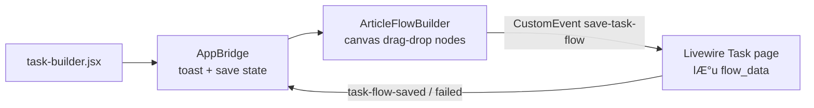
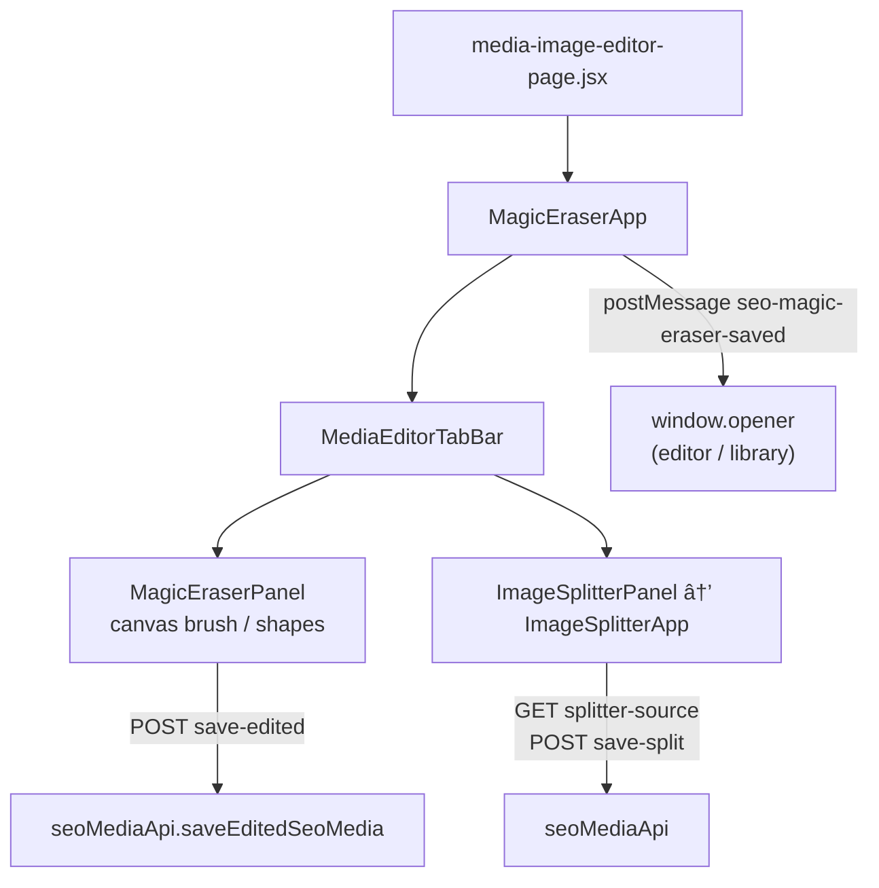
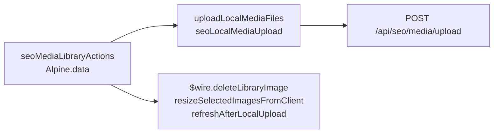
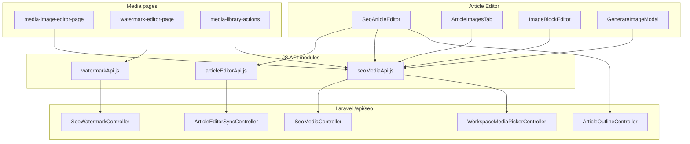

> Status: Historical
> Not canonical
> Archived on: 2026-08-01
> Superseded by: ../../modules/ARTICLE_EDITOR.md
> Purpose: implementation history only
# SeoContentAi — Bản đồ Frontend (React / Vite / Alpine)

[← Quay lại Bản đồ tổng](SUPER_MAP_INDEX.md)

**Liên quan backend:** [React Editor](MAP_SEO_EDITOR.md) · [Media / Watermark](MAP_SEO_MEDIA.md) · [Content Projects](MAP_SEO_PROJECTS.md) · [Settings & AI](MAP_SEO_SETTINGS.md) · [Audit / List](MAP_SEO_AUDIT.md)

> Quét từ `vite.config.js` + toàn bộ `app/Addons/SeoContentAi/resources/js/` (123 file, cập nhật 2026-07-10).  
> Alias Vite: `@seo-addon` → `app/Addons/SeoContentAi/resources/js`.  
> **Lưu ý:** `FRONTEND_MAP_RAW.txt` không có trong repo — cây thư mục dưới đây được sinh trực tiếp từ filesystem.

---

## 1. Tổng quan kiến trúc Frontend SEO

```mermaid
flowchart TB
    subgraph Vite["vite.config.js — laravel-vite-plugin input"]
        CORE["resources/js/app.js<br/>(core, không phải SEO)"]
        SEO_REACT["*.jsx React entry × 7"]
        SEO_JS["*.js Alpine/bridge × 4"]
        SEO_CSS["*.css bundle × 9"]
    end

    subgraph Host["Filament Blade / Livewire"]
        BLADE["edit-article, media-library,<br/>watermark-editor, task-workflow-builder, …"]
    end

    subgraph Bridge["Không dùng React Router / Context"]
        LW["Livewire $wire / callEditArticleLivewire"]
        WIN["window.__seo* globals + CustomEvent"]
        ALP["Alpine.data / Alpine.store"]
        LS["localStorage utils"]
    end

    subgraph API["Laravel REST /api/seo/*"]
        MEDIA["/api/seo/media/*"]
        WM["/api/seo/watermark/*"]
        ART["/api/seo/articles/*"]
        PICKER["workspace-picker, media-picker, seo-preview"]
    end

    Vite --> Host
    Host --> Bridge
    SEO_REACT & SEO_JS --> API
    Bridge --> LW
```



| Đặc điểm | Giá trị |
|----------|---------|
| **Không có** | React Router, Redux, Zustand, React Context toàn cục |
| **State chính** | `useState` / `useRef` trong component hub; bootstrap JSON từ Blade; Livewire snapshot |
| **Giao tiếp chéo** | `window.dispatchEvent(CustomEvent)`, `Livewire.on`, `postMessage` (media editor popup) |
| **Persist client** | `articleEditorStorage`, `articleMediaPickerCache`, `articleProductAlbumStorage`, … |
| **Chunking build** | `manualChunks`: `react-vendor`, `tiptap-vendor`, `vendor` |

---

## 2. Vite entry points (`vite.config.js`)

### 2.1 React / JS applications (có logic UI)

| # | Vite input | Loại | Entry file | Host Blade / Route |
|---|------------|------|------------|-------------------|
| 1 | `task-builder.jsx` | **React** | `resources/js/task-builder.jsx` | `task-workflow-builder.blade.php` → `#seo-task-workflow-builder-root` |
| 2 | `article-editor.jsx` | **React** (multi-root) | `resources/js/article-editor.jsx` | `edit-article.blade.php` → `#seo-article-editor-root` + 4 root phụ |
| 3 | `article-seo-preview.jsx` | **React** (lazy mount) | `article-seo-preview.jsx` → `articleSeoPreviewMount.jsx` | `list-articles.blade.php` — modal SEO point |
| 4 | `keyword-detail-panel.jsx` | **Vanilla JS** | `keyword-detail-panel.jsx` → `keywordDetailPanel.js` | `list-keywords.blade.php` — drawer chi tiết keyword |
| 5 | `keyword-destinations-modal.jsx` | **Vanilla JS** | `keyword-destinations-modal.jsx` → `keywordDestinationsListModal.js` | Keywords — modal destinations |
| 6 | `watermark-editor-page.jsx` | **React** | `watermark-editor-page.jsx` | `watermark-editor.blade.php` → `/seo/watermark-editor` |
| 7 | `media-image-editor-page.jsx` | **React** | `media-image-editor-page.jsx` | `media-image-editor.blade.php` → `/seo/media-image-editor` |
| 8 | `article-media-picker-cache-bootstrap.js` | **Alpine bridge** | cache + workspace picker factory | `edit-article`, `workspace-media-picker.blade.php` |
| 9 | `media-library-actions.js` | **Alpine** | `seoMediaLibraryActions` | `media-library.blade.php` |
| 10 | `project-run-queue.js` | **Alpine** | `seoProjectRunQueue` + store `seoRunQueue` | `view-project-run.blade.php` |
| 11 | `automation-workflow-viewer.jsx` | **React** (read-only) | `automation-workflow-viewer.jsx` → `AutomationWorkflowViewerApp` | Admin `/admin/automation/flows` — list ~17rem \| canvas `flex-1` `min-h: calc(100vh-…)` \| inspector ~20rem (collapse); CSS `automation-workflow-viewer.css` |

### 2.2 CSS-only bundles (không mount React)

| Vite input | Dùng tại |
|------------|----------|
| `article-edit-page.css` | EditArticle layout |
| `media-library.css` | Media Library, Image Processing, test-prompt |
| `image-splitter.css` | Editor + media-image-editor (import kèm JSX) |
| `watermark-editor.css` | Watermark editor page |
| `image-optimization-settings.css` | Image optimization settings |
| `ai-result.css` | Blade component `ai-result` |
| `project-run-step.css` | Project run step views |
| `project-run-queue.css` | Project run queue |
| `global-ai-chat.css` | Global AI chat component |

### 2.3 File JS/JSX **không** đăng ký Vite (legacy / orphan)

| File | Ghi chú |
|------|---------|
| `magic-eraser-mount.jsx` | Modal eraser cũ (`seo-open-magic-eraser`); thay bằng trang `/seo/media-image-editor` |
| `media-library-page.jsx` | React `MediaLibraryTools` cũ; Media Library hiện dùng Livewire + `media-library-actions.js` |
| `components/WatermarkConfigPanel.jsx` | Panel cấu hình WM cũ (type/text/logo); không mount trên Filament page — thay bằng design suite + batch page |
| `components/ArticleDomainWidgetsSidebar.jsx` | Component tồn tại nhưng **không** được import/mount ở entry nào |

---

## 3. Cây thư mục `resources/js/`

```
resources/js/
├── article-editor.jsx              # Hub EditArticle — 5 React roots
├── article-seo-preview.jsx         # Boot modal SEO list
├── articleSeoPreviewMount.jsx      # mount SeoScorePanel trong modal
├── articleSeoListModal.js
├── articleListTableLoading.js
├── article-media-picker-cache-bootstrap.js
├── task-builder.jsx
├── watermark-editor-page.jsx
├── media-image-editor-page.jsx
├── media-library-actions.js
├── project-run-queue.js
├── keyword-detail-panel.jsx
├── keywordDetailPanel.js
├── keyword-destinations-modal.jsx
├── keywordDestinationsListModal.js
├── magic-eraser-mount.jsx          # (orphan)
├── media-library-page.jsx          # (orphan)
├── components/                     # 50+ React components
│   ├── SeoArticleEditor.jsx        # Hub editor ~8.7k dòng
│   ├── ArticleFlowBuilder.jsx      # Task workflow canvas
│   ├── WatermarkEditorApp.jsx      # Watermark design suite
│   ├── MagicEraserApp.jsx          # Eraser + splitter tabs
│   ├── ImageSplitterPanel.jsx → ImageSplitterApp.jsx
│   ├── ArticleImagesTab.jsx
│   ├── GenerateImageModal.jsx
│   ├── ArticleFaqEditor.jsx
| `keywordReviewApi.js` | `utils/keywordReviewApi.js` | `ensureKeywordForReview` (`POST /api/seo/keywords/ensure-for-review`); review/restore (`POST /api/seo/keywords/{id}/review|restore`, `reason_id` hoặc `custom_reason_text`) |
| `keywordReviewReasonUtils.js` | `utils/keywordReviewReasonUtils.js` | Xếp hạng/lọc lý do + recent reason (`sessionStorage`) cho popover |
| `KeywordReviewPopover.jsx` | `components/KeywordReviewPopover.jsx` | Popover inline cạnh dòng gợi ý: 2 nút warning/danger; `ArticleLinksSidebar.openReviewPopover` đảm bảo `keyword_id` (ensure nếu thiếu) trước khi mở |
│   ├── ArticleAiChatPanel.jsx
│   ├── MediaLibraryTools.jsx       # (chỉ qua orphan entry)
│   ├── ImageWatermarkEditor.jsx    # Canvas WM đơn giản (modal cũ)
│   ├── WatermarkConfigPanel.jsx
│   ├── SeoSelect.jsx               # Shared select UI
│   ├── imageMeta/                  # ImageMetaFormFields, ImageMetaEditForm
│   └── watermark*.js               # Draw utils, position, CTA icons
├── utils/                          # API clients, storage, TipTap helpers
│   ├── seoMediaApi.js              # /api/seo/media/*
│   ├── watermarkApi.js             # /api/seo/watermark/*
│   ├── articleEditorApi.js         # save / sync-wp / finishArticleSyncFromApi
│   ├── articleOperationTracker.js  # overlay poll + reload (WP sync, slug fix)
│   ├── seoArticleApi.js            # fetch wrapper + CSRF
│   ├── articleEditorLivewire.js    # callEditArticleLivewire bridge
│   ├── seoAssistantNavigator.js    # Alpine Assistant Dock (Edit Article sidebar)
│   ├── seoWorkspaceMediaPicker.js  # Alpine workspace picker
│   └── … (40+ util modules)
├── hooks/
│   ├── useArticleEditorHistory.js
│   └── useDebouncedCallback.js
├── extensions/
│   └── imageMarkerExtension.js
└── data/
    ├── emojiCatalog.js
    └── google-fonts.json
```

---

## 4. Ứng dụng React / JS theo từng entry

### 4.1 Article Editor Suite — `article-editor.jsx`

**Filament:** `EditArticle.php` · **Route:** `/seo/articles/{id}/edit`  
**Chi tiết backend:** [MAP_SEO_EDITOR.md](MAP_SEO_EDITOR.md)

#### Mount graph (5 React roots)

```mermaid
flowchart TB
    ENTRY["article-editor.jsx<br/>mountArticleEditorPage()"]

    ENTRY --> EDITOR["SeoArticleEditor<br/>#seo-article-editor-root"]
    ENTRY --> FAQ["ArticleFaqEditor<br/>#seo-article-faq-root"]
    ENTRY --> LINKS["ArticleLinksSidebar<br/>#seo-article-links-root"]
    ENTRY --> LAUNCHER["ArticleAiFloatingLauncher<br/>#seo-article-ai-launcher-root"]
    ENTRY --> CHAT["ArticleAiChatPanel<br/>#seo-article-ai-chat-root"]

    EDITOR --> PORTAL_SEO["createPortal → SeoScorePanel<br/>#seo-article-seo-assistant-root"]
    EDITOR --> PORTAL_IMG["createPortal → ArticleImagesTab<br/>#seo-article-image-assistant-root"]
    EDITOR --> PORTAL_REV["createPortal → ArticleReviewsTab<br/>#seo-article-reviews-assistant-root"]
    EDITOR --> MODAL["GenerateImageModal"]
    EDITOR --> TIPTAP["TipTap BlockEditor / ImageBlockEditor"]
```



#### Component hierarchy (SeoArticleEditor)

| Lớp | Component | Vai trò |
|-----|-----------|---------|
| Left rail | `ArticleGoogleSerpPreview` | SERP preview, focus keyword; modal SEO + nút AI Prompt Hook meta description |
| Title toolbar | `articleTitlePromptHook.js` (mount từ `article-editor.jsx`) | Nút AI gợi ý tiêu đề cạnh `.wp-title-input` |
| Left rail | `ArticleOutlineTab` | Outline tree, REST outline API |
| Left rail | `article-editor-shortcuts-rail.blade.php` → host `[data-seo-outline-shortcuts-host]` | Keyboard shortcuts dưới Outline; Prev/Next đổi nhóm; `mountShortcutsBelowOutline` trong `articleEditorHeaderActions.js` |
| Top bar | `article-editor-page-actions.blade.php` | Primary: **Save → Sync WP → Preview (split WP/nội bộ) → Approve**; More: History, Prompts, Assign/Open project, Restore, Debug MD (icon+chữ), Delete. `EditArticle::getHeaderActions()` trống — UI More Blade |
| Center | `BlockFormatToolbar`, `BlockInsertMenu`, `LinkEditBubble` | TipTap formatting; delete paragraph trong `.seo-toolbar-end-actions` (`margin-left: auto`); link bubble tìm bài + **Phân vào Content Projects** |
| Center | `ImageBlockEditor`, `BlockImagesPanel` | Khối ảnh; `ImageBlockPickerBox` **Quick download** → `importSeoMediaFromUrl({ randomFilename: true })` |
| Overlay | `ArticleAiFloatingLauncher` (`#seo-article-ai-launcher-root`) | Click → `seo-article-ai-chat-open` (AI images & videos); không menu phụ |
| FAQ root | `ArticleFaqEditor` (`#seo-article-faq-root`) | FAQ bar: Generate / Import / Extract FAQ / Add; Extract disable tới khi có selection |
| Portal tabs | `ArticleImagesTab` | Quản lý ảnh bài, AI jobs, mở media editor; UI hàng: **Except** + menu `⋯` (`.seo-article-images-more-menu`) |
| Portal tabs | `SeoScorePanel` | Phân tích SEO client-side + violations |
| Portal tabs | `ArticleReviewsTab` | Product reviews local + WP: real/generated/pending/reviewed + **Target count** / **Missing**; Refresh / Create / Sync; `{count}` + **Tạo bình luận nhanh** + **Làm mới**; `StarRating` 1–5; Livewire `generateQuickPostReviews` / `refreshVirtualReviewsForEditor` |
| Modal | `GenerateImageModal` → `ImageSplitterPanel` | Tạo ảnh AI + split album |
| Overlay | `EditorBusyOverlay` | Lock UI khi heavy action |

#### State & persistence (không Context)

| Nguồn | Module / pattern | Dữ liệu |
|-------|------------------|---------|
| SSR bootstrap | `#seo-article-initial-*` JSON scripts | HTML, SEO, images, FAQs, settings |
| React local | `useState` trong `SeoArticleEditor` | blocks, tabs, analysis, modals |
| History | `useArticleEditorHistory` hook | undo/redo TipTap |
| localStorage | `articleEditorStorage`, `articleFeaturedImageStorage`, `articleProductAlbumStorage` | draft FAQ, featured, album |
| Window API | `window.__seoCollectEditorHeavyBundle`, `__seoExecuteHeavyArticleAction` | save/sync từ Filament header |
| Livewire | `callEditArticleLivewire(method, …)` | search links, persist album, WP slug rename, reviews refresh |
| Events | `seo-product-gallery-updated`, `virtual-reviews-updated`, `seo-open-generate-image-modal` | cross-widget sync |

#### Livewire methods gọi từ JS

| Method | Caller |
|--------|--------|
| `searchInternalLinkArticles` | `LinkEditBubble.jsx` — popup «Tìm bài viết (cùng domain)»; cùng `ArticleInternalLinkSearchService` tái dụng bởi content-keyword fallback |
| `POST .../editor/links/suggestions` | `ArticleLinksSidebar.jsx` — «Tạo gợi ý liên kết» (`mode=full`) / «Tạo gợi ý bổ sung» (`mode=fallback`); HTML qua event `seo-editor-document-html-request` ← `SeoArticleEditor` |
| `POST /api/seo/keywords/ensure-for-review` | `ArticleLinksSidebar.openReviewPopover` khi suggestion thiếu `keyword_id` (fallback phrase) — trước `KeywordReviewPopover` |
| `mountAction('assignKeywordAnchorToContentProject')` | `LinkEditBubble.jsx` — `anchorPhrase` từ text bôi đen editor (không lấy ô search) |
| `persistProductAlbumFromClient` | `articleProductAlbumStorage.js` |
| `renameAttachmentSlugsOnWordPress` | `SeoArticleEditor.jsx` |
| `refreshVirtualReviewsForEditor` | `SeoArticleEditor.jsx` → `ArticleReviewsTab` |
| `generateQuickPostReviews` | `SeoArticleEditor.jsx` → `ArticleReviewsTab` (quick create) |
| `mountEditArticleAction` | Filament header actions (qua `articleEditorLivewire.js`) |

#### Assistant Dock (Alpine — cùng bundle `article-editor.jsx`)

| Thành phần | Chi tiết |
|------------|----------|
| Blade | `edit-article.blade.php` → `.seo-assistant-host` + `.seo-assistant-dock` |
| Alpine | `seoAssistantNavigator()` — tab auto từ `data-assistant-widget*` |
| CSS | `article-editor.css` — sticky sidebar cột + dock `top: 0` trong scroll nội bộ |
| Chi tiết luồng | [MAP_SEO_EDITOR.md §2.5.4.1](MAP_SEO_EDITOR.md#2541-assistant-dock--sidebar-phải-edit-article-đã-implement) |

---

### 4.2 Task Workflow Builder — `task-builder.jsx`

**Filament:** Task Workflow Builder · **Root:** `#seo-task-workflow-builder-root`



| Thành phần | File | State |
|------------|------|-------|
| Entry + bridge | `task-builder.jsx` | `useState`: taskName, saving, toast |
| Canvas | `ArticleFlowBuilder.jsx` | nodes, edges, zoom — `useState` + `useRef`; Prompt node **không** chọn model (routing từ Settings → AI Advanced) |
| Theme/helpers | `flowTheme.js` | pure functions |
| Prompt list SSR | `window.__SEO_PROMPTS__` | từ Blade, không REST lúc mở |

**API:** Không gọi REST trực tiếp — persist qua Livewire event `save-task-flow`.

---

### 4.3 Watermark Editor Suite — `watermark-editor-page.jsx`

**Route:** `/seo/watermark-editor` (design suite) · `/seo/watermark-settings-page` (batch apply) · **Backend:** [MAP_SEO_MEDIA.md §2.4](MAP_SEO_MEDIA.md)

```mermaid
flowchart TB
    PAGE["watermark-editor-page.jsx"] --> APP["WatermarkEditorApp"]

    subgraph Config["Panel trái — design"]
        PAT["Pattern presets<br/>cta_button, classic_grid, …"]
        GC["GradientColorPicker"]
        PC["PreciseControl"]
        WMP["WatermarkMediaPicker"]
    end

    subgraph Preview["Panel phải"]
        CANVAS["HTML Canvas<br/>watermarkDrawUtils"]
        WOPP["WatermarkOverlayPreviewPanel"]
    end

    subgraph API["watermarkApi.js"]
        GET["GET /settings"]
        POST_S["POST /settings"]
        POST_M["POST /media/{id}/save"]
        POST_N["POST /save-new"]
    end

    APP --> Config & Preview
    APP --> API
```



| Component con | Vai trò |
|---------------|---------|
| `WatermarkEditorApp` | Hub state: pattern, colors, position, opacity, CTA text |
| `WatermarkOverlayPreviewPanel` | Preview multi-overlay export |
| `watermarkDrawUtils.js` | Vẽ pattern lên canvas |
| `watermarkOverlayExport.js` | Export blob variants cho lÆ°u settings |
| `WatermarkMediaPicker` | Chọn ảnh mẫu từ library |
| `ImageWatermarkEditor` | **Legacy** canvas đơn giản (dùng trong `MediaLibraryTools`, không qua Vite entry hiện tại) |
| `WatermarkConfigPanel` | **Legacy** — panel cấu hình WM cũ (không còn gắn Filament); dùng `WatermarkEditorApp` + `WatermarkSettingsPage` |

**Bootstrap:** `dataset` trên `#seo-watermark-editor-root` (`siteId`, `initialConfig`, `mediaSamples`, …).

---

### 4.4 Media Image Editor — `media-image-editor-page.jsx`

**Route:** `/seo/media-image-editor?media={id}&tab=eraser|splitter` · **Backend:** [MAP_SEO_MEDIA.md §2.2](MAP_SEO_MEDIA.md)



| Tab | Component | API |
|-----|-----------|-----|
| Eraser | `MagicEraserPanel` | `POST /api/seo/media/{id}/save-edited` |
| Splitter | `ImageSplitterApp` | `GET /api/seo/media/splitter-source`, `POST /api/seo/media/save-split` |

**Mở từ:** `ArticleImagesTab` (`buildMediaImageEditorUrl`), Media Library, `GenerateImageModal` (split inline, `canDeleteOriginal=false`).

---

### 4.5 Article SEO Preview Modal — `article-seo-preview.jsx`

| Layer | File | Hành vi |
|-------|------|---------|
| Boot | `article-seo-preview.jsx` | `DOMContentLoaded` + `livewire:navigated` |
| Modal logic | `articleSeoListModal.js` | Mở modal, fetch preview JSON |
| React mount | `articleSeoPreviewMount.jsx` | `SeoScorePanel` read-only |

**API:** `GET` route `seo.articles.seo-preview` — template `previewUrlTemplate` trong `list-articles.blade.php` (`/__ID__` → article id).

---

### 4.6 Keyword UI — `keyword-detail-panel.jsx` / `keyword-destinations-modal.jsx`

| Entry | Pattern | Livewire |
|-------|---------|----------|
| Detail drawer | Vanilla JS + DOM | `selectKeyword`, load panel qua `$wire` |
| Destinations modal | Vanilla JS modal | Livewire list keywords page |

**Không** gọi `/api/seo/*` — data qua Livewire Filament.

---

### 4.7 Media Library — `media-library-actions.js` (Alpine, không React)



| Hành động | Client | Backend |
|-----------|--------|---------|
| Upload local | `uploadSeoMediaFromFile` | `POST /api/seo/media/upload` |
| Xóa / resize batch | `$wire.*` | Livewire `MediaLibrary` page |
| Selection persist | `sessionStorage` key `seo-media-library:selected:{scope}` | — |

---

### 4.8 Project Run Queue — `project-run-queue.js` (Alpine)

| Thành phần | Vai trò |
|------------|---------|
| `Alpine.store('seoRunQueue')` | `isRunning`, `stopRequested`, `currentTaskId` |
| `Alpine.data('seoProjectRunQueue')` | Queue `taskIds`, bulk Article actions, generic step modal |
| Livewire | `ViewSeoProjectRun`: `retryWorkflowStep` (→ StepRerun), `previewBulkRerunByAction` / `bulkRerunByAction`, `previewBulkGenericStep` / `bulkRerunGenericStep`, `cancelWorkflowStep` |
| Bulk Article | `regenerate_outline` / `regenerate_article` / `regenerate_outline_and_article` + confirm modal |
| Generic step modal | `genericStepOpen` — **không** `window.prompt`; preview valid/invalid rồi serial rerun |
| `cancelWorkflowStep` | Chỉ xóa `[data-run-busy-step]` + reload khi `success && (cancelled>0 \|\| already_idle)`; không `applyItemFailure` hàng chính |
| Busy badge / row status | Blade `data-run-busy-step` + `row_status_*` từ `ContentProjectArticleRowStatusResolver` |

**Không** gọi REST — orchestration workflow qua Livewire. Không `$refresh` khi `seoRunQueue.isRunning`; `init()` bỏ qua nếu queue đang chạy (tránh re-init mất hàng). Chi tiết Phase 2.0/2.1: [MAP_SEO_PROJECTS.md](MAP_SEO_PROJECTS.md).

---

### 4.9 Workspace / Article Media Picker — `article-media-picker-cache-bootstrap.js`

| Global | Module |
|--------|--------|
| `window.__seoArticleMediaPickerCache` | `articleMediaPickerCache.js` |
| `window.__seoArticleMediaPickerCustomTabs` | `articleMediaPickerCustomTabs.js` |
| `window.__seoWorkspaceMediaPicker` | `createSeoWorkspaceMediaPicker()` |

**Picker REST (Alpine `fetch`):**

| Endpoint | Route name | Consumer |
|----------|------------|----------|
| `GET /api/seo/media/workspace-picker` | `seo.media.workspace-picker` | Global workspace picker, AI chat |
| `GET /seo/articles/{article}/media-picker` | `seo.articles.media-picker` | EditArticle modal (`media_picker_url` trong meta JSON) |

---

## 5. Bản đồ API Frontend → Laravel

### 5.1 `seoMediaApi.js` → `/api/seo/media/*`

| Export function | HTTP | Path | Component tiêu thụ chính |
|-----------------|------|------|--------------------------|
| `uploadSeoMediaFromFile` | POST | `/upload` | `media-library-actions`, clipboard paste |
| `importSeoMediaFromUrl` | POST | `/import-url` | `ImageBlockEditor` |
| `prepareImageEditorUrl` | POST | `/prepare-editor` | `ArticleImagesTab` |
| `applyWatermarkToImage` | POST | `/apply-watermark` | `ArticleImagesTab` |
| `saveEditedSeoMedia` | POST | `/{id}/save-edited` | `MagicEraserPanel` |
| `renameSeoMedia` | POST | `/{id}/rename` | `SeoArticleEditor` |
| `renameSeoMediaByUrl` | POST | `/rename-by-url` | `SeoArticleEditor` |
| `updateSeoMediaMeta` | POST | `/update-meta` | `SeoArticleEditor`, image meta panels |
| `fetchSplitterSource` | GET | `/splitter-source` | `ImageSplitterApp` |
| `saveSplitPiecesToLibrary` | POST | `/save-split` | `ImageSplitterApp` |
| `fetchArticleAiMediaJobs` | GET | `/article/{id}/ai-jobs` | `ArticleImagesTab` |
| `fetchSeoMediaStatus` | GET | `/{id}/status` | `GenerateImageModal` |
| `retryAiMediaGeneration` | POST | `/{id}/retry-generation` | `ArticleImagesTab` |
| `deleteAiMediaJob` | DELETE | `/{id}/ai-job` | `ArticleImagesTab` |
| `processClipboardImagePaste` | POST | `/upload` (implicit) | TipTap paste handler |
| `buildMediaImageEditorUrl` | — | navigates `/seo/media-image-editor` | `ArticleImagesTab` |

**Controller:** `SeoMediaController` · **Picker riêng:** `WorkspaceMediaPickerController`, `ArticleMediaPickerController`  
**Chi tiết pipeline:** [MAP_SEO_MEDIA.md §2.1](MAP_SEO_MEDIA.md)

### 5.2 `watermarkApi.js` → `/api/seo/watermark/*`

| Export function | HTTP | Path | Component |
|-----------------|------|------|-----------|
| `fetchWatermarkSettings` | GET | `/settings?site_id=` | `WatermarkEditorApp`, `MediaLibraryTools` |
| `saveWatermarkSettings` | POST | `/settings` | `WatermarkEditorApp` (design suite — bật `auto_watermark` khi lưu thiết kế) |
| `applyWatermarkBatch` | POST | `/batch` | Settings UI (batch) |
| `saveWatermarkedMedia` | POST | `/media/{id}/save` | `WatermarkEditorApp`, `ImageWatermarkEditor` |
| `saveNewWatermarkedImage` | POST | `/save-new` | `WatermarkEditorApp`, `ImageWatermarkEditor` |

**Controller:** `SeoWatermarkController`

### 5.3 `articleEditorApi.js` → `/api/seo/articles/*`

| Function | HTTP | Path | Trigger |
|----------|------|------|---------|
| `saveArticleViaApi` | POST | `/{article}/save` | Filament header Save, `__seoExecuteHeavyArticleAction` |
| `syncArticleToWordPressViaApi` | POST | `/{article}/sync-wp` | Filament header Sync WP |
| `fetchArticleOperationStatus` | GET | `/{article}/operation-status` | `articleOperationTracker.js` (poll) |

**Controller:** `ArticleEditorSyncController`, `ArticleEditorOperationController` · **Wrapper:** `seoArticleApi.js` (tự gắn `X-CSRF-TOKEN` cho POST/PUT/PATCH/DELETE + JSON)

### 5.4 Outline API (inline fetch)

| Path | Methods | File |
|------|---------|------|
| `/api/seo/articles/{id}/outline` | GET, POST | `ArticleOutlineTab.jsx`, `SeoArticleEditor.jsx` |
| `/api/seo/articles/{id}/outline/refresh` | POST | `ArticleOutlineTab.jsx` |
| `/api/seo/articles/{id}/outline/check-duplicates` | POST | `ArticleOutlineTab.jsx` |
| `/api/seo/articles/{id}/outline/{heading}` | PUT, DELETE | `ArticleOutlineTab.jsx` |
| `/api/seo/articles/{id}/outline/{heading}/generate` | POST | `ArticleOutlineTab.jsx` |

**Controller:** `ArticleOutlineController`

### 5.5 Preview & picker (không qua module `*Api.js` chuyên dụng)

| Route | Method | Client |
|-------|--------|--------|
| `seo.articles.seo-preview` | GET | `articleSeoListModal.js` |
| `seo.articles.media-picker` | GET | EditArticle Alpine modal (`seoWorkspaceMediaPicker` pattern) |
| `seo.media.workspace-picker` | GET | `seoWorkspaceMediaPicker.js` |

### 5.6 Sơ đồ data flow tổng hợp (media + editor)



---

## 6. Shared components & utilities

### 6.1 UI primitives (dùng chéo nhiều app)

| Component | Apps |
|-----------|------|
| `SeoSelect.jsx` | Editor, Task builder, Watermark, Generate modal |
| `GradientColorPicker`, `PreciseControl` | Watermark editor |
| `SeoScorePanel` | Editor portal, SEO preview modal |
| `ImageSplitterPanel` / `ImageSplitterApp` | Media editor page, Generate modal |
| `ArticleAssistantWidget` | Editor sidebar portals |

### 6.2 Hooks

| Hook | Dùng bởi |
|------|----------|
| `useArticleEditorHistory` | `SeoArticleEditor` — undo/redo |
| `useDebouncedCallback` | `SeoArticleEditor` — debounce analysis |

### 6.3 TipTap / Editor extensions

| Module | Vai trò |
|--------|---------|
| `editorExtensions.js` | Bundle TipTap extensions |
| `articleImageExtension.js` | Custom image node |
| `imageMarkerExtension.js` | Image markers |
| `editorHtmlUtils.js`, `editorSelectionUtils.js` | HTML transform / selection |

### 6.4 i18n client

`utils/i18n.js` — `t('key')` cho watermark strings và labels UI.

---

## 7. Custom events quan trọng

| Event | Publisher | Subscriber |
|-------|-----------|------------|
| `save-task-flow` | `ArticleFlowBuilder` | Livewire task page |
| `seo-open-generate-image-modal` | Editor / sidebar | `SeoArticleEditor` |
| `generate-article-image` | `ArticleAiChatPanel`, quick section | `SeoArticleEditor` → `requestGenerateArticleImage` |
| `article-ai-image-generated` | Livewire `EditArticle` (bridge `article-editor.jsx`) | `SeoArticleEditor` poll/replace placeholder |
| `article-ai-media-job-updated` | Poll / apply completed | `ArticleImagesTab` refresh jobs |
| `seo-open-workspace-media-picker` | Global AI chat | `seoWorkspaceMediaPicker` |
| `seo-product-gallery-updated` | `GenerateImageModal` | Alpine album box |
| `seo-magic-eraser-saved` | `media-image-editor-page` | `window.opener` |
| `seo-media-library-dom-refreshed` | Livewire media library | `media-library-actions` |
| `seo-article-editor-notify` | API save/sync | Filament notifications |
| `editor-html-collected` | TipTap collect | Alpine save handler |
| `seo-assistant-switch-panel` | `SeoArticleEditor` | `seoAssistantNavigator` (Assistant Dock) |
| `seo-assistant-navigator-badges` | `SeoArticleEditor`, `ArticleLinksSidebar` | Badge tab dock |
| `seo-assistant-link-section` | `seoAssistantNavigator` | `ArticleLinksSidebar` (FAQ/CTA filter) |
| `seo-assistant-widget-control` | `seoAssistantNavigator` | React sidebar widgets (`seo`, `images`, `links`, `reviews`) |
| `seo-sidebar-open-publish-tab` | Publish UI / shortcut | Alpine `syncOpen` + panel Publishing |

---

## 8. Blade ↔ Vite mapping (quick reference)

| Filament view | Vite bundle |
|---------------|-------------|
| `edit-article.blade.php` | `article-media-picker-cache-bootstrap.js`, `article-edit-page.css`, `article-editor.jsx` |
| `list-articles.blade.php` | `article-seo-preview.jsx` |
| `list-keywords.blade.php` | `keyword-detail-panel.jsx` |
| `task-workflow-builder.blade.php` | `task-builder.jsx` |
| `watermark-editor.blade.php` | `watermark-editor-page.jsx` |
| `media-image-editor.blade.php` | `media-image-editor-page.jsx` |
| `media-library.blade.php` | `media-library.css`, `media-library-actions.js` |
| `image-processing.blade.php` | `media-library.css` |
| `view-project-run.blade.php` | `project-run-queue.css`, `project-run-queue.js` |
| `workspace-media-picker.blade.php` | `article-media-picker-cache-bootstrap.js` |
| `global-ai-chat.blade.php` | `global-ai-chat.css` |

---

## 9. Hướng dẫn prompt Cursor — Frontend SEO

```
Vite entries: vite.config.js → app/Addons/SeoContentAi/resources/js/*.jsx
Alias: @seo-addon → resources/js (import nội bộ addon).

Editor hub: article-editor.jsx → SeoArticleEditor.jsx (TipTap, multi-root, Livewire bridge).
Media API client: utils/seoMediaApi.js → SeoMediaController.
Watermark client: utils/watermarkApi.js → SeoWatermarkController.
Save/Sync: utils/articleEditorApi.js → ArticleEditorSyncController.
Livewire bridge: utils/articleEditorLivewire.js → callEditArticleLivewire.

Media editor page: media-image-editor-page.jsx → MagicEraserApp.
Watermark page: watermark-editor-page.jsx → WatermarkEditorApp.
Task canvas: task-builder.jsx → ArticleFlowBuilder.jsx.

Không thêm React Router/Context — theo pattern bootstrap JSON + window events + Livewire.
Select UI: SeoSelect.jsx (React), x-select (Blade).
Sau đổi JS/CSS: npm run build + kiểm tra vite.config.js input nếu thêm entry mới.

Backend maps: MAP_SEO_EDITOR.md, MAP_SEO_MEDIA.md, MAP_SEO_PROJECTS.md.
```

---

## 10. Verify sau thay đổi Frontend

```bash
# Build assets
npm run build

# Test PHP liên quan API editor/sync (nếu đổi contract)
php artisan test app/Addons/SeoContentAi/tests/Unit/ArticleWpSyncQueueServiceTest.php
php artisan test app/Addons/SeoContentAi/tests --filter=Media
```

| Thay đổi | Kiểm tra thủ công |
|----------|-------------------|
| `article-editor.jsx` | Mở EditArticle — 5 roots mount, save/sync header |
| `seoMediaApi.js` | Upload library, eraser save, splitter |
| `watermark-editor-page.jsx` | Lưu settings + save ảnh WM |
| `media-library-actions.js` | Chọn batch, upload, xóa |
| Entry mới | Thêm vào `vite.config.js` `input[]` + `@vite` trong Blade |
