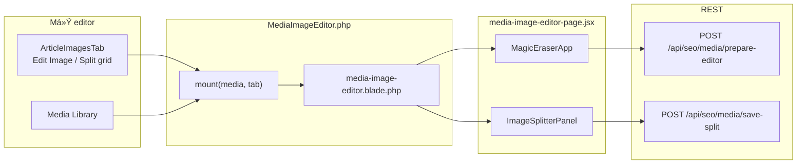

> Status: Historical
> Not canonical
> Archived on: 2026-08-01
> Superseded by: ../../modules/MEDIA_AND_GALLERY.md
> Purpose: implementation history only
# SeoContentAi — Media API & Thư viện ảnh

[← Quay lại Bản đồ tổng](SUPER_MAP_INDEX.md)

**Liên quan:** [React Editor](MAP_SEO_EDITOR.md) · [Content Projects](MAP_SEO_PROJECTS.md)

---

## 2.1 Media API (`/api/seo/media/*`)

```mermaid
flowchart TB
    subgraph Client["React / Browser"]
        SEOAPI["seoMediaApi.js<br/>fetch + FormData + CSRF"]
        EDITOR["SeoArticleEditor.jsx<br/>renameSeoMedia, updateSeoMediaMeta"]
    end

    subgraph Middleware["Middleware Stack"]
        AUTH["Authenticate + CheckMainRole"]
        DBBOOT["SetDynamicSeoDatabase<br/>→ SeoDatabaseRequestBootstrap"]
        CTX["SeoConnectionContext<br/>hash / site_id"]
    end

    subgraph Routes["SeoPanelProvider routes"]
        R_UPLOAD["POST /api/seo/media/upload"]
        R_IMPORT["POST /api/seo/media/import-url"]
        R_RENAME["POST /api/seo/media/rename-by-url"]
        R_META["POST /api/seo/media/update-meta"]
        R_SPLIT["POST /api/seo/media/save-split"]
        R_SPLIT_SRC["GET /api/seo/media/splitter-source"]
        R_PREP["POST /api/seo/media/prepare-editor"]
        R_WM["POST /api/seo/media/apply-watermark"]
        R_STATUS["GET /api/seo/media/{media}/status"]
        R_AI_JOBS["GET /api/seo/media/article/{article}/ai-jobs"]
        R_RETRY["POST /api/seo/media/{media}/retry-generation"]
        R_DEL_AI["DELETE /api/seo/media/{media}/ai-job"]
        R_RENAME_MEDIA["POST /api/seo/media/{media}/rename"]
        R_SAVE_EDITED["POST /api/seo/media/{media}/save-edited"]
        R_WP_PICKER["GET /api/seo/media/workspace-picker"]
    end

    subgraph Controller["SeoMediaController"]
        UPLOAD["upload()"]
        IMPORT["importFromUrl()<br/>random_filename? → storeFromRemoteUrl"]
        RENAME_URL["renameByUrl()"]
        META["updateMeta()"]
        SPLIT["saveSplit()"]
        SPLIT_SRC["splitterSource()"]
        PREP["prepareEditor()"]
        WM["applyWatermark()"]
        STATUS["status()"]
        AI_JOBS["articleAiJobs()"]
        RETRY["retryGeneration()"]
        DEL_AI["deleteAiJob()"]
        RENAME["rename()"]
        SAVE_EDITED["saveEditedImage()"]
        ACL["canAccessSite() / canAccessArticle()"]
    end

    subgraph Services["Services Layer"]
        STORAGE["SeoMediaStorageService<br/>storeUpload, storeFromRemoteUrl"]
        IMGOPT["SeoImageOptimizationService<br/>processUpload, processBinary,<br/>prepareWordPressUploadFile"]
        PIPELINE["SeoImagePipeline<br/>resize + encode<br/>Imagick native → Intervention"]
        RESIZE["SeoMediaResizeService<br/>resizeLocal, resizeBinary"]
        MATH["SeoImageResizeMath<br/>dimensions + progressive steps"]
        DRIVER["ImageDriverResolver<br/>app/Support — imagick/gd"]
        WM_SVC["SeoWatermarkService<br/>applyToMediaIfEnabled"]
        SPLIT_SVC["SeoImageSplitterService"]
        URL_RES["SeoMediaUrlImportResolverService"]
        PATH["SeoMediaPathAllocator"]
        HIST["SeoMediaProcessingHistoryService"]
    end

    subgraph DB["omi_seo_ai"]
        T_MEDIA["seo_media"]
        T_META["seo_media_meta"]
        T_WM["seo_watermark_settings"]
        T_HIST["seo_media_processing_history"]
        T_IMG_OPT["seo_image_optimization_settings"]
        T_WP_BACKUP["seo_wp_media_backups"]
        T_WP_EDITED["seo_wp_media_edited_pending"]
    end

    subgraph Core["Core mysql (cross-DB)"]
        SITE["sites"]
    end

    SEOAPI --> R_UPLOAD & R_IMPORT & R_RENAME & R_META & R_SPLIT & R_SPLIT_SRC & R_PREP & R_WM & R_STATUS & R_AI_JOBS & R_RETRY & R_DEL_AI & R_RENAME_MEDIA & R_SAVE_EDITED
    EDITOR --> SEOAPI

    R_UPLOAD & R_IMPORT & R_RENAME & R_META & R_SPLIT & R_SPLIT_SRC & R_PREP & R_WM & R_STATUS & R_AI_JOBS & R_RETRY & R_DEL_AI & R_RENAME_MEDIA & R_SAVE_EDITED --> AUTH --> DBBOOT --> CTX
    CTX --> UPLOAD & IMPORT & RENAME_URL & META & SPLIT & SPLIT_SRC & PREP & WM & STATUS & AI_JOBS & RETRY & DEL_AI & RENAME & SAVE_EDITED
    UPLOAD & IMPORT & RENAME_URL --> ACL
    ACL --> SITE

    UPLOAD --> STORAGE
    IMPORT --> URL_RES --> STORAGE
    STORAGE --> IMGOPT --> WM_SVC
    IMGOPT --> PIPELINE
    RESIZE --> PIPELINE
    PIPELINE --> MATH
    PIPELINE --> DRIVER
    STORAGE --> PATH
    SPLIT --> SPLIT_SVC --> STORAGE
    WM --> WM_SVC
    STATUS --> HIST
    RETRY --> AI_JOBS

    STORAGE --> T_MEDIA
    STORAGE --> T_META
    WM_SVC --> T_WM
    HIST --> T_HIST
```



**Trace MCP (`upload` outbound, depth 4):** `SeoMediaController.upload` → `SeoMediaStorageService.storeUpload` → `SeoImageOptimizationService.processUpload` → `processOriginalBytes` (temp source → encode temp out → `SeoConvertedImageValidator.validate`) → `SeoWatermarkService.applyToMediaIfEnabled` → `SeoMedia::create`.

**Clipboard Ctrl+V (`source=clipboard`):** `storeUpload` truyền `$randomFilename=true` → `processUpload` slug `paste-{16 hex}` (không dùng tên OS `image.png`) — tránh URL trùng sau xóa ảnh cũ → browser cache ảnh cũ. Import URL vẫn dùng body `random_filename` → slug `import-{hex}`.

**Validate sau convert (`SeoConvertedImageValidator` + `ImageContentSignature`):** dùng để **chọn** WebP vs fallback — không chặn sync WordPress nếu ảnh gốc còn decode được. Reject WebP blank/collapsed → fallback original. Upload paste: nguồn undecodeable → không tạo `seo_media`.

**Imagick encode:** bỏ `ALPHACHANNEL_ACTIVATE` (tránh WebP alpha=0). Fresh decode mỗi attempt.

**Imagick pixel sample:** `ImagickPixelColor::normalized()` bọc `ImagickPixel::getColor()` để tương thích extension mới (`int $normalized`) và cũ (`bool $normalized`); tránh `getColor(true)` làm fail encode rồi kéo dài sync WP.

**WP upload:** WebP ưu tiên; fail → fallback gốc/compress; **không** return null chỉ vì WebP fail hoặc >100KB. `diagnoseLocalMedia` chỉ cho repair dữ liệu cũ — không bắt buộc trước sync.

**Trace resize (Media Library / workflow):** `SeoMediaLibraryImageActionService` hoặc `PromptPostProcessingApplyService` → `SeoMediaResizeService.resizeLocal|resizeBinary` → `SeoImagePipeline.resizeFile`.

**Trace đồng bộ WP:** `WordPressArticleSyncService.prepareEditorSyncPayload` → `WordPressLocalMediaSyncService.syncHtml` → `syncMedia` → `SeoImageOptimizationService.prepareWordPressUploadFile` → `POST …/attachments/import` hoặc `…/replace-binary` (plugin **≥ 1.0.50** đổi extension sang `.webp` khi mime `image/webp`) — **không ghi đè file PNG/JPG gốc** trên disk Laravel.

**File upload WordPress (`prepareWordPressUploadFile`):**
1. WebP hợp lệ (ưu tiên) → dùng WebP; >100KB thì ladder shrink; vẫn lớn → vẫn dùng WebP hợp lệ + log `SEO_MEDIA_FALLBACK_OVER_TARGET_SIZE` (không chặn sync).
2. WebP blank/fail → log `SEO_MEDIA_WEBP_VALIDATION_FAILED` + `SEO_MEDIA_FALLBACK_FROM_ORIGINAL` → **không** return null.
3. Fallback: original ≤100KB → dùng gốc; original lớn → `ensureLocalOptimizedUploadCopy` (fresh decode, format gốc rồi JPEG) → bản nhỏ nhất hợp lệ kể cả >100KB.
4. Chỉ `null` khi file gốc thiếu / undecodeable (`getimagesize` fail).
5. Log sync: `SEO_MEDIA_SYNC_CONTINUED_WITH_FALLBACK`, `SEO_MEDIA_FALLBACK_COMPRESSED`.

| Ưu tiên | Điều kiện | File |
|---------|-----------|------|
| 1 | WebP OK | Sibling `.webp` (shrink nếu cần; >100KB vẫn dùng nếu hợp lệ) |
| 2 | WebP fail, gốc ≤100KB | File gốc |
| 3 | Gốc >100KB | `-wp-upload.{ext}` best-effort |
| 4 | Compress fail | File gốc (**vẫn sync**) |

**`syncHtml` — tránh import trùng (mỗi lượt sync):**

1. Quét `` local → ưu tiên `data-seo-media-id` (không chỉ lookup theo `path`).
2. Mỗi `seo_media.id` chỉ gọi `syncMedia` **một lần** trong lượt (`$syncedThisPass`).
3. Vòng `applyWpUrlsToSeoMediaImages`: nếu ảnh đã sync trong lượt → chỉ patch `src` từ cache, **không** `forgetMediaCache` + re-import.

**WebP backfill** (`syncWebpBackfillMediaForArticle`, sau `completeEditorSyncResponse`):

Chỉ chạy khi **bản WebP local thật sự dùng được** (`hasUsableLocalWebpCopy`). **Không** backfill khi đã fallback JPEG (`hasPersistentOptimizedUploadFallback` — file `-wp-upload.jpg` tồn tại): tránh vòng lặp “URL WP là JPG → sync lại → import attachment mới” (nguyên nhân 3 file WP cho 2 ảnh bài).

| Hàm | Khi nào `true` |
|-----|----------------|
| `needsWordPressWebpBackfill` | `auto_convert_webp` + file local hợp lệ + sibling `.webp` hợp lệ + URL WP chưa `.webp` + **không** có `-wp-upload.jpg` |
| `hasPersistentOptimizedUploadFallback` | Sibling `-wp-upload.{jpg\|png\|…}` hợp lệ (signature OK) |

**Attachment WP đã xóa thủ công:** `syncMedia` thấy `wp_attachment_id > 0` nhưng `fetchWordPressAttachmentUrl` rỗng → clear `wp_attachment_id` / `wp_synced_at` → **import mới** (không cố `replace-binary` lên ID chết).

**Ảnh local sau sync:** Không set `status=trash`. Chỉ xóa local khi **Reviewed** (`ArticleResource::markArticleReviewed` → `deleteLocalMediaForArticle`). Ảnh `trash` được restore `completed` khi sync lại.

**Workspace Picker route** (`GET /api/seo/media/workspace-picker`): Xử lý bởi `WorkspaceMediaPickerController` riêng, không phải `SeoMediaController`.

### SeoMediaBuilder

`SeoMedia` override `newEloquentBuilder()` → `SeoMediaBuilder`. `where`/`update` trên field meta được route sang `seo_media_meta`.

---

## 2.1.1 Pipeline resize & encode ảnh

Pipeline trung tâm cho mọi thao tác resize/encode trong addon SEO. Thay thế `Intervention::scaleDown()` trực tiếp — ưu tiên **native Imagick** (Lanczos, sRGB, progressive scale, unsharp mask), fallback **Intervention Image** (driver Imagick hoặc GD).

```mermaid
flowchart TB
    subgraph Entry["Điểm gọi"]
        UP["processUpload / processBinary"]
        RL["resizeLocal / resizeBinary"]
        WP["prepareWordPressUploadFile"]
        LIM["applyMaxDimensions"]
    end

    subgraph Opt["SeoImageOptimizationService"]
        CFG["SeoImageOptimizationSetting<br/>max_width/height, quality, auto_convert_webp"]
    end

    subgraph Pipe["SeoImagePipeline"]
        DIM["SeoImageResizeMath<br/>outputDimensions, progressiveScaleSteps"]
        TRY_I["tryResizeWithImagick / tryEncodeImagickSourceToPath"]
        ENC_DST["encodeSourceToPath<br/>source → dest đúng extension"]
        FALL["resizeWithIntervention / encode fallback"]
    end

    subgraph Driver["ImageDriverResolver (core)"]
        IMAGICK["supportsImagick()"]
        GD["supportsGd()"]
        ENV["env IMAGE_DRIVER (optional)"]
    end

    subgraph Out["Kết quả"]
        LOCAL["Disk local: PNG chủ đạo<br/>lossless, giữ alpha"]
        WP_OUT["Upload WP: .webp hoặc -wp-upload.jpg<br/>sibling persistent, gốc không đổi"]
    end

    UP & LIM --> CFG --> Pipe
    RL --> Pipe
    WP --> CFG --> Pipe
    Pipe --> DIM
    TRY_I -->|"extension_loaded('imagick')"| IMAGICK
    TRY_I -->|"catch Throwable"| FALL
    FALL --> ENV --> IMAGICK & GD
    UP & RL & LIM --> LOCAL
    WP --> WP_OUT
```



| Thành phần | File | Vai trò |
|------------|------|---------|
| Pipeline | `Support/SeoImagePipeline.php` | `resizeFile`, `encodeFile`, `encodeSourceToPath` (Imagick coalesce + alpha), `applyMaxDimensions`; log driver qua `lastDriver()` |
| Validate convert | `Support/SeoConvertedImageValidator.php`, `ImageContentSignature.php`, `ImageContentSignatureSampler.php` | Signature source↔output; `fully_transparent_canvas` / `content_collapsed_*` |
| Imagick pixel compat | `Support/ImagickPixelColor.php` | `normalized()` gọi `getColor(1)` trước, fallback `getColor(true)` cho Imagick cũ; dùng trong pipeline encode + signature sampler |
| Pipeline encode | `Support/SeoImagePipeline.php` | Bỏ `ALPHACHANNEL_ACTIVATE`; assert visible trước flatten; fresh decode mỗi encode |
| Toán resize | `Support/SeoImageResizeMath.php` | Một chiều (width **hoặc** height); upscale ~1.5×/bước; downscale >2× chia ~50%/bước |
| Driver | `app/Support/ImageDriverResolver.php` | `supportsImagick()`, `supportsGd()`, `shouldUseNativeImagickPipeline()`; Intervention ưu tiên Imagick |
| Tối ưu + upload | `Services/SeoImageOptimizationService.php` | `processUpload`/`processBinary` → `processOriginalBytes` (transactional); `prepareWordPressUploadFile`, `ensureLocalWebpCopy`, `ensureLocalWebpUnderMaxBytes`, `validateConvertedImage`; log `SEO_MEDIA_WEBP_*` / `SEO_MEDIA_SOURCE_DECODE_FAILED` |
| Resize thủ công | `Services/SeoMediaResizeService.php` | `resizeLocal` (ghi đè file `public`), `resizeBinary` (in-memory / workflow) |
| Media Library UI | `Services/SeoMediaLibraryImageActionService.php` | Quick resize → `resizeLocal` |
| Post-processing | `Services/PromptPostProcessingApplyService.php` | Quick Split N×N từ snapshot `quick_split` + `QuickSplitCanvasValidator`; fail-safe giữ ảnh gốc; resize child sau split |
| Runtime output mode | `Services/ImageOutputModePromptInjector.php` | Block `[IMAGE_OUTPUT_MODE_*]` khi compile image prompt (không DB Hook) |
| Config normalize | `Support/PromptPostProcessing.php` | `split_grid_size` (legacy rows/cols → square) |
| Sync WP | `Services/WordPressLocalMediaSyncService.php` | `syncHtml`, `syncMedia`, `syncWebpBackfillMediaForArticle`, `prepareWordPressUploadFile` trÆ°á»›c khi push attachment |

### Chiến lược định dạng

| Giai đoạn | Định dạng | Ghi chú |
|-----------|-----------|---------|
| Lưu local (upload, import, save-edited, resize) | **PNG** chủ đạo | `normalizeExtension` fallback `png`; Imagick PNG compression level 3, quality 100 |
| Đồng bộ WordPress | **WebP** khi encode OK và ≤ 100KB | Sibling `{basename}.webp`. Ladder long-edge nếu >100KB. **Fallback:** original ≤100KB → `-wp-upload.{origExt}` → JPEG chỉ khi cần size. **Backfill:** chỉ sibling `.webp` hợp lệ. Plugin **≥ 1.0.50**. |
| JPEG / GIF / WebP | Hỗ trợ khi nguồn yêu cầu | Encode quality từ `SeoImageOptimizationSetting.quality` (mặc định pipeline 95 qua `ImageDriverResolver::ENCODE_QUALITY`) |

### Native Imagick (khi có extension)

1. `transformImageColorspace(SRGB)` (không dùng `setImageColorspace` — dễ WebP blank); PNG/WebP giữ alpha; multi-frame `coalesceImages`.
2. `progressiveScaleSteps` — nhiều bước Lanczos thay vì một lần thu/phóng lớn.
3. `unsharpMaskImage` sau upscale (mạnh) hoặc downscale nhẹ.
4. `try/catch` — lỗi Imagick → log warning → Intervention fallback.
5. Sau encode: `SeoConvertedImageValidator` — signature source↔output; reject transparent/collapsed.

### Fallback Intervention

- Driver: `ImageDriverResolver::interventionDriverClass()` — Imagick nếu có, không thì GD.
- Cùng progressive steps + `sharpen()` tương ứng upscale/downscale.
- Không có imagick **và** gd → `RuntimeException` khi resolve driver.

### Cảnh báo Dashboard

`Filament/Pages/Dashboard.php` → `mount()` → `notifyImageDriverStatus()`:

| Điều kiện | Mức | i18n key |
|-----------|-----|----------|
| Thiếu Imagick, còn GD | `warning` | `dashboard.imagick_missing_*` |
| Không có imagick và gd | `danger` | `dashboard.image_driver_missing_*` |

**Lưu ý hosting:** Imagick phải bật cho **PHP-FPM** (không chỉ CLI). `Imagick::queryFormats()` có `WEBP` nhưng thiếu `libwebp` runtime vẫn có thể fail encode → hệ thống tự fallback JPEG. Sau khi bật extension: `php artisan config:clear`.

### Test liên quan

| Test | Phạm vi |
|------|---------|
| `tests/Unit/SeoImageResizeMathTest.php` | `outputDimensions`, `progressiveUpscaleSteps`, `progressiveScaleSteps` |
| `tests/Unit/ImageDriverResolverTest.php` | Driver preference, `hasAnyDriver` |
| `tests/Unit/SeoConvertedImageValidatorTest.php` | Transparent blank; content collapse black/white vs source; solid color source OK; logo alpha OK |
| `tests/Unit/SeoImageOptimizationServiceTest.php` | WebP/original/JPEG fallback, ladder, block blank, diagnose, immutable source, PNG bytes≠`.webp` |

---

## Hướng dẫn prompt Cursor — Upload / thư viện / watermark

```
Route: SeoPanelProvider.php prefix api/seo/media.
Controller: Http/Controllers/SeoMediaController.php.
Services: SeoMediaStorageService, SeoImageOptimizationService, SeoMediaResizeService, SeoWatermarkService, **SeoMediaUrlReplacementService**, **SeoMediaArticleSlugFixService**.
Pipeline: Support/SeoImagePipeline.php + Support/SeoImageResizeMath.php.
Driver: app/Support/ImageDriverResolver.php (imagick/gd, env IMAGE_DRIVER).
Model/Query: Models/SeoMedia.php + Models/SeoMediaBuilder.php (meta routing).
Frontend: seoMediaApi.js, components/ArticleImagesTab.jsx, ImageBlockEditor.jsx, `utils/brokenImageGuard.js` (404 → placeholder tĩnh, không retry), `resolveArticleImageRemoveTarget` (disable Xóa khi ảnh stale không khớp).
Article Editor slug fix: `POST /api/seo/articles/{id}/fix-media-slugs` — batch rename + rewrite `article.body`/meta (`SeoMediaArticleSlugFixService`) trả `renamed[]` exact map. Single rename (`rename`/`rename-by-url`) nhận `article_id` → rewrite article refs. **WP Fix slug:** `renameAttachmentSlugsOnWordPress` cũng rewrite Laravel refs qua `SeoMediaUrlReplacementService` (stem + `-WxH`). **Fix slug all** (editor): save → rename → apply map vào TipTap/blocks → invalidate Gallery/Images/picker → save lại — chi tiết [docs/article-editor/image-slug-rename.md](article-editor/image-slug-rename.md). Không full page reload.
Watermark batch: POST /api/seo/watermark/* → SeoWatermarkController.
Image Optimization Settings: SeoImageOptimizationSetting model + ImageOptimizationSettings page.
AI Image Processing: ImageProcessingPage.php + /api/seo/media/prepare-editor.
WP Media Backup: Models SeoWpMediaBackup, SeoWpMediaEditedPending.
Dashboard: cảnh báo thiếu Imagick/GD khi mount Filament Dashboard.
```

### API surface (frontend)

| Client module | Endpoints |
|---------------|-----------|
| `seoMediaApi.js` | `POST upload`, `import-url`, `prepare-editor`, `apply-watermark`, `rename-by-url`, `rename` (optional `article_id`), `update-meta`, `save-split`, `save-edited`, `retry-generation`, `delete-ai-job`; `POST /api/seo/articles/{id}/fix-media-slugs` (`fixArticleMediaSlugs`); `GET splitter-source`, `article/{id}/ai-jobs`, `{media}/status`, `workspace-picker` |
| `watermarkApi.js` | `POST /api/seo/watermark/*` (settings, batch, save, save-new) |

**Liên quan editor:** [MAP_SEO_EDITOR.md](MAP_SEO_EDITOR.md) — tab Images, media picker modal, video generation.

---

## 2.2 Trang chỉnh sửa ảnh (`/seo/media-image-editor`)

Filament page toàn màn hình cho magic eraser + image splitter. Không nằm trong menu; mở qua query `?media={seo_media_id}&tab=eraser|splitter`.



| Thành phần | File |
|------------|------|
| Filament page | `Filament/Pages/MediaImageEditor.php` — slug `media-image-editor` |
| Blade + Vite | `resources/views/filament/pages/media-image-editor.blade.php` → `media-image-editor-page.jsx` |
| URL builder | `seoMediaApi.js` → `buildMediaImageEditorUrl({ seoMediaId, tab })` |
| Multi-tenant hash | `/seo/{connectionHash}/media-image-editor?media=…` |
| Split lưới (product gallery) | Modal `.seo-generate-image-modal` — `GenerateImageModal.jsx` + `ImageSplitterPanel` (`canDeleteOriginal=false`, giữ ảnh gốc) |

**Product gallery:** split nhanh trên thumbnail sidebar đã bỏ; split album sản phẩm thực hiện trong modal tạo ảnh AI (chọn ảnh preview → panel Split grid).

---

## 2.3 Image Processing & AI Enhance

### ImageProcessingPage (`/seo/image-processing`)

Filament page riêng cho AI image enhancement (magic eraser, background removal, upscale). Entry từ Media Library hoặc Image Editor.

- **Page:** `Filament/Pages/ImageProcessingPage.php`
- **Entry:** Via `POST /api/seo/media/prepare-editor` để chuẩn bị ảnh cho AI processing
- **Jobs tracking:** `GET /api/seo/media/article/{article}/ai-jobs` — `processing`/`failed` + **completed 2h gần đây** (editor reconcile placeholder); `SeoMediaController::articleAiJobs`
- **Retry:** `POST /api/seo/media/{media}/retry-generation` retry AI job failed
- **Delete:** `DELETE /api/seo/media/{media}/ai-job` xóa job

### Image routing stack (Phase 1 + 2 + version policy)

| Symbol | File | Vai trò |
|--------|------|---------|
| `ImageToolType` | `Support/ImageToolType.php` | Enum tool: image, image_typography, video, … |
| `ImageCapability` | `Support/ImageCapability.php` | Capability matrix (render, typography_supported, image_input, …) |
| `ImageCapabilityResolver` | `Support/ImageCapabilityResolver.php` | Map slug → capability; unknown slug → `unknown` (không gán text_generation) |
| `ImageRoutingStrategy` | `Support/ImageRoutingStrategy.php` | Chọn model/render policy; gate `GeminiModelVersionPolicy`; typography `executionPolicy()` |
| `ImageRoutingExecutionPolicy` | `Support/ImageRoutingExecutionPolicy.php` | DTO candidate count, resolution, validation threshold |
| `GeminiModelVersionPolicy` | `Support/GeminiModelVersionPolicy.php` | Auto-routing chỉ major ≥ 3; `routing_status`/`disabled_reason` |
| `VisionValidationModelRouter` | `Support/VisionValidationModelRouter.php` | Failover Vision models cho typography validation |
| `GeminiMediaGenerationService` | `Services/GeminiMediaGenerationService.php` | Render + log `render_model`; unavailable → mark + retry next |
| `MediaGenerationService` | `Services/MediaGenerationService.php` | Entry image gen; delegate typography → `TypographyPipelineService` |
| `TypographyPipelineService` | `Services/TypographyPipelineService.php` | N candidate → Vision → winner; validation fail không hủy ảnh đã render |
| `EditorWorkflowExecutionService` | `Services/EditorWorkflowExecutionService.php` | Editor `source=workflow` → full graph qua `TaskWorkflowTestRunner::run()`; BC `extract_last_prompt_bc` nếu graph không trả media |
| `TaskWorkflowTestRunner` | `Services/TaskWorkflowTestRunner.php` | Tool image/`image_typography`: `runFullDependentChain=false` (không ép text Flash trên parent) — parity Test Prompt |

**Settings routing UI:** `SeoSettingsAiAdvanced` (priority + typography validation); Editor/Workflows chỉ Prompt\|Workflow slot — xem [MAP_SEO_SETTINGS.md](MAP_SEO_SETTINGS.md).

### Typography candidate (không spam thư viện)

| Service | Vai trò |
|---------|---------|
| `TypographyCandidateGenerationService` | Sinh N candidate qua `GeminiMediaGenerationService::generateImageBinary` — chỉ **temp disk** (`TypographyTemporaryStorageService`), không `seo_media` |
| `TypographyValidationService` | Vision scoring qua `VisionValidationModelRouter`; log `validation_model` |
| `GeminiMediaGenerationService` | `generateImageBinary` = render binary; `generateImage` = persist qua `PromptMediaStorageService::storeBinaryMedia` (gắn placeholder) |
| `TypographyPipelineService` | Chọn winner → **một** lần `storeBinaryMedia` vào job placeholder |
| `GenerateMediaJob` | Skip nếu media đã `failed` hoặc `completed`; nhánh `source=workflow` vs `prompt`; freeze snapshot `quick_split` lúc chạy; apply post-processing + `quick_split_error*` khi fail |

### ImageOptimizationSettings (`/seo/settings/image-optimization`)

- **Page:** `Filament/Pages/ImageOptimizationSettings.php`
- **Model:** `SeoImageOptimizationSetting` (table `seo_image_optimization_settings`)
- Cấu hình: `auto_convert_webp`, `quality`, `limit_dimensions`, `max_width` / `max_height` (một chiều hoặc ưu tiên width khi cả hai > 0), `clean_filename`, `auto_alt_tag`
- **Local:** upload/import qua `processUpload` / `processBinary` — giới hạn kích thước + encode PNG (pipeline)
- **WordPress:** `prepareWordPressUploadFile` — WebP ưu tiên; fail → gốc/`-wp-upload.*`; chỉ fail khi gốc undecodeable; >100KB không chặn sync.

### Save Edited Image

`POST /api/seo/media/{media}/save-edited` → lưu ảnh đã chỉnh sửa (crop/resize/AI edit). Tạo bản backup trong `seo_wp_media_backups` trước khi ghi đè. Nếu bài đã sync WP → tạo pending record trong `seo_wp_media_edited_pending`.

**Models backup:**
- `SeoWpMediaBackup` (table `seo_wp_media_backups`) — backup ảnh gốc trước khi edit
- `SeoWpMediaEditedPending` (table `seo_wp_media_edited_pending`) — pending changes cần push lên WP

---

## 2.4 Watermark

### Route group (`/api/seo/watermark/*`)

| Method | Path | Controller Action |
|--------|------|-------------------|
| GET | `/api/seo/watermark/settings` | `SeoWatermarkController@showSettings` |
| POST | `/api/seo/watermark/settings` | `SeoWatermarkController@saveSettings` |
| POST | `/api/seo/watermark/batch` | `SeoWatermarkController@applyBatch` |
| POST | `/api/seo/watermark/media/{media}/save` | `SeoWatermarkController@saveMediaWatermark` |
| POST | `/api/seo/watermark/save-new` | `SeoWatermarkController@saveNewFromCanvas` |

**Controller:** `Http/Controllers/SeoWatermarkController.php` (riêng, không lẫn với SeoMediaController)

### Filament Pages

| Page | Route | Vai trò |
|------|-------|---------|
| `WatermarkEditor.php` | `/seo/watermark-editor` | **Watermark design suite** — thiết kế đóng dấu theo domain (canvas React, lưu `design_config` + overlay PNG). Domain mặc định từ `SeoAccessControl::globalSiteId()`. |
| `WatermarkSettingsPage.php` | `/seo/watermark-settings-page` | **Batch apply** — đóng dấu hàng loạt + tối ưu ảnh (local + WordPress). Không còn form «Automatic watermark settings»; cấu hình thiết kế chỉ qua design suite. |

**Luồng cấu hình:** Design suite lưu thiết kế → `auto_watermark=true` (tự động đóng dấu khi upload/paste). Batch page chỉ chạy xử lý hàng loạt trên ảnh đã có.

### Watermark Service

`SeoWatermarkService` — `applyToMediaIfEnabled()` được gọi từ upload pipeline khi `auto_watermark` và thiết kế đã lưu. Batch processing qua `applyBatchAllForSite()` / `applyBatch()`.

### Save New From Canvas

`POST /api/seo/watermark/save-new` → nhận canvas data URL từ WatermarkEditor → tạo watermark image mới → lưu vào storage.
