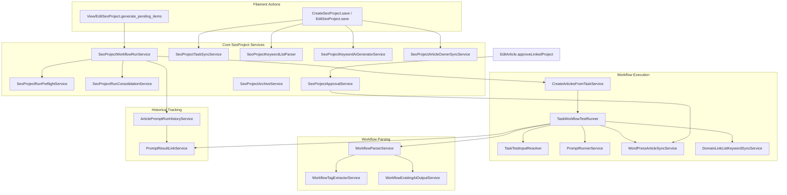
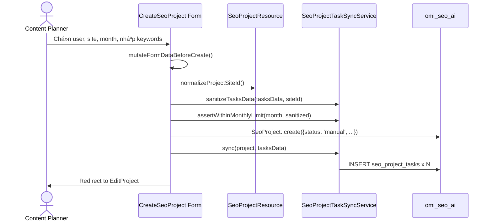
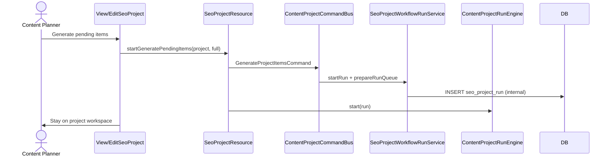

> Status: Historical
> Not canonical
> Archived on: 2026-08-01
> Superseded by: ../../modules/CONTENT_PROJECTS.md
> Purpose: implementation history only
# SeoContentAi — Content Projects & Workflow Execution

[← Quay lại Bản đồ tổng](SUPER_MAP_INDEX.md)

**Liên quan:** [React Editor & EditArticle](MAP_SEO_EDITOR.md) · [Media / upload](MAP_SEO_MEDIA.md) · [WordPress sync](MAP_SEO_WP.md)

---

## 1. Tổng quan

Content Projects là module lập kế hoạch nội dung theo tháng. Mỗi `SeoProject` đại diện cho một tháng sản xuất content cho một site/domain cụ thể, chứa danh sách các `SeoProjectTask` (bài viết cần tạo/viết lại/tối ưu) và lịch sử các `SeoProjectRun` (các lần chạy workflow tự động để sinh nội dung).

### Vai trò trong hệ thống

```
SeoProject (kế hoạch tháng)
  ├── SeoProjectTask (từng bài viết / từ khóa)
  │     └── SeoArticle (bài viết được tạo ra)
  └── SeoProjectRun (lần chạy workflow)
        └── PromptResultLink (liên kết kết quả AI)
```

---

## 2. Models & Database

### 2.1 SeoProject

| Khoản mục | Giá trị |
|-----------|---------|
| **Table** | `seo_projects` (connection `omi_seo_ai`) |
| **File** | `Models/SeoProject.php` |
| **Trait** | `BelongsToOnDefaultConnection` (cross-DB relationships) |

**Casts:**
- `month` → `date`, `site_id` → `integer`, `total_tasks` → `integer`

**Status constants:**
- `pending` (Chờ duyệt), `manual` (Thủ công — mặc định khi tạo), `running` (Đang chạy), `completed` (Hoàn thành), `paused` (Tạm dừng), `approved` (Đã duyệt)

**Relationships:**
- `site()`: BelongsTo → `Site` (mysql, cross-DB qua trait)
- `user()`: BelongsTo → `User` (mysql, cross-DB)
- `tasks()`: HasMany → `SeoProjectTask`
- `runs()`: HasMany → `SeoProjectRun`

**Helper methods:**
- `isArchive()` / `KIND_MONTHLY` / `KIND_ARCHIVE`: project tháng vs kho lưu trữ domain
- `monthCarbon()`: parse month thành Carbon
- `maxTasksAllowed()`: archive = unlimited (`PHP_INT_MAX`); monthly = số ngày trong tháng
- `isExecutionMonthOpen()`: archive luôn mở; monthly kiểm tra hạn tháng
- `registeredTaskCount()` / `remainingTaskCapacity()` / `canRegisterMoreTasks()`: capacity (archive không giới hạn)
- `syncTotalTasksCounter()`: đồng bộ counter
- `defaultNameFromMonth($month)` / `archiveProjectName()` / `archiveSentinelMonth()`: tên + month sentinel `2000-01-01` cho archive

### 2.2 SeoProjectTask

| Khoản mục | Giá trị |
|-----------|---------|
| **Table** | `seo_project_tasks` (connection `omi_seo_ai`) |
| **File** | `Models/SeoProjectTask.php` |
| **Trait** | `BelongsToOnDefaultConnection` |

**Columns quan trọng:**
- `project_id` → FK `seo_projects` (CASCADE)
- `site_id` → nullable, index
- `article_id` → nullable, **UNIQUE** (1 task ↔ 1 article)
- `type` → ENUM action: `create` | `rewrite` | `improve` (migration `2026_07_24_160000_normalize_seo_project_task_actions`; legacy `new_keyword`/`new_title` → `create`)
- `post_type` → nullable: `article`, `product`, `category`, `product_category` (chỉ Create)
- `keyword` / `title` → nullable; Create/Rewrite — Prompt inject nếu có dữ liệu; validation ≥1 field
- `source_content` → Create: derived identity (`keyword` ?: `title`); Rewrite/Improve: tiêu đề Existing/Target article
- `source_key` → SHA-256 identity (`project_id`+`type`+`post_type`+normalized source); **UNIQUE(`project_id`,`source_key`)**
- `secondary_description` → optional context Create/Rewrite (`{{secondary_description}}` / Description)
- `rewrite_mode` → Rewrite luôn `content` (đọc bài gốc); cột còn cho BC
- `rewrite_notes` → Improve instruction (Improve); optional notes Rewrite
- `description` → Gallery description (Product only) — không lẫn `secondary_description`
- `loai_san_pham` → loại sản phẩm thủ công cho prompt ảnh
- `target_date` → ngày KPI
- `status` → `pending`, `writing`, `reviewing`, `completed`, `failed`, `cancelled` (+ SoftDeletes `deleted_at`)
- `archived_at` / `status_before_archive` → lifecycle archive trên cùng task row (không hard-delete)
- `connected_at` → thời điểm gắn bài / vào project (nullable datetime)
- `completed_at` → thời điểm hoàn thành xử lý (nullable datetime)
- `archived_from_project_id` → project tháng nguồn khi chuyển sang archive (nullable)

**Task types (action):**
| Type | Mô tả |
|------|-------|
| `create` | Viết mới — Keyword và/hoặc Title (+ Description optional); publish SeoTask |
| `rewrite` | Viết lại — Existing Article + Keyword/Title/Description; rewrite SeoTask (content) |
| `improve` | Prompt Improve only — Target article + Improve instruction; rewrite SeoTask; **không** post-run image pipeline / full publish |

**Post types** (cho Create): `article`, `product`, `category`, `product_category`

**Relationships:**
- `site()`: BelongsTo → `Site` (cross-DB)
- `project()`: BelongsTo → `SeoProject`
- `article()`: BelongsTo → `SeoArticle`

### 2.3 SeoProjectRun

| Khoản mục | Giá trị |
|-----------|---------|
| **Table** | `seo_project_runs` (connection `omi_seo_ai`) |
| **File** | `Models/SeoProjectRun.php` |

**Columns:**
- `project_id` → FK `seo_projects` (CASCADE)
- `user_id` → người kick-off run
- `mode` → `full` | `test` (test giới hạn 1 task)
- `status` → `running`, `completed`, `failed`
- `total`, `succeeded`, `failed` → counters
- `items` → JSON (danh sách task identities)
- `error_message` → TEXT
- `started_at`, `finished_at` → TIMESTAMP

**Relationships:**
- `project()`: BelongsTo → `SeoProject`
- `user()`: BelongsTo → `User` (cross-DB)

### 2.4 SeoTask (Workflow template)

| Khoản mục | Giá trị |
|-----------|---------|
| **Table** | `seo_tasks` (connection `omi_seo_ai`) |
| **File** | `Models/SeoTask.php` |

**Columns:** `user_id`, `name`, `description`, `flow_data` (JSON — định nghĩa workflow steps), `is_active`

**Mối quan hệ:** SeoProjectTask không dùng SeoTask trực tiếp; CreateArticlesFromTaskService uses `SeoTask::find($taskId)` để lấy `flow_data` và chạy workflow cho từng task của project.

### 2.5 SeoPromptResultLink (cross-reference)

| Khoản mục | Giá trị |
|-----------|---------|
| **Table** | `seo_prompt_result_links` (connection `omi_seo_ai`) |
| **File** | `Models/SeoPromptResultLink.php` |

Đây là bảng liên kết giữa `PromptResult` (kết quả từ AI) với article, project run, project task. Cho phép truy xuất nguồn gốc của mỗi output AI.

**Columns quan trọng:** `prompt_result_id`, `article_id`, `project_run_id`, `project_task_id`, `source`, `workflow_node_id`, `workflow_step_title`, `meta` (JSON)

**UNIQUE constraint:** `(prompt_result_id, source, project_run_id, project_task_id, workflow_node_id)`

### 2.6 task_test_results

| Khoản mục | Giá trị |
|-----------|---------|
| **Table** | `task_test_results` (connection `omi_seo_ai`) |
| **File** | `Models/SeoTaskTestResult.php` |

Lưu kết quả test workflow cho một task. Columns: `task_id` (FK → `seo_tasks`), `input_snapshot` (JSON), `resolved_context` (JSON), `step_results` (JSON), `error_message`, `started_at`, `finished_at`.

**UI test:** `TaskResource/Pages/TestTask.php` + `test-task.blade.php` — `/tasks/{id}/test`; runner `TaskWorkflowTestRunner`; không chọn model per-step; preview ảnh ở bước prompt image (`stepMediaUrls`); «Chạy lại» ẩn trên node `end`.

---

## 3. Filament UI

### 3.1 Route structure

**Canonical UX:** Content Project → Operations/Items → Article.

```
/seo/{connection_hash}/content-projects           → ListSeoProjects (index)
/seo/{connection_hash}/content-projects/create     → CreateSeoProject
/seo/{connection_hash}/content-projects/{record}   → ViewSeoProject (operations workspace — Run Results UX)
/seo/{connection_hash}/content-projects/{record}/edit → EditSeoProject (settings form)
/seo/{connection_hash}/content-projects/{record}/publishing-queue → ContentProjectPublishingQueue
/seo/{connection_hash}/content-operations          → ContentProjectOperationsCenter (manager+; tabs gồm **Site Sync**: runs/events/diagnostics; tab **Runtime** cũng có **MCP Reference** markdown; `SiteSyncOperationsCenter` ẩn sidebar nav)
/admin/content-operations                          → ContentOperationsRedirect → SEO ops
```

`ContentProjectOperationsCenter` tab **Site Sync**: recent runs (nút theo status — completed: report/diagnostic/reconcile; failed: resume; running: cancel), inbound events, diagnostics. Không còn menu sidebar riêng **Site Sync Ops**.

**Scheduler flags (VALUE_NONE):** Trong `SeoContentAiServiceProvider`, cron đăng ký string `--apply` / `--sync` (vd. `seo:content-project:recover-stale-generation --apply`, `agent:metrics:aggregate --sync`) — **không** `['--apply' => true]` (Symfony biến thành `--apply=1` → fail). `RecoverContentProjectStaleGenerationCommand` mỗi 10 phút.

**MCP / Agent capability contract:** `ContentProjectCapabilityRegistry` + `CanonicalCapabilityRegistry` — mỗi cap có `capability_kind` (`system_action` vs site_feature keys trong `SiteSyncSchema`), `required_context`, `side_effect_level`, `action_domain`. Fail-closed: `CapabilityContextGuard` → `missing_required_context` / `context_mismatch`. UI domain: `/domains/{id}/mcp` (`ViewDomainMcp` = Markdown→sanitized HTML docs only); Agent slash palette = curated `AgentCliCommandCatalog` (không dump registry). General chỉ nút link, không embed catalog. SEO Audit Agent read: `seo_audit.list` (`SeoAuditAgentReadService`, site-level, không cần `project_ref`).

**Edit/Create sync duplicate input:** `SeoProjectTaskSyncService::assertNoDuplicateInput` / `assertNoDuplicateTasksData` — trùng identity (`type`+`post_type`+`source_content`) với `task_id` khác → `ValidationException` (i18n `projects.sync_duplicate_input`). `ContentProjectCommandBus` map `ValidationException` → `VALIDATION_FAILED` + `errors` bag (không nuốt thành `RuntimeException` thô). `EditSeoProject` / `CreateSeoProject` preflight trước save; sync fail validation → Filament field errors (`data.tasks_data.*`).

`ViewSeoProject` = màn hình điều hành chính (dashboard vận hành compact):

- **Header:** Filament `getHeading` = project name; `getSubheading` = domain · owner · month. Actions: Generate pending · Edit project · Project info · More (Test run chỉ khi `allowsDevTestGenerateUi()`, ẩn production). Không lặp tên project trong card riêng.
- **KPI grid:** 2→4→8 cột (`x-seo-content-ai::content-project-summary-card`); click áp filter; accent qua `ContentProjectStatusBadgePresenter::summaryAccent()`; active ring khi filter khớp.
- **Filter toolbar:** search + generation/lifecycle/queue/schedule + failed only + clear; mobile drawer Filters. **BulkSelectionToolbar** (`content-project-bulk-selection-toolbar`) chỉ hiện khi `selectedCount > 0` (nhóm Content / Review / Publishing).
- **Một bảng Project Items** canonical (`ContentProjectItemOperationsReadModel`): Item meta 2 dòng + badges Generation/Lifecycle/Queue + Schedule + Last activity + grouped actions menu (`ContentProjectItemActionsPresenter` — chỉ action hợp lệ UI). Sticky header, density vừa, mobile card list (`md:hidden` / `md:block`).
- Semantic badges: `ContentProjectStatusBadgePresenter` + `content-project-status-badge` (nền nhạt + icon + ring; dark-mode).
- Empty/loading: no items / no filter results / pulse skeleton.

**Publishing Queue:** không còn tầng/page bắt buộc. Route `/{record}/publishing-queue` → redirect compatibility tới `view?lifecycle=waiting_publish,published`. `getPublishingQueueUrl()` trỏ cùng filter.

**Legacy Run History (compatibility redirects only — không render UI):**

```
.../content-projects/{record}/runs              → redirect → ViewSeoProject
.../content-projects/runs/{run}                 → redirect → ViewSeoProject (project của run)
.../content-projects/runs/{run}/items/{article} → redirect → ViewSeoProject
```

Generate pending: header action trên `ViewSeoProject` / `EditSeoProject` → dry-run preview (`ContentProjectItemGenerationClassifier`) → `GenerateProjectItemsCommand` + PHP `ContentProjectRunEngine`. Chỉ item **never-generated** (không có execution success / article / lifecycle review|approved|published|scheduled / improve). Fail-closed nếu sẽ chọn cả project khi đã có execution lịch sử (cần technical confirm). Test generate chỉ hiện khi `allowsDevTestGenerateUi()` (local/testing + debug; fail-closed production).

**Project Items table:** render trên `view-seo-project-operations.blade.php` (không RelationManager). Cột: checkbox · Item · Generation · Lifecycle · Schedule · Queue · Last activity · Actions. Components flat (namespace `seo-content-ai`): `content-project-summary-card`, `content-project-status-badge`, `content-project-filter-toolbar`, `content-project-bulk-selection-toolbar`, `content-project-item-meta`, `content-project-item-actions-menu`. Không điều hướng Run History.

**Counters (list):** `Generated` (content ready) ≠ Run OK. Tách `Pending` (chưa generate) / `Failed`. Không dùng “Completed” mơ hồ so với Run succeeded.

**Compatibility:** `ContentProjectCounterAuditService` (audit 31 OK vs status≠completed), `ContentProjectLegacyExecutionHydrateService` (dry-run/idempotent; không AI; không đè reviewing/completed).

`SeoProjectRun` = execution record nội bộ (ADR-004). Ops/Timeline đọc operation — không phục hồi Run History hub.

Docs: [CONTENT_PROJECT_OPERATIONS.md](CONTENT_PROJECT_OPERATIONS.md) — dashboard, metrics, replay, health, analytics.

### 3.2 SeoProjectResource (`Filament/Resources/SeoProjectResource.php`)

- **Model:** `SeoProject`
- **Slug:** `content-projects`
- **Navigation:** "Content projects" → `SEO Workspace` group, sort 8
- **Permission gates:**
  - `canViewAny()`: `SeoAccessControl::canAccessContentFeatures()`
  - `canCreate()`: `canAccessPlannerFeatures()`
  - `canEdit()`: `SeoAccessControl::canMutateContentProjects()`
  - Content manager: chỉ xem project của mình (`user_id == auth()->id()`)

**Assign keyword từ editor / keyword list:** `KeywordResource::assignKeywordContentProjectFormSchema()`, `assignKeywordContentProjectFormSchemaForSite()` (editor), `assignKeywordsToContentProject()` → `SeoProjectTask::TYPE_CREATE` (`keyword` + `source_content`); form field `project_id_{siteId}`.

### 3.3 Form schema (create + edit)

**Section 1: Project Info** (2 columns)
- `user_id`: Select → chọn writer (Content Manager role)
- `site_id`: Select → chọn domain
- `month`: DatePicker → format `m/Y`, default today's month
- `status_display`: Placeholder (read-only)
- `description`: Textarea

**Section 2: Article / Keyword List** (full width)
- `import_keywords`: Action → modal nhập raw text (bullet/numbered/plain list) → parse bằng `SeoProjectKeywordListParser`
- `ai_generate_keywords`: Action → modal nhập số lượng + brief → sinh AI bằng `SeoProjectKeywordAiGeneratorService`
- `tasks_data`: Repeater → mỗi item là một task:
  - `type`: Select Create / Rewrite / Improve (`TYPE_CREATE` | `TYPE_REWRITE` | `TYPE_IMPROVE`)
  - `keyword` | `title`: cùng hàng — Create/Rewrite; ≥1 field bắt buộc
  - `secondary_description`: Description optional (Create/Rewrite)
  - `source_content`: SearchableSelect Existing/Target article (Rewrite/Improve)
  - `rewrite_notes`: Improve instruction (Improve)
  - `post_type`: Select (article/product/category/product_category — Create)
  - `loai_san_pham` / `description` (gallery): Product Create only
  - Không còn Generate by / `new_keyword` / `new_title` / rewrite_mode UI

### 3.4 Table columns (List page)

| Column | Source | Ghi chú |
|--------|--------|---------|
| `name` | `->name` | Bold, searchable, sortable, linked |
| `user.name` | Relationship | Sortable, searchable |
| `site.domain` | Relationship (cross-DB) | Placeholder "—" |
| `month` | `->month` | Date format `m/Y`, sortable |
| `total_items` / `active_tasks_count` | Active tasks | Numeric |
| `generated` / `active_generated_count` | Content ready (completed\|reviewing\|article linked) | **Không** đồng nghĩa Run OK |
| `pending_never_generated` | status=pending và chưa article | Generate pending target |
| `failed` | status=failed | |
| `status` | `->status` | Badge (color-coded) |
| `updated_at` | `->updated_at` | Toggleable, hidden by default |

**Filters:** status, user_id, site_id, month

**Row actions:** `ActionGroup (...)` chứa `open_project_items` (workspace), `publishing_queue`, `archive_project`, `Delete`; bên ngoài `Edit` / `View`

**Bulk actions:** Delete — cùng logic rollback tháng trước (`SeoProjectTaskMoveService`)

**Header list:** `open_site_archive` → `findOrCreateArchiveProject` + edit archive; Create

**List query:** ẩn `kind=archive` (chỉ hiện project tháng)

### 3.5 Legacy Run History pages (redirect stubs)

| Page | Route | Behavior |
|------|-------|----------|
| `ListSeoProjectRuns` | `/{record}/runs` | Redirect → `ViewSeoProject` |
| `ViewSeoProjectRun` | `/runs/{run}` | Redirect → project workspace |
| `ViewSeoProjectRunStep` | `/runs/{run}/items/{article}` | Redirect → project workspace |

Không còn header Run / Test run / View run trên Run History. Generate: `SeoProjectResource::makeGeneratePendingItemsAction` trên View/Edit project. Blade `view-project-run.blade.php` + `project-run-queue.js` còn trong repo (asset/legacy) nhưng **không mount** qua Filament page.

### 3.6 ViewSeoProject / EditSeoProject — Project Items workspace

- Canonical items UI trên form project (tasks repeater)
- Header: Generate pending items (+ optional Test generate khi `allowsDevTestGenerateUi()`), publishing queue, edit
- Không breadcrumb/link “Run history”
- Item-level regenerate / step rerun: services (`ContentProjectStepRerunService`, `SeoProjectWorkflowStepRetryService`, article editor) — không qua Run Detail page

### 3.7 (removed) ViewSeoProjectRunStep UI

Redirect stub only — xem §3.5. Prompt timeline per article: article editor / `ArticlePromptRunHistoryService` (không mount qua run step route).

---

## 4. Services Layer

### 4.0 Business Hook (WP không gọi trực tiếp từ workflow)

| Symbol | Vai trò |
|--------|---------|
| `MarkProjectTaskCompletedAction` / bridge | Emit `project.task_completed` → bridge map `content_project.task.completed` + `article.completed` nếu có `article_id` |
| `BusinessHookEmitter` | `taskFailed`, `runCompleted`, `taskArchived`, `articleArchived` / `articleRestored` |
| Rule `sync-article-to-wordpress` | Seed **enabled+published** (business) — `article.completed` → linear `wordpress.article.sync` → `product-review.create` → `product-review.sync-wp` on `automation-external` |
| `WordPressManualSyncService` | Manual only (`ManualSyncContext` + `ManualWordPressSyncJob` on `seo`); emit `wordpress.synced` origin=manual; không giả automation |
| `ContentProjectWorkspaceSaveService` | Editor Sync khi bài thuộc Content Project active = **Save Workspace** (`project_local_save`): `article.content.update` + stamp flags/hash; **không** WP API / không enqueue `seo`. TX ngắn chỉ quanh stamp (`last_synced_at` + sync flags) — không bọc cả persist (tránh Lock wait `articles.body`) |
| `automation:audit-wordpress-coupling` / `automation:audit-coupling` | Audit automatic/manual callers + ownership collisions |

Invariant: `SeoProjectWorkflowRunService` / `CreateArticlesFromTaskService` / `ArticleScheduleReconcileService` **không** import WP outbound hub. Completion → business event only. Chi tiết: [AUTOMATION_CUTOVER_AUDIT.md](automation/AUTOMATION_CUTOVER_AUDIT.md).

**Release freeze (2026-07-20):** Task = business identity; run item = CP execution; Automation execution = workflow (immutable published version). Draft never executes. External WP side effect chỉ khi rule **enabled + published**. `ExecuteAutomationRuleJob` queue = `automation-critical` (không `default`).

### 4.1 Core process (diagram)



### 4.2 Service descriptions

#### Core Project services (9 files)

| Service | File | Mô tả |
|---------|------|-------|
| **SeoProjectWorkflowRunService** | `SeoProjectWorkflowRunService.php` | Điều phối run: `startRun()` (`items=null`) → `prepareRunQueue()` seed `seo_project_run_items` → autorun `retryTask()` (cùng task, không copy). Runtime SoT = run items; JSON `runs.items` chỉ legacy/debug. |
| **SeoProjectRunPreflightService** | `SeoProjectRunPreflightService.php` | Kiểm tra preflight trước khi chạy: tìm conflict keyword/title giữa các pending task. formatWarningsForModal() sinh HTML cảnh báo. |
| **SeoProjectRunConsolidationService** | `SeoProjectRunConsolidationService.php` | Phase 3C3: mark `consolidated_into_run_id`/`consolidated_at`, relink run items sang keeper — **không** hard-delete run. UI list `notConsolidated()`. |
| **SeoProjectRunItemService** | `SeoProjectRunItemService.php` | Claim/retry/counters trên `seo_project_run_items`; `mirrorJsonSafely()` no-op (Phase 3C3). |
| **SeoProjectRunItemsReader** | `SeoProjectRunItemsReader.php` | Đọc run: DB XOR legacy JSON — không merge dual-source. |
| **SeoProjectRunItemMergeService** | `SeoProjectRunItemMergeService.php` | Relink/merge khi collapse duplicate task hoặc consolidate run (`relinkTask` / `relinkRun`). |
| **SeoProjectRunItemsDisplayPresenter** | `Support/SeoProjectRunItemsDisplayPresenter.php` | Gom hàng bảng ViewSeoProjectRun: `consolidate()` — 1 task/article = 1 row (view layer); giữ raw history; badge/note `retry_count`. Test: `SeoProjectRunItemsDisplayPresenterTest`. |
| **SeoProjectWorkflowStepCatalogService** | `SeoProjectWorkflowStepCatalogService.php` | Liệt kê node `prompt` rerunnable từ SeoTask publish/rewrite; kind + label + order outline→content. |
| **SeoProjectWorkflowStepRetryService** | `SeoProjectWorkflowStepRetryService.php` | Rerun từng prompt (`action=step:{nodeId}`); `cancelActiveStep` / `resolveActiveStepIdsForCancel`; claim/success không đè cancel marker; log `seo.project_run.cancel_workflow_step`. |
| **ContentProjectRunEngine** | `Services/RunEngine/ContentProjectRunEngine.php` | Phase 1 PHP orchestration (flag `CONTENT_PROJECT_PHP_ENGINE`): start/stop/dispatch/finalize; job `RunContentProjectArticleJob`; runner reuse `retryTask`; doc `architecture/CONTENT_PROJECT_RUN_ENGINE_REFACTOR.md` + handoff `audits/CONTENT_PROJECT_RUN_ENGINE_PHASE1_HANDOFF.md`. |
| **ContentProjectArticleRunner** | `Services/RunEngine/ContentProjectArticleRunner.php` | Chạy 1 article trong run; normalize `ArticleExecutionResult`; không dispatch next. |
| **ArticleLastSavedTimestampService** | `ArticleLastSavedTimestampService.php` | `last_manual_saved_at` / `last_synced_at` trên `articles`; resolve display cho cột «Lần cuối lưu». |
| **SeoProjectTaskSyncService** | `SeoProjectTaskSyncService.php` | Diff/upsert theo `task_id` → `source_key`; không delete-all/recreate; create qua `SeoProjectTaskUniqueWriter::createStrict()`. |
| **SeoProjectTaskLifecycleService** | `SeoProjectTaskLifecycleService.php` | Archive/restore/softDelete trên task row; mirror `seo_content_archive_items`. |
| **SeoProjectTaskRepairService** | `SeoProjectTaskRepairService.php` | Phase 3C3 repair: backfill `source_key`, merge duplicate groups, archive mirrors, purge sync orphans. |
| **SeoProjectTaskUniqueWriter** | `SeoProjectTaskUniqueWriter.php` | Create race-safe dưới UNIQUE(`project_id`,`source_key`); map conflict → `CONTENT_PROJECT_TASK_SOURCE_KEY_CONFLICT`. |
| **SeoProjectTaskCanonicalResolver** | `Support/SeoProjectTaskCanonicalResolver.php` | Repair-time pick canonical trong duplicate `source_key` group (class A–F). |
| **ProjectTaskSourceKeyGenerator** | `Support/ProjectTaskSourceKeyGenerator.php` | Generator chuẩn `source_key` (NFC + lowercase + collapse whitespace). |
| **SeoProjectApprovalService** | `SeoProjectApprovalService.php` | approveLinkedProject() → đánh dấu project là "approved", yêu cầu user là Content Manager. |
| **SeoProjectArchiveService** | `SeoProjectArchiveService.php` | Archive qua lifecycle; resolve article từ run items reader (không đọc JSON business). |
| **SeoProjectTaskMoveService** | `SeoProjectTaskMoveService.php` | `deleteProjectRollingBackToPreviousMonth()` — xóa project tháng, chuyển mọi task về tháng −1 (tạo nếu thiếu, chặn nếu đầy); `moveTasksToProject()` di chuyển item sang tháng/archive khác. |
| **SeoProjectKeywordListParser** | `SeoProjectKeywordListParser.php` | parse() → phân tích raw text (bullet, numbered, plain lines) thành mảng keyword. appendKeywordsToTasks() → gộp vào tasks_data hiện tại. |
| **SeoProjectKeywordAiGeneratorService** | `SeoProjectKeywordAiGeneratorService.php` | generate() → gọi AI sinh danh sách keyword cho tháng, dựa trên brief + description. |
| **SeoProjectArticleOwnerSyncService** | `SeoProjectArticleOwnerSyncService.php` | syncProjectArticles() → đồng bộ user_id từ project sang article liên kết. |

#### Workflow Execution services (4 files)

| Service | File | Mô tả |
|---------|------|-------|
| **CreateArticlesFromTaskService** | `CreateArticlesFromTaskService.php` | Phase 0.6: CREATE → `ArticleWritingExecutionService` PublishGraph; TYPE_REWRITE «Tạo lại bài từ dàn ý» → ContentNode (không chạy lại outline); TYPE_IMPROVE → `ArticleImproveExecutionService` (không Publish). `runOutlineThenArticleForContext()` = outline mới + article. Không đọc `rewrite_article_task_id`. |
| **ArticleWritingExecutionService** | `ArticleWritingExecutionService.php` | Entry duy nhất `article.content.generate`: validate source → provider → format → Prompt owner XOR → execute (publish_graph / content_node / direct_generate) → persist + history. |
| **ArticleImproveExecutionService** | `ArticleImproveExecutionService.php` | Improve riêng (`article.content.improve` Settings binding). Không generate / không outline / không `article_length` full / không `getPublishArticleTaskId()`. |
| **TaskWorkflowTestRunner** | `TaskWorkflowTestRunner.php` | Engine workflow: AI → `PromptTestPublishService.publishArticle` (chỉ Laravel). Content generate stamp `prompt_owner_type=workflow_node`. Gallery product chỉ khi `isProductWorkflowContext`. |
| **TaskTestInputResolver** | `TaskTestInputResolver.php` | `resolveForProjectTask()`: Create → `contextForNewArticleOnSite` (không copy keyword↔title); inject optional Keyword/Title/`secondary_description`. Rewrite/Improve → `resolveExistingArticleRewrite()` (body Markdown + notes); thiếu bài → **throw**. |
| **SeoProjectTaskSyncDataNormalizer** | `Support/SeoProjectTaskSyncDataNormalizer.php` | Chuẩn hóa Create/Rewrite/Improve; derive `source_content`; `allowedSiteIds()` = `SeoAccessControl::accessibleSiteIds()`. |
| **PromptTestPublishService** | `PromptTestPublishService.php` | `publishArticle()` lưu title/body/meta Laravel + `markLocalEditPending` — **không** `WordPressArticleSyncService`. |
| **PromptRunnerService** | `PromptRunnerService.php` | Engine AI cấp thấp nhất: gửi request đến AI model, xử lý streaming, lưu PromptResult. |

#### Workflow Parser services (3 files)

| Service | File | Mô tả |
|---------|------|-------|
| **WorkflowParserService** | `WorkflowParserService.php` (2609 dòng) | Phân tích output workflow từ AI (Markdown outline, structured content) → cấu trúc dữ liệu article. FAQ parsing + shortcode. |
| **WorkflowTagExtractorService** | `WorkflowTagExtractorService.php` | Trích xuất tagged sections từ raw text output (VD: `<OUTLINE>`, `<CONTENT>`). |
| **WorkflowExistingAiOutputService** | `WorkflowExistingAiOutputService.php` | Xác định output AI có sẵn (outline/content) có thể tái sử dụng. Task REWRITE / có `rewriteMode` → không reuse (`TaskWorkflowTestRunner::shouldReuseExistingAiOutput()`). |
| **SimpleMarkdownHtmlConverter** | `Support/SimpleMarkdownHtmlConverter.php` | Markdown → HTML cho editor. `prepareImport()` ủy quyền `ArticleMarkdownImportParser`: tách `h1_title` / `seo_title` / `meta_description`, bỏ structural wrappers, giữ body sạch. |
| **ArticleMarkdownImportParser** | `Support/ArticleMarkdownImportParser.php` | Parser theo dòng + allowlist exact. Nhận `# Title`, `H1:`, `**Meta Description:**`, `### 1. Meta Description`, plain numbered `1. Meta Description:` / `2. SEO Title:` / `3. Introduction` / `4. Main Content:`; không xóa list số thường; HTML document trả nguyên; outer ` ```markdown ` fence gỡ khi bọc cả document. |
| **ArticlePostTypeResolver** | `Support/ArticlePostTypeResolver.php` | Resolve post type hiệu lực của article: ưu tiên `articles.type` local, `wp_post_type` meta chỉ fallback khi type trống (tránh meta WP stale ép nhầm product). Rewrite không ghi đè type bài (`CreateArticlesFromTaskService::ensureArticlePostType()` skip TYPE_REWRITE). |

#### Supporting services (4 files)

| Service | File | Mô tả |
|---------|------|-------|
| **SeoNotificationService** | `SeoNotificationService.php` | Gửi Filament notification cho các sự kiện project: gán owner, approved, task added. Dùng khi `KeywordResource::assignKeywordsToContentProject()` thêm task. |
| **ArticlePendingInternalLinkService** | `ArticlePendingInternalLinkService.php` | Gán keyword vào `SeoProjectTask` + tạo pending link `#hash` từ editor (`assignFromEditor`). |
| **PromptResultLinkService** | `PromptResultLinkService.php` | Liên kết PromptResult với task/article của project để truy xuất nguồn gốc output AI. |
| **ArticlePromptRunHistoryService** | `ArticlePromptRunHistoryService.php` | `build()` timeline `/articles/{id}/prompts`. Phase 2.1: `execution_type` First/Retry/Rerun + `status_label` (stale/blocked). |
| **WorkflowKeywordResearchService** | `WorkflowKeywordResearchService.php` | `syncTopicCluster()` — lưu Topic Cluster từ action workflow `save_vocabulary_research`; không throw khi focus keyword khớp CTA blacklist. |
| **AllDomainsDashboardService** | `AllDomainsDashboardService.php` | Tổng hợp thống kê article/project/task trên tất cả sites cho All-Domains Dashboard. |

---

## 5. Luồng dữ liệu chi tiết

### 5.1 Tạo Project (Create/CreateSeoProject)



### 5.2 Generate pending items (Project workspace)



`SeoProjectRun` không mở UI. Progress qua item status / Operations / timeline.

### 5.3 Đồng bộ task type → bài viết

```
create   ───→ SeoArticle.create() — inject Keyword/Title/secondary_description nếu có (publish SeoTask)
rewrite  ───→ SeoArticle.update() bài cũ — đọc body + optional Keyword/Title/Description (rewrite SeoTask)
improve  ───→ SeoArticle.update() — chỉ Prompt Improve (rewrite SeoTask); không Outline/Image/Meta post-run
```

### 5.4 Archive Content Project (đơn vị = project)

**Đơn vị archive chính = Content Project (monthly), không phải bài lẻ.**

| Thành phần | Chi tiết |
|---|---|
| Flag active/kho | `seo_projects.archived_at` / `archived_by` — active = `whereNull(archived_at)` |
| Header | `seo_project_archives` (+ snapshot/stats): 1 record hiện hành / project (`restored_at IS NULL`) |
| Items | `seo_project_archive_items` (+ `task_id`, `position`, `article_snapshot`) |
| Service | `ArchiveContentProjectService` — transaction, không đổi task/article status, không detach |
| Export | `ContentProjectArchiveExportService` (OpenSpout XLSX, `ExcelFormulaEscaper`) |
| Migration | `2026_07_24_140000_extend_seo_project_archives_for_project_unit` |

```
ArchiveContentProjectService.archive(project, userId, note?)
  1. lock project; reject nếu đã archived_at
  2. buildSummary từ tasks/articles
  3. upsert seo_project_archives + sync items snapshot
  4. set project.archived_at/by
ArchiveContentProjectService.restore(project, userId)
  → clear project.archived_*; set archive.restored_*; giữ snapshot
```

**Không:** soft-delete article, lifecycle archive từng task, set `content_archived_at` hàng loạt, tạo bảng archive song song.

**UI:**
- List active: action **Lưu trữ dự án**; nút **Kho dự án đã lưu trữ** → `/content-projects/archive`
- Tab 1: dự án đã lưu trữ (preview / Excel / restore)
- Tab 2: **Legacy bài lẻ** (`content_archived_at` / `seo_content_archive_items`) — chỉ đọc
- Preview: `/content-projects/archive/{archive}/preview` — `{archive}` = ID `seo_project_archives` (không phải project gốc).
  - Page `ContentProjectArchivePreview`: route param scalar `$archive`, model `$archiveRecord` (tránh Livewire bind Eloquent trùng tên param → 404 layout rỗng).
  - Không phụ thuộc global domain. Snapshot lỗi → banner + `RuntimeLogger` (`archive_id`, `source_project_id`), không giả 404.
  - Header summary: CSS grid 1→2→4 cột (class `fi-archive-preview-summary-grid`, không phụ thuộc Tailwind purge).
  - Table full width; title link `text-primary-600` (tab mới); cột **Int/Ext** (`internal_link_count` / `external_link_count` từ article hoặc snapshot).
  - Hydrate rows: method `rebuildArticleRows()` — **không** đặt tên `hydrate*` (Livewire coi là lifecycle hook → `BadMethodCallException`).
- Details bài: Filament Action `viewArchiveItem` **slideOver** (`MaxWidth::FourExtraLarge`, sticky header) + partial `archive-preview-item-slideover` (section Main / SEO / Status / Links / Timestamps / Excerpt).
  - Presenter `ArchivePreviewArticlePresenter`: batch `whereIn` article IDs, map `edit_url` qua `ArticleResource::getUrl('edit')` (binding không scope global domain). Không lazy-load `task`/`articleMetas` nếu chưa eager. Auth/URL factory thiếu (pure PHPUnit) → catch, `can_edit=false`.
  - Article mất → badge `archive_preview_article_missing`, không link hỏng.
- Modal archive confirm: bỏ dòng **Đã duyệt**; count chỉ `tasks()->active()` còn gắn project. Field `approved_articles` vẫn lưu snapshot (tương thích cũ).
- List widget **Staff chưa có dự án** (`UnassignedContentProjectStaffWidget` + `ContentProjectStaffAvailabilityService`): `role=staff` + `seo_role=content_manager`, chưa là `user_id` của project active. Create: nhóm unassigned + Staff khác; preselect `?writer_id=`; create + assign trong transaction + race validate.
- Tests: `ContentProjectArchivePreviewAndDomainContextTest`, `ArchivePreviewArticleUiTest` (pure PHPUnit — dùng `dirname(__DIR__, 2)`, không `base_path()`).

**Global domain (UI context, không phải auth):**
- List Content Projects / Articles: vẫn filter theo `SeoAccessControl::globalSiteId()`.
- Detail/edit/preview: `getRecordRouteBindingEloquentQuery()` **không** áp global site scope. `ArticleResource` / `SeoProjectResource` **override** `resolveRecordRouteBinding()` (Filament core mặc định gọi `getEloquentQuery()` — thiếu override = 404 khi mở record khác domain). `canView` project dùng `canAccessSite`, không dùng `getEloquentQuery()` đã scope domain.
- Edit article khác domain: mở được, note badge, **không** auto `setGlobalSiteId`, **không** 404 giả.
- Legacy run routes redirect via `getRecordRouteBindingEloquentQuery()` / `SeoProjectRun.project`.
- Guard tests: `ContentProjectArchivePreviewAndDomainContextTest` (`test_article_resolve_record_route_binding_uses_unscoped_query`, project twin).

**“Hoàn tất duyệt”** (`ArticleReviewService` action `archive`): chỉ `review_status=archived` + audit log. **Không** detach task, **không** `content_archived_at`.

**Deprecated:** `SeoProjectArchiveService` (warehouse/task mirror), run UI `archiveItem`, action `archive_project_articles`.

### 5.4b (legacy) Project kind=archive / batch cũ

`seo_projects.kind=archive` và flow move-task-sang-kho-domain: đã migrate sang `seo_content_archive_items`. Giữ đọc; không dùng cho archive project mới.

### 5.5 Xóa project tháng (rollback)

```
SeoProjectTaskMoveService.deleteProjectRollingBackToPreviousMonth(project)
  → chuyển mọi task về tháng trước cùng domain (tạo nếu chưa có)
  → nếu tháng trước đầy capacity → chặn xóa
```

Edit repeater: `extraItemActions` **Di chuyển** item sang project tháng/archive khác còn chỗ.

---

## 6. Authorization

| Permission | Method | Ghi chú |
|-----------|--------|---------|
| Xem danh sách project | `canAccessContentFeatures()` | User có SEO role cơ bản |
| Xem chi tiết project | `canAccessPlannerFeatures()` | Planner + |
| Tạo project | `canAccessPlannerFeatures()` | Planner |
| Sửa project | `canMutateContentProjects()` | Manager + (trừ Content Manager) |
| Xóa project | `canAccessPlannerFeatures()` | Planner |
| Duyệt project | `isContentManager()` | Chỉ Content Manager |
| Chạy workflow | `canAccessContentProjectRun()` | Kiểm tra quyền truy cập run |
| Content Manager scope | `isContentManager()` | Chỉ xem project của mình (`user_id == auth()->id()`) |
| Archive project / xem lịch sử | `canArchiveContentProjects()` / `canViewProjectArchives()` | Manager + Admin |

---

## Phase 0.7 — Workflow execution roles + bulk 3 action + Improve default

### Storage

`SeoTask.flow_data.nodes[].data.execution_role` — không migration DB.

### Registry

`WorkflowExecutionRoleRegistry` + enum `WorkflowExecutionRole`:

| Role | Label VI |
|---|---|
| `article.outline.generate` | Tạo dàn ý |
| `article.content.generate` | Viết bài |
| `article.content.improve` | Cải thiện bài viết |
| `article.image.generate` | Tạo hình ảnh |

Runtime lookup: `WorkflowExecutionRoleResolver` — **không** title/hook heuristic.

### Migration command

```text
php artisan seo:workflow:assign-execution-roles
php artisan seo:workflow:assign-execution-roles --apply
```

Auto-assign chỉ khi hook map 1-1 và không duplicate. Ambiguous → null (operator chọn trong Builder).

Improve default binding (plain `php`, không dùng `$PHP_BIN`):

```text
php artisan seo:prompt:install-default-improve
```
Ba action (`ContentProjectBulkRerunService`):

1. `regenerate_outline` — chỉ outline role
2. `regenerate_article` — chỉ content role (dàn ý hiện tại)
3. `regenerate_outline_and_article` — outline mới → artifact hash → content; outline fail → article blocked

### Improve default

`DefaultImprovePromptInstaller` + migration `2026_07_26_140000_*` — Prompt + Settings binding nếu thiếu; không overwrite binding đã có.

Scope: `article|section|selection` — hiện chỉ `article` persist an toàn; selection/section reject rõ.

### Heuristic đã xóa (runtime)

- `ArticleWritingExecutionService::resolveContentNodeId` title/2nd-prompt fallback
- `SeoProjectWorkflowStepCatalogService::detectKind` title haystack

Giữ suggester title-free; only hook trong `WorkflowRoleMigrationSuggester`.

---

## Phase 0.9 — Remove remaining heuristics + lock Article Writing contract

### Runtime contract only

`execution_role` / `source_type` / execution snapshot / explicit `node_id` / prompt owner.

Heuristic title/position **đã xóa** khỏi:

- `TaskWorkflowTestRunner` (`captureOutlinePromptOutput`, filter hydrate, merge-outline support)
- `ArticleGenerationInputResolver::isOutlineProducerStep`
- `WorkflowExistingAiOutputService::outputType`
- Builder `isWriteFromOutlinePrompt` (hook / `supports_merge_outline_save`)

Heuristic **chỉ còn** `WorkflowRoleMigrationSuggester` (migration/audit).

### Legacy

- `rewrite_article_task_id` DB **giữ**; runtime không đọc `getRewriteArticleTaskId()`
- `ArticleWritingLegacyRewriteAdapter` mỏng: remap hook + map existing_article + log + delegate

### Retry

Thiếu snapshot → `Không thể thử lại lần chạy cũ. Hãy chọn «Chạy lại bằng cấu hình hiện tại».` — không vá live.

### Tests

`ArticleWritingPhase09Test` + cập nhật ExistingAiOutput / PipelineRerun detectKind.

---

## Phase 1.0 — Stable lock + legacy surface cleanup

### Contract cuối

`article.content.generate` + `source_type` ∈ {outline, existing_article, brief}  
`article.content.improve` tách riêng  
`article.content.rewrite` = **DEPRECATED COMPATIBILITY ONLY** → remap generate + existing_article

### UI

- Settings: không render rewrite selector; save **preserve** `rewrite_article_task_id`
- Hook selector: không cho tạo mới rewrite; Prompt cũ xem được + warning/badge Legacy
- Duplicate Prompt rewrite → remap generate
- Builder: merge-outline chỉ `article.content.generate`

### Stable Gate

`ArticleWritingStableHealthService` + `seo:workflow:doctor` in:

`Article Writing Stable Gate: PASS|WARN|FAIL`

### Adapter callers

- `PromptHookExplicitBindingExecutor` — chỉ khi hook rewrite
- `TaskWorkflowTestRunner` — chỉ khi hook rewrite  
Generate binding **không** log `article_writing.legacy_adapter_used`

### DB

`rewrite_article_task_id` — deprecated_since Phase 1.0; planned_drop sau khi adapter log=0; **không drop** release này.

### Tests

`ArticleWritingStablePhase10Test`

---

## Phase 2.0 — Step Rerun + Bulk Execution

**Verdict:** Canary ready → khóa tiếp Phase 2.1.

Không mở lại Article Writing / không engine mới / không parallel article / không Agent-SSE.

### Retry vs Rerun

| | Retry | Rerun |
|---|---|---|
| User | «Thử lại lần chạy lỗi» | «Chạy lại bằng cấu hình hiện tại» |
| Service | `SeoProjectWorkflowStepRetryService` (mutate `step:{nodeId}` + attempt++) | `ContentProjectStepRerunService` |
| Config | Snapshot lần lỗi (Article Writing path) | Live Publish workflow + Prompt + Settings hiện tại |
| Record | Cùng row Model A | **Append-only** `action = step:rr:{ulid}` — không ghi đè history cũ |

### Step Catalog

`SeoProjectWorkflowStepCatalogService::listStepDescriptors()` → `ContentProjectStepDescriptor`:

`node_id`, `execution_role`, `hook_key`, `post_type`, `label`, `kind`, `sequence`, `rerunnable`, `source_requirements`, `downstream_nodes`, `prompt_id`

Identity: `execution_role` / `hook_key` / image tool — **không** title heuristic.  
`listGenericPickerSteps()` loại outline+content (đã có 3 nút Article).

### Source contract

`ContentProjectStepSourceValidator` — outline cần title; article content cần outline usable; FAQ/meta/image cần article body. Thiếu source → không gọi AI.

### Typed request / result

- `ContentProjectStepRerunRequest` — `mode`: `single_step` (UI mặc định) | `step_and_downstream`
- `ContentProjectStepRerunResult`
- Metadata item: `execution_type=rerun`, `source_run_id`, `source_run_item_id`, `target_node_id`, `target_execution_role`, `rerun_mode`, `uses_current_workflow`

### Ba action Article (giữ rõ)

`ContentProjectBulkRerunService` → ủy quyền `ContentProjectStepRerunService::executeBulkSerial`:

1. `regenerate_outline` — single outline node  
2. `regenerate_article` — single content node  
3. `regenerate_outline_and_article` — `step_and_downstream` + handoff `CreateArticlesFromTaskService::runOutlineThenArticleForContext`

Bulk: preview valid/invalid → confirm partial → **serial** từng article. Không «Chạy lại toàn bộ» (`canRerunAllItems()=false`).

### UI (Phase 2.0 — updated)

Step rerun services vẫn tồn tại; **không** mount qua `ViewSeoProjectRun` (redirect stub). Entry điểm: article editor / project items. Leftover `view-project-run.blade.php` + `project-run-queue.js` không gắn Filament page.

### Tests

`ContentProjectStepRerunPhase20Test`, `ContentProjectBulkRerunPhase20Test`

---

## Phase 2.1 — Final UX + History + Timestamp lock

**Verdict:** Content Project step rerun **Stable** (with minor limitations: featured hard-delete gallery cũ chủ yếu append; modal Alpine không Filament Action class).

### Generic step modal

Bỏ `window.prompt`. Alpine modal `genericStepOpen` trên run page:

- Options từ `genericPickerSteps` / catalog rerunnable  
- Preview Livewire `previewBulkGenericStep`  
- Submit `bulkRerunGenericStep` → cùng `ContentProjectStepRerunService`  
- Partial: «Chạy N bài hợp lệ» chỉ sau confirm

### Row status

`ContentProjectArticleRowStatusResolver` + `ContentProjectArticleRowStatus`:

Priority: Active → Failed(+step) → `ignored_stale` → Manual edit (`manual_saved_at` > `last_ai_content_at`) → Completed → Pending  

Labels: `Đang chạy: {step}`, `Lỗi: {step}`, `Bỏ qua kết quả AI cũ`, `Đã sửa thủ công`, …

### Last saved contract

`ArticleLastContentChange` / `ArticleLastContentChangeResolver`:

- Max(`last_manual_saved_at`, `last_synced_at`, `last_ai_content_at`)  
- Trả `occurred_at` + `source` (`manual`|`sync`|`ai`) — không chỉ Carbon  
- **Không** `updated_at` / poll / heartbeat  
- UI: relative + tooltip absolute + nguồn

### `last_ai_content_at`

Migration `2026_07_26_160000_add_last_ai_content_at_to_articles_table`  
Touch: `ArticleLastSavedTimestampService::touchAiContent` sau `PromptTestPublishService::publishArticle` khi body hash đổi  

**Có touch:** first-run / article rerun / outline+article / editor full rewrite / Improve scope=article / brief generate (qua publish body)  
**Không touch:** outline-only, FAQ/meta/image-only, ignored_stale, AI fail, manual save, sync

### History

`ArticlePromptRunHistoryService` + `view-article-prompts.blade.php`:

- `execution_type` / `execution_type_label`: Lần chạy đầu | Thử lại | Chạy lại  
- Status UI: Thành công / Lỗi / Đang chạy / Bỏ qua vì bài đã thay đổi / Bị chặn…  
- Rerun append-only hiện riêng — không merge vào row cũ trên UI

### Image cleanup contract

`ContentProjectImageRerunCleanupContract` — order: generate → persist → update_reference → commit → cleanup_old  
Audit `ArticleEditorMediaAiService`: cancel processing trước generate; **không** delete completed asset trước persist.

### Key paths

| Symbol | Path |
|---|---|
| `ContentProjectStepRerunService` | `Services/ContentProject/` |
| `ContentProjectStepSourceValidator` | `Services/ContentProject/` |
| `ContentProjectStepDescriptor` | `Support/ContentProject/` |
| `ContentProjectBulkRerunService` | `Services/` |
| `SeoProjectWorkflowStepCatalogService` | `Services/` |
| `ContentProjectArticleRowStatusResolver` | `Services/` |
| `ArticleLastContentChangeResolver` | `Services/` |
| `ViewSeoProjectRun` | `Filament/.../ViewSeoProjectRun.php` |

### Tests Phase 2.1

`ContentProjectPhase21FinalUxTest`, `ContentProjectArticleRowStatusPhase21Test`, `ArticleLastContentChangePhase21Test`  
(+ regression Phase 2.0 / ArticleWritingStable / RunEngine / PromptOwnership)

### Host commands

```text
php artisan migrate
php artisan optimize:clear
php vendor/bin/phpunit --filter=ContentProjectStepRerun
php vendor/bin/phpunit --filter=ContentProjectBulkRerun
php vendor/bin/phpunit --filter=ContentProjectArticleRowStatus
php vendor/bin/phpunit --filter=ArticleLastContentChange
php vendor/bin/phpunit --filter=ContentProjectPhase21
php vendor/bin/phpunit --filter=ArticleWritingStable
```

### Overall stack verdict

```text
Article Writing: Stable with legacy compatibility
Content Project step rerun: Stable
```

---

## Phase 0.8 — Production canary + workflow configuration enforcement

### Settings bind validation

`WorkflowAssignmentValidator` + enum `WorkflowCapability`:

| Capability | Roles bắt buộc |
|---|---|
| Publish article | outline + content |
| Content-only | content |
| Improve (nếu Workflow) | improve |
| Media/gallery/video | không ép `article.image.generate` cứng |

Save Settings fail rõ (tên WF + role thiếu + link Builder) — không toast success.

### Builder save

`WorkflowExecutionRoleResolver::validateFlowData` + `validateFlowPreservesSettingsBindings`:

- duplicate unique role, wrong node type, hook mismatch
- broken edges, role thiếu Prompt / Prompt missing
- Settings đang bind → không cho xóa role bắt buộc

### Snapshot

`WorkflowExecutionSnapshot` / `WorkflowExecutionSnapshotBuilder`:

- `workflow_id`, `flow_data_hash`, nodes[`node_id`,`execution_role`,`prompt_id`]
- Gắn vào `SeoProjectRun.settings.workflow_execution_snapshot` lúc `startRun`
- Stamp vào CreateArticles / retry snapshot (`content_node_id`)

Retry: dùng node/prompt/length từ snapshot — thiếu node → lỗi rõ (không nhảy live).  
Rerun: config hiện tại.

### Doctor

```text
php artisan seo:workflow:doctor
php artisan seo:workflow:doctor {workflowId}
```

Exit 0 = không blocking; ≠0 = có blocking.

### Settings health UI

Placeholder dưới Publish: `✓ Workflow hợp lệ` / `⚠ Thiếu vai trò: …` + link Builder.

### Legacy log

`article_writing.legacy_adapter_used` từ `ArticleWritingLegacyRewriteAdapter::logLegacyAdapterUsed`.

### Canary evidence

`docs/audits/ARTICLE_WRITING_PHASE08_CANARY.md` — operator paste. Verdict **Stable candidate** chỉ khi canary A–F pass trên host.

### Remaining risks

- `TaskWorkflowTestRunner` / `ArticleGenerationInputResolver` còn title haystack phụ — audit Phase 0.9
- Image role hooks (gallery/typography/video) chưa tách role riêng
- Legacy DB `rewrite_article_task_id` + adapter giữ

---

## Phase 0.6 — Article Writing runtime stabilization

### Source contract (`article.content.generate`)

| `source_type` | Provider | Caller chính |
|---|---|---|
| `outline` | `OutlineArticleWritingSourceProvider` | First-run CREATE; CP «Tạo lại bài từ dàn ý» |
| `existing_article` | `ExistingArticleWritingSourceProvider` | Editor «Viết lại toàn bộ bài hiện có»; legacy rewrite adapter |
| `brief` | `BriefArticleWritingSourceProvider` | Manual Task Test raw input (stamp bắt buộc) |

Improve **không** dùng source contract này — capability `article.content.improve`.

### Workflow mapping

| Flow | Mode | Notes |
|---|---|---|
| First-run / CREATE | `publish_graph` | Outline node rồi content node (artifact vừa tạo) |
| CP regenerate article | `content_node` | Không chạy lại outline |
| CP outline + article | `publish_graph` via `runOutlineThenArticleForContext` | Outline mới → article |
| Editor full rewrite | `direct_generate` | Settings-owned; không Publish graph; `EditArticle::queueEditorFullRewrite` → `resolveEditorFullRewrite` |
| Improve | `ArticleImproveExecutionService` | Settings `article.content.improve` |

### Prompt owner

- Ngoài workflow: `settings_binding` → `PromptBindingResolver` / `article.content.generate`
- Content node: `workflow_node` + `prompt_id` node — **không** resolve Settings song song
- History: `prompt_owner_type`, `prompt_owner_id`, `prompt_id`, `hook_key` (+ source badge / length / artifact ids trên `/articles/{id}/prompts`)

### Retry vs rerun

- **Retry same execution:** `ArticleWritingExecutionContext.useRetrySnapshot=true` — giữ source_type, source hash/artifact refs, prompt owner/id, `article_length`
- **Rerun / new execution:** resolve lại Settings, binding, length, outline artifact hiện tại

### Persistence + stale write

- Canonical body/title/meta: `PromptTestPublishService::publishArticle` (+ conflict guard `expected_updated_at` / content hash)
- Late result: `persist_status=ignored_stale` — history có thể ghi, canonical article không overwrite manual edit
- Editor/CP pass `expectedUpdatedAt` vào execution context

### Legacy

- `ArticleWritingLegacyRewriteAdapter`: map → `existing_article` → `ArticleWritingExecutionService` (mỏng; không tự persist/workflow)
- `rewrite_article_task_id`: DB legacy only — runtime không đọc

### Manual verification

```text
A CP «Tạo lại bài từ dàn ý» → Source Outline; không chạy outline node
B Editor «Viết lại toàn bộ…» → Source Existing article; Settings owner
C Brief Task Test → Source Brief; labels đúng
D Retry after Settings change → snapshot cũ
E Rerun → config mới
F Stale: user sửa khi job pending → late result ignored_stale
```

---

## Hướng dẫn prompt — Content Projects

```
Filament Resource: Filament/Resources/SeoProjectResource.php
Pages: ListSeoProjects, CreateSeoProject, EditSeoProject, ViewSeoProject
       (+ legacy redirect stubs: ListSeoProjectRuns, ViewSeoProjectRun, ViewSeoProjectRunStep)
Models: SeoProject, SeoProjectTask, SeoProjectRun (internal), SeoProjectRunItem, SeoProjectTaskEvent
Core Service: SeoProjectWorkflowRunService + ContentProjectRunEngine
Generate UI: SeoProjectResource::startGeneratePendingItems (CommandBus)
Run items SoT: SeoProjectRunItemService + SeoProjectRunItemsReader (DB XOR JSON)
Task Execution: CreateArticlesFromTaskService → ArticleWritingExecutionService / ArticleImproveExecutionService → TaskWorkflowTestRunner
Preflight: SeoProjectRunPreflightService
Consolidation: SeoProjectRunConsolidationService (mark consolidated, không hard-delete)
Run table display: SeoProjectRunItemsDisplayPresenter (1 task = 1 row)
Task Sync: SeoProjectTaskSyncService + SeoProjectTaskUniqueWriter
Lifecycle: SeoProjectTaskLifecycleService
Repair/Diagnose: content-project:repair, content-project:diagnose, content-project:backfill-run-items
Identity: ProjectTaskSourceKeyGenerator + UNIQUE(project_id, source_key)
Move/Delete rollback: SeoProjectTaskMoveService
Archive: SeoProjectArchiveService (mirror seo_content_archive_items.task_id)
Keyword Parser: SeoProjectKeywordListParser
Keyword AI Gen: SeoProjectKeywordAiGeneratorService
Approval: SeoProjectApprovalService
Article Owner Sync: SeoProjectArticleOwnerSyncService
Link History: PromptResultLinkService, ArticlePromptRunHistoryService
Article Writing: ArticleWritingExecutionService + source providers; Improve: ArticleImproveExecutionService
```
