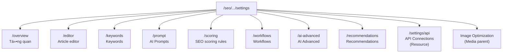
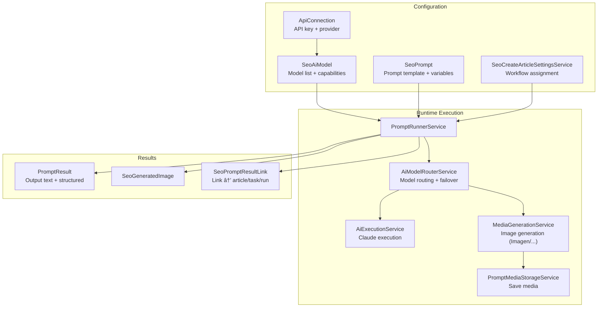

> Status: Historical
> Not canonical
> Archived on: 2026-08-01
> Superseded by: ../../modules/PROMPTS_AND_AI.md
> Purpose: implementation history only
# SeoContentAi — Settings, Prompts & AI Connections

[← Quay lại Bản đồ tổng](SUPER_MAP_INDEX.md)

**Liên quan:** [React Editor & EditArticle](MAP_SEO_EDITOR.md) · [WordPress sync](MAP_SEO_WP.md) · [Team & Phân quyền](MAP_SEO_TEAM.md)

---

## 1. Hệ thống Settings

### 1.1 Tổng quan

Settings được tổ chức thành các page Filament dưới nhánh `/seo/{connection_hash}/settings/`. Tất cả đều yêu cầu **Manager role** (`SeoAccessControl::canAccessManagerFeatures()`).

### 1.2 Sơ đồ điều hướng



`SeoSettings.php` (slug `/settings`) là page redirect, `mount()` chuyển hướng sang `SeoSettingsOverview`.

### 1.3 Settings Pages

| Page | Slug | File | Mô tả |
|------|------|------|-------|
| **SeoSettingsOverview** | `settings/overview` | `Filament/Pages/SeoSettingsOverview.php` | AI model status (sync, capability groups, `routing_status`/`disabled_reason`), team chat limits; teaser → Recommendations |
| **SeoSettingsWorkflows** | `settings/workflows` | `Filament/Pages/SeoSettingsWorkflows.php` | Gán task/prompt nghiệp vụ; Editor Media (Prompt\|Workflow) — không chọn model per-node |
| **SeoSettingsAiAdvanced** | `settings/ai-advanced` | `Filament/Pages/SeoSettingsAiAdvanced.php` | Rendering Preference, Image/Typography/Video model priority, typography validation |
| **SeoSettingsEditor** | `settings/editor` | `Filament/Pages/SeoSettingsEditor.php` | Cấu hình Editor: **local draft interval** (`autosave_interval_seconds`, localStorage only, clamp 0–30s, default 2), undo steps, publish; **Nhận diện FAQ** (`faq_catch_keywords`, 1 keyword/dòng) |
| **ArticleEditorHistoryService** | — | `Services/ArticleEditorHistoryService.php` | Option `seo_article_editor_settings`: `history_step`, `autosave_interval_seconds` (browser local draft — **không** ghi DB), `wiki_trust_domains` |
| **SeoOverviewSettingsService** | — | `Services/SeoOverviewSettingsService.php` | Option `seo_overview_settings`; key `faq_catch_keywords` + `outline_skip_words` + team chat limits; `getFaqCatchKeywords()`, `faqHeadingMatcher()`; default FAQ song ngữ VI+EN khi trống (không merge/ghi đè setting đã lưu) |
| **FaqHeadingMatcher** | — | `Support/FaqHeadingMatcher.php` | So khớp tiêu đề H2–H6 với `faq_catch_keywords` (normalize + token-boundary); dùng chung parser/editor/form_faq |
| **SeoSettingsKeywords** | `settings/keywords` | `Filament/Pages/SeoSettingsKeywords.php` | CTA blacklist (`SeoKeywordSettingsService`, default phrases) + **Lý do đánh giá từ khóa** (`keyword_review_reasons`, `KeywordReviewReasonService`) |

**CTA blacklist phạm vi:** `CtaKeywordBlacklistFilter` — import keyword từ bài, child/related Topic Cluster (skip im lặng). **Không** chặn từ khóa chính khi `WorkflowKeywordResearchService::syncTopicCluster()` (action `save_vocabulary_research`).
| **KeywordReviewService** | — | `Services/KeywordReviewService.php` | `submitReview()` lưu `review_status` + history; `article_suggestion` không `assertKeywordLinkedToArticle`; custom reason → `review_note`, `reason_id` null |
| **SeoSettingsPrompt** | `settings/prompt` | `Filament/Pages/SeoSettingsPrompt.php` | Cấu hình prompt mặc định, model selection, system prompts |
| **SeoSettingsScoring** | `settings/scoring` | `Filament/Pages/SeoSettingsScoring.php` | **Quy tắc chấm điểm SEO** — bật/tắt từng rule, chỉnh điểm trừ (lưu `wp_options.seo_scoring_rules_settings`) |
| **SeoSettingsRecommendations** | `settings/recommendations` | `Filament/Pages/SeoSettingsRecommendations.php` | Best-practices admin (hard-coded); badge Current Recommendation; không ảnh hưởng runtime |
| **SeoSettingsRecommendationsContent** | — | `Support/SeoSettingsRecommendationsContent.php` | Constants + cấu trúc card (Image Routing, Typography, Prompt Design, Workflow, AI Models, Experimental) |
| **SeoSettingsMenu** | — | `Support/SeoSettingsMenu.php` | Sidebar Settings: Overview → Workflows → AI Advanced → … → SEO scoring → **Recommendations** |
| **SeoSettings** | `settings` | `Filament/Pages/SeoSettings.php` | Redirect → overview |

### 1.4 Image Optimization Settings

| Page | Slug | File | Mô tả |
|------|------|------|-------|
| **ImageOptimizationSettings** | `image-optimization` | `Filament/Pages/ImageOptimizationSettings.php` | WebP/AVIF, quality %, dimension limits, alt tag pattern |

**Site-aware:** Dùng `#[Url] $siteId` để lưu setting theo từng site. Nếu không có global site scope, hiển thị dropdown chọn site.

**Các setting lưu vào model** `SeoImageOptimizationSetting` (table `seo_image_optimization_settings`):
- `auto_convert_webp` (bool)
- `quality` (int 10-100)
- `limit_dimensions` (bool), `max_width`, `max_height`
- `clean_filename` (bool)
- `auto_alt_tag` (bool), `alt_tag_pattern` (string — mẫu như `{post_title} - {focus_keyword}`)

---

## 1.5 SEO Scoring Rules (`SeoSettingsScoring`)

Page quản lý **quy tắc trừ điểm** khi chấm SEO on-page. Rules cố định trong `SeoScoringRulesRegistry`; override bật/tắt và điểm trừ lưu `wp_options` key `seo_scoring_rules_settings` qua `SeoScoringSettingsService`.

| Thành phần | File | Mô tả |
|------------|------|-------|
| Page | `Filament/Pages/SeoSettingsScoring.php` | Repeater: label, toggle enabled, deduction |
| Service | `Services/SeoScoringSettingsService.php` | `effectiveRules()`, `auditFilterDefinitions()`, `aggregateFilterDefinitions()` |
| Registry | `Support/SeoScoringRulesRegistry.php` | `defaultRules()`, `effectiveRuleDefinitions()`, `auditFilterDefinitions()`, `activeViolations()`, `AUDIT_LOW_SCORE_THRESHOLD` |
| Messages | `Support/SeoScoringRuleMessageResolver.php` | Map legacy `seo.*` → canonical rule key |
| Violations DB | `Support/SeoRuleViolationsResolver.php` | Đọc `seo_rule_violations`; runtime bỏ rule disabled |

**Effective rule contract** (mỗi rule qua `enrichRuleDefinition()`): `key`, `label`, `short_label`, `category`, `enabled`, `deduction`, `filterable`, `violation_keys`, `threshold` (resolve từ `SeoPromptSettingsService` cho độ dài bài).

**Rule disabled:** không trừ điểm, không filter audit, không hiển thị badge; violation cũ trong DB vẫn giữ nguyên nhưng runtime bỏ qua.

**Hành vi quan trọng:** Lưu settings **không** bulk cập nhật `article_meta.seo_rule_violations`. Điểm hiển thị tính động từ violations đã lưu + rules hiện tại. Violations trong DB chỉ đổi khi analyze/save bài hoặc **Refresh article metadata (domain)**.

Điểm: `100 - sum(deduction)` với rule disabled → deduction = 0.

---

## 1.6 Recommendations (`SeoSettingsRecommendations`)

Trang tài liệu nội bộ admin — **không ảnh hưởng runtime routing**.

| Thành phần | File | Mô tả |
|------------|------|-------|
| Page | `Filament/Pages/SeoSettingsRecommendations.php` | Slug `settings/recommendations`; badge Current Recommendation; grid card Info/Success/Warning |
| Content | `Support/SeoSettingsRecommendationsContent.php` | Hard-coded card blocks (Image Routing, Typography, Prompt Design, Workflow, AI Models, Experimental) |
| View | `resources/views/filament/pages/seo-settings-recommendations.blade.php` | Heroicons + responsive CSS (`seo-settings.css`) |
| Menu | `Support/SeoSettingsMenu.php` | Mục cuối sidebar Settings |
| Overview teaser | `seo-settings-overview.blade.php` | Link «Best practices» → Recommendations |

Lang: `filament.settings_recommendations` (`lang/en|vi/filament.php`).

---

## 2. Workflow Settings (`SeoSettingsWorkflows`)

Page cấu hình workflow quan trọng nhất. **Prompt ownership model (2026-07):**

- **Hook** = loại/capability contract (`settings_visible` trong Runtime Registry).
- **Settings binding** = `prompt_hook_bindings` map `hook_key → prompt_id` (runtime SoT).
- **UI labels:** section Settings + Hook dropdown + Prompt table hiện `Display [hook_key]` (`PromptHookEditorCatalog::labelWithHookKey` / `option_label`) — khớp `seo:workflow:doctor`.
- **`article.content.generate`:** `settings_visible=true` (Editor full rewrite + Stable Gate); Publish CP vẫn dùng Prompt trên Workflow node.
- **Form encoding:** Filament coi `.` là nested path — form dùng `article__title_suggestion` rồi decode về `article.title_suggestion` khi save (`encodeHookKeyForForm` / `decodePromptHookBindingsFromForm`).
- **Presentation metadata** (optional trên Hook JSON): `presentation.default_instructions`, `output_format`, `variables[].label` — UI Settings/Prompt Edit; không ảnh hưởng resolver.
- **Task Prompt Block** = `prompt_id` trực tiếp trong workflow graph.
- **Prompt không còn status** (`is_active` legacy column giữ DB, app không đọc để gate runtime).
- Unassigned Prompt (không Hook, không binding, không Task) vẫn hợp lệ — không tự chạy.

### 2.1 Form Schema

| Section | Field | Key / Hook | Mô tả |
|---------|-------|------------|-------|
| **Task Workflows** | Publish / Rewrite / Post comment | `KEY_*_TASK` | Task orchestration — không phải Prompt binding |
| **Prompt Hooks** | Dynamic selectors | `KEY_PROMPT_HOOK_BINDINGS` | Render từ `PromptHookEditorCatalog::settingsVisibleHooks()` |
| **Editor Media** | Typography / Video | `KEY_CREATE_TYPOGRAPHY_*`, `KEY_CREATE_VIDEO_*` | Prompt\|Workflow (chưa Hook-hóa hết) |
| | Product gallery source | `KEY_CREATE_PRODUCT_GALLERY_SOURCE` + binding `product.gallery.generate` | Prompt path dùng Settings binding |

Legacy fields (`article_title_suggestion_prompt_id`, `renew_faq_prompt_id`, …) còn trong option JSON để rollback; **runtime đọc bindings** (migrate-on-read).

Resolver: `SettingsPromptBindingResolver` — không tìm “active prompt by hook”.

Used by / delete safety: `PromptUsageLocator`, `PromptDeleteGuard`.

Default comment: `DefaultCommentPromptInstaller` + hook `article.comment.generate`.

### 2.2 Service: `SeoCreateArticleSettingsService`

```php
// Lưu và đọc settings cho workflows
SeoCreateArticleSettingsService::KEY_PUBLISH_ARTICLE  // => trả về task_id
SeoCreateArticleSettingsService::getPublishArticleTaskId()
SeoCreateArticleSettingsService::KEY_PROMPT_HOOK_BINDINGS
SeoCreateArticleSettingsService::getBoundPromptId('article.title_suggestion')
```

Dùng trong:
- `CreateArticlesFromTaskService.runFromKeywords()` — lấy task_id để chạy workflow tạo bài từ keyword
- `SettingsPromptBindingResolver` — capability Settings → Prompt
- `TaskWorkflowTestRunner` — resolve task/workflow cho từng action node

---

## 3. Prompt Management (`PromptResource`)

### Prompt Hook documentation

Danh sách và contract từng Hook: [Prompt Hooks Index](prompt-hooks/README.md)

- Form chọn Hook: `PromptHooks/PromptHookFormSchema.php`
- Settings slots (title / meta description): `SeoSettingsWorkflows` + `SeoCreateArticleSettingsService`
- Execute API: `POST /api/seo/prompt-hooks/{hookKey}/execute` (`PromptHookExecuteController`) — không save article / SEO / WP

### 3.1 Tổng quan

- **Resource:** `Filament/Resources/PromptResource.php`
- **Model:** `SeoPrompt` (table `prompts`, connection `omi_seo_ai`)
- **Slug:** `prompts` → `/seo/{connection_hash}/prompts`
- **Navigation:** "Prompt management" → SEO Workspace
- **Permission:** `canAccessPlannerFeatures()` để view, `allowsSeoPanelMutation() && canAccessPlannerFeatures()` để create/edit/delete

### 3.2 Form Schema

Layout 2 cá»™t (4 + 8):

**Cột trái (4): Thông tin chung**
- `name` (TextInput, required)
- `description` (Textarea)
- `ai_connection_id` (Select: chọn API connection) + nút "Sync models"
- `model_category` (Select: model category từ connection — gemini_pro, gemini_flash, ...)
- `tool` (Radio: `text` | `image`) — quyết định hiển thị post-processing section
- Name, Hook (Unassigned nếu null), AI connection, **Used by**, Actions (Test/Edit/Delete)
- **Không còn** cột Status / Toggle `is_active`
- Delete bị chặn nếu Settings binding hoặc Task Prompt Block đang tham chiếu
- Đổi Hook bị chặn nếu Prompt đang bị Settings binding theo Hook cũ
- `variables` (Repeater: key + label + required + type) — **auto-sync từ nội dung markdown**

**Cột phải (8): Nội dung**
- `content` (MarkdownEditor) — nội dung prompt, có thể chứa biến `{{variable_name}}`
- **Post-Processing** (chỉ visible khi tool=image):
  - Quick split: `split_enabled` + **một** `split_grid_size` (N×N; legacy `split_rows`/`split_columns` normalize về square)
  - Quick resize: enabled + width + height (chỉ sau split thành công)
  - **Runtime Image Output Mode** (UI): preview + full block từ `ImageOutputModePromptInjector::buildBlock()` — không phải Manual Prompt Hook, không lưu vào template
  - Manual Prompt Hook dropdown (`PromptHookFormSchema`) độc lập; Quick Split không cần chọn Hook

| Symbol | Path | Vai trò |
|--------|------|---------|
| `PromptPostProcessing` | `Support/PromptPostProcessing.php` | Normalize `split_grid_size`, snapshot `quick_split` vào variables |
| `ImageOutputModePromptInjector` | `Services/ImageOutputModePromptInjector.php` | Inject idempotent `[IMAGE_OUTPUT_MODE_*]`; `buildBlock` / `summarize` / `auditMeta` |
| `QuickSplitCanvasValidator` | `Support/QuickSplitCanvasValidator.php` | Validate canvas vuông chia hết trước split |
| `PromptManualGridWarning` | `Support/PromptManualGridWarning.php` | Soft warning template vs grid_size |

### 3.3 Variables System

Prompt hỗ trợ biến động `{{variable_name}}` trong nội dung markdown:
- **`extractVariableNamesFromMarkdown()`** — tự động trích xuất biến từ markdown
- **`mergeVariablesFromMarkdown()`** — gộp biến đã khai báo với biến mới phát hiện
- **`variableDefinitionsForPrompt()`** — trả về định nghĩa biến cho runtime
- **`defaultVariableLabels()`** — nhãn mặc định: article_title, focus_keyword, language,...
- **`defaultRuntimeVariableNames()`** — tên biến runtime: content, seo_data, ...

### 3.4 Query Scope

```php
getEloquentQuery() {
    if (shouldScopeToAccountOwner()) {
        $query->where('user_id', accountSiteOwnerId());
    }
}
```

### 3.5 Model: `SeoPrompt`

| Thuộc tính | Kiểu |
|-----------|------|
| `$connection` | `omi_seo_ai` |
| `$table` | `prompts` |
| `$casts` | `content` → json, `schema` → json, `is_active` → boolean |
| Relations | `aiConnection()` → `ApiConnection`, `user()` → `User` (cross-db via trait) |

---

## 4. API Connections (`AiConnectionResource`)

### 4.1 Tổng quan

- **Resource:** `Filament/Resources/AiConnectionResource.php`
- **Slug:** `settings/api` → `/seo/.../settings/api` (canonical); legacy `/settings/ai` redirect trong `SeoPanelProvider`
- **List page:** `Pages/ListAiConnections.php` — view `seo-settings-api-list.blade.php`, Filament table `contentGrid` + cột **Provider**
- **Navigation:** Không register navigation (truy cập từ settings sidebar)
- **Permission:** `canAccessManagerFeatures()` view; `allowsSeoPanelMutation()` create/edit/delete (chỉ AI providers)

### 4.2 Provider & lưu trữ

| Provider | Form fields | Bảng lưu |
|----------|-------------|----------|
| `gemini`, `claude` | name, api_key, status | `api_connections` (mysql) + `connection_type` |
| `google_search_console` | email, tokens, property URL | `seo_gsc_master_connections` (mysql) |
| `dataforseo` | login, password, location, language | `seo_dataforseo_connections` (mysql) |
| `serpapi`, `serper`, `searchapi` | api_key, defaults | `seo_serp_provider_connections` (mysql) |
| `keywords_everywhere`, `seranking` | name, api_key/token, status | `seo_extended_provider_connections` (mysql) |

Support: `Support/ApiConnectionProviders.php` (delegate `SeoProviderRegistry`), `Support/ApiConnectionFormSchema.php`.

**Connection type (`connection_type`):** `ai` | `seo` — cột **Loại** + filter Tất cả/AI/SEO trên list (`ListAiConnections`, URL `?type=`). AI: `api_connections.connection_type` (migration backfill idempotent). External rows: expose qua `ApiConnectionListRow::connection_type` từ registry.

**SEO Provider Registry (single source of truth):** `Services/SeoProviderRegistry.php`, `DataTransfer/SeoProviderDefinition.php`, `DataTransfer/SeoProviderCapabilityState.php`, enums `ApiConnectionType`, `SeoProviderCategory`, `SeoProviderCapabilityKey`, `PerformanceHubSectionKey`. Resolver runtime: `Services/SeoProviderCapabilityResolver.php`, `Services/SeoProviderConnectionStatusService.php`.

**Capability matrix helper:** icon `?` header list → modal Alpine `api-capability-matrix-modal` (data từ registry, không hard-code Blade).

**Providers má»›i (settings only, chÆ°a data adapter):**
- `keywords_everywhere` → `Models/SeoExtendedProviderConnection`, `Services/SeoExtendedProviderConnectionService`, edit `EditExtendedProviderApiConnection` (`settings/api/extended/{provider}/edit`). Test: credits endpoint, không tiêu keyword credit.
- `seranking` → cùng bảng `seo_extended_provider_connections`. Test: balance endpoint. `partial_implementation` — chưa Performance tab.

**List columns:** Kết nối API | Loại | Nhà cung cấp | Trạng thái | Thao tác.

Create/Edit: dropdown Provider đổi form; GSC/DataForSEO có page riêng `edit-gsc`, `edit-dataforseo`.

**Chi tiết GSC (OAuth, route `{id}`, gap, debug):** [MAP_SEO_GSC_API_CONNECTIONS.md](MAP_SEO_GSC_API_CONNECTIONS.md).

### 4.3 List thống nhất

- **Service:** `Services/ApiConnectionsListService.php` → `recordsForUser()` gộp AI + GSC + DataForSEO
- **Model ảo:** `Models/ApiConnectionListRow.php` — row GSC/DataForSEO; GSC status = `GoogleSearchConsoleConnectionService::resolveEffectiveStatus()`
- **Override records:** `ListAiConnections::getTableRecords()` — search/sort; `notifyOAuthFlash()` sau OAuth callback; Edit URL tùy provider; Delete AI/GSC/DataForSEO

### 4.4 Form AI (gemini/claude)

- `provider` (Select: `gemini` | `claude` | `google_search_console` | `dataforseo`)
- `name`, `api_key` (encrypted), `status` (`active` | `inactive`)

### 4.5 Query Scope (AI)

```php
getEloquentQuery() {
    where('user_id', auth()->id())->orWhere('is_global', true);
}
```

### 4.6 Model: `ApiConnection`

| Thuộc tính | Kiểu |
|-----------|------|
| `$connection` | `mysql` |
| `$table` | `api_connections` |
| `$casts` | `api_key` → encrypted, `metadata` → json, `is_global` → boolean |
| Relations | `seoAiModels()` → HasMany → `SeoAiModel` |

### 4.7 External connection models

| Model | Table | Service resolve |
|-------|-------|-----------------|
| `SeoGscMasterConnection` | `seo_gsc_master_connections` | `GoogleSearchConsoleConnectionService` |
| `SeoDataForSeoConnection` | `seo_dataforseo_connections` | `DataForSeoConnectionService` |

Migration: `2026_07_11_100000_create_seo_external_api_connections_tables.php` (mysql).

### 4.8 SeoAiModel (Model phụ thuộc)

- **Table:** `seo_ai_models` (connection `mysql`)
- Lưu danh sách model từ API provider (Gemini models), sync qua `AiModelsSyncService`
- **Columns:** `api_connection_id`, `category` (gemini_pro, gemini_flash,...), `raw_model_name`, `display_name`, `priority`, `status`, `capabilities` (JSON)

---

## 5. AI Execution Pipeline



### 5.1 PromptRunnerService (`Services/PromptRunnerService.php`)

Engine AI trung tâm, 1181 dòng. **Dependencies:**
- `AiExecutionService` — gọi Claude
- `MediaGenerationService` — pipeline sinh ảnh (Imagen/Nano Banana)
- `PromptMediaStorageService` — lưu media từ remote
- `AiModelRouterService` — router model với failover
- `AiModelsReadinessService` — kiểm tra kết nối AI sẵn sàng

**Methods chính:**

| Method | Mô tả |
|--------|-------|
| `run(prompt, variables, ...)` | Entry point: compile prompt → route provider → xử lý chain |
| `runWithCompiledPrompt()` | Chạy với prompt đã compile sẵn |
| `runDirectImagePreview()` | Image tool (+ optional sub_task): compile parts → `executeImage` **không** chạy planner text Flash |
| `runChainStepOutput()` | Chạy 1 bước trong chain (dùng cho ImageGenerationChainService) |
| `compilePrompt()` | Compile parts + variables; **image pipeline** prepend Runtime Image Output Mode via `ImageOutputModePromptInjector` (snapshot `quick_split` nếu có) |
| `callProvider()` | Router cuối: gemini → `callGemini()`, claude → `callClaude()`, image → `MediaGenerationService` |
| `callGemini()` | Gọi Gemini API với retry model/version |
| `callClaude()` | Delegate sang `AiExecutionService::executeClaude()` |
| `executeWithModelRouting()` | Gọi `AiModelRouterService::executeWithFailover()` |

**Run audit:** `PromptResult.input_snapshot` lưu `compiled_prompt` + `image_output_mode` (`auditMeta`: mode / grid / expected_children / `generation_snapshot`). Test Prompt hiển thị template vs final từ snapshot, không rebuild từ form.

**Image path parity:** `GenerateMediaJob` và `TaskWorkflowTestRunner` (tool image/`image_typography`) dùng `runFullDependentChain=false` → cùng pipeline Test Prompt / Editor. Không ép `modelOverride` category Flash lên image node.

### 5.2 AiModelRouterService

Router model vá»›i failover mechanism:
- Thá»­ model theo priority
- Nếu model bị `exhausted` hoặc lỗi → fallback sang model tiếp theo
- Lưu trạng thái `last_error` vào `SeoAiModel`
- `overviewForUser()` gắn `routing_status` + `disabled_reason` từ `GeminiModelVersionPolicy::routingDecision()`
- `getNextActiveModel()` / planner failover bỏ model không eligible; `markModelUnavailableForAutoRouting()` khi provider unavailable

### 5.2.1 Gemini version routing (`Support/GeminiModelVersionPolicy.php`)

Gate auto-routing Gemini/Imagen: **major ≥ 3** (`MIN_MAJOR_VERSION = 3`).

| Symbol | Vai trò |
|--------|---------|
| `routingDecision()` | Trả `routing_status` (`enabled`/`disabled`) + `disabled_reason` (`legacy_version`, `provider_unavailable`, …) |
| `filterEligibleForAutoRouting()` | Lọc slug list theo version + capability `auto_routing` |
| `preferStableFirst()` | Typography/render ưu tiên stable trước preview |
| `markCapabilitiesUnavailable()` | Ghi `auto_routing=false` khi API trả unavailable |
| `isProviderUnavailableError()` | Nhận diện lỗi provider để retry model kế |

Model 2.x vẫn seed/sync trong DB và hiển thị Model Status — chỉ **không** vào auto-routing.

**Wired:** `GoogleAiModelRegistry`, `SeoCreateArticleSettingsService` (default/normalize priority), `ImageRoutingStrategy`, `GeminiModelCatalog`, `GeminiMediaGenerationService`, `AiModelRouterService`.

Default image priority runtime (3.x): `gemini-3.1-flash-image-preview` → `gemini-3-pro-image-preview` → `imagen-4.0-generate-001`.

### 5.2.2 Vision validation router (`Support/VisionValidationModelRouter.php`)

Typography Vision chọn model text có `ImageCapability::ImageInput`, major ≥ 3, failover multi-model. Primary mặc định: `gemini-3.5-flash-preview`. Dùng trong `TypographyValidationService`.

### 5.3 PromptResult

**Table:** `prompt_results` (connection `omi_seo_ai`)

| Column | Type | Mô tả |
|--------|------|-------|
| `prompt_id` | FK nullable | Prompt gốc |
| `user_id` | FK nullable | Người chạy |
| `article_id` | FK nullable | Article liên kết |
| `status` | varchar | pending, running, completed, failed |
| `input_snapshot` | JSON | Input variables snapshot |
| `output_text` | longText | Output text từ AI |
| `output_structured` | JSON | Output structured (nếu có) |
| `error_message` | text | Lỗi nếu failed |

### 5.4 SeoPromptResultLink

**Table:** `seo_prompt_result_links` — cross-reference giữa PromptResult, article, project run, project task.

Cho phép truy xuất nguồn gốc của mỗi output AI (prompt result nào sinh ra article nào, thuộc project run/task nào).

---

## Hướng dẫn prompt — Settings, Prompts, AI

```
Settings Pages: Filament/Pages/SeoSettings*.php, ImageOptimizationSettings.php
AI Advanced: Filament/Pages/SeoSettingsAiAdvanced.php → SeoCreateArticleSettingsService (routing keys)
Recommendations: Filament/Pages/SeoSettingsRecommendations.php → Support/SeoSettingsRecommendationsContent.php (docs only)
Workflows Settings: Filament/Pages/SeoSettingsWorkflows.php → SeoCreateArticleSettingsService
API Connections: `AiConnectionResource` (`settings/api`) → `ApiConnection` + external models; list `ApiConnectionsListService` + `ApiConnectionListRow`; registry `SeoProviderRegistry` + `SeoProviderCapabilityResolver`
Prompt Management: Filament/Resources/PromptResource.php → SeoPrompt model (omi_seo_ai)
Prompt Engine: Services/PromptRunnerService.php (1181 dòng)
Model Router: Services/AiModelRouterService.php → SeoAiModel (mysql)
Image Gen: Services/MediaGenerationService.php
Claude Exec: Services/AiExecutionService.php
```
