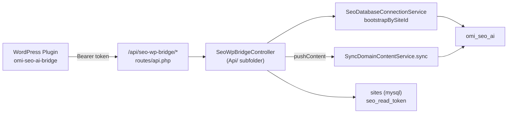

> Status: Historical
> Not canonical
> Archived on: 2026-08-01
> Superseded by: ../../modules/WORDPRESS_BRIDGE.md
> Purpose: implementation history only
# SeoContentAi — WordPress Bridge & Sync

[← Quay lại Bản đồ tổng](SUPER_MAP_INDEX.md)

**Liên quan:** [React Editor](MAP_SEO_EDITOR.md) · [Content Projects & Workflow](MAP_SEO_PROJECTS.md)

### Nguyên tắc: Laravel bản tạm ↔ WordPress nguồn sống

- Bài trên Laravel = bản tạm: **được** sync nội dung/SEO/media, sửa local, trash/xóa **chỉ trên Laravel**.
- Outbound Laravel → WP **không** xóa / trash WP. Sync status **chỉ** gửi `publish` (+ `post_date` clamp ≤ now) — `WordPressArticleSyncService::resolveWordPressStatusPayload()`.
- Lịch đăng (`scheduled`) sống **chỉ trên Laravel**; cron tới giờ mới sync. **Không** gửi `draft` / WP `future` khi đồng bộ.
- Plugin `omi-seo-ai-bridge` ≥ **1.0.57**: chặn demote `publish/private/future` → `draft`; elevate admin + `force_post_status`; clamp `post_date` tương lai khi publish.
- Plugin `omi-seo-ai-bridge` ≥ **1.0.61**: `editor-sync` / `apply_supplementary_sync_fields` — `faqs:[]` **không** xóa `_omi_seo_faqs` nếu meta đang có, trừ khi `clear_faqs` (tránh sync Laravel gửi [] nhầm → shortcode `[omi_faq]` trống trên frontend).
- Plugin `omi-seo-ai-bridge` ≥ **1.0.68**: capability `product_category_taxonomy_export`; `map_term` canonical (`term_id`, `parent_term_id` kể cả `0`, `taxonomy`, `url`, `post_count`, `page_type=taxonomy`); `GET /omi-seo-ai/v1/taxonomies/{taxonomy}/terms`. Laravel Site MCP draft ưu tiên live taxonomy; sync persist `wp_parent_id="0"` (không xóa khi parent=0).
- Inbound WP → Laravel (push trash / force_delete) vẫn phản ánh trạng thái WP — xem bridge bên dưới.

---

## 2.3 WordPress Bridge (inbound từ plugin WP)



**Endpoints:**
| Method | Path | Action |
|--------|------|--------|
| GET | `/api/seo-wp-bridge/ping` | Kiểm tra token + domain |
| POST | `/api/seo-wp-bridge/push-content` | Compat: legacy article import; **V2 writer skips** links/keywords/scores enrich (delta/snapshot own those) |
| POST | `/api/seo-wp-bridge/snapshot-callback` | Site Sync V2 snapshot apply |
| POST | `/api/seo-wp-bridge/delta-event` | Site Sync V2 delta inbox |

**Middleware:** `api` (không auth, không session) — authentication dùng Bearer token từ `sites.seo_read_token`.

---

## 2.4 WordPress Sync (outbound Laravel → WP)

```mermaid
flowchart TB
    subgraph Triggers["Entry Points"]
        EDIT["EditArticle.syncArticleToWordPress"]
        LIST["ListArticles actions"]
        QUEUE["ArticleWpSyncQueueService / scheduled publish"]
        APPROVE["SeoProjectApprovalService.approveLinkedProject"]
        HOOK["Business Hook rule enabled<br/>wordpress.article.sync"]
    end

    Note1["Content Project workflow + PromptTestPublishService.publishArticle<br/>chỉ lưu Laravel — không gọi sync outbound"]

    subgraph Hub["WordPressArticleSyncService"]
        SYNC["syncForArticle()"]
        CTX["resolveEditorSyncContext()"]
        SLUG["syncSlugForArticle()"]
        SEO["syncSeoMetaForArticle()"]
        MEDIA_URL["syncPromptMediaLinksToWordPressUrls()"]
    end

    subgraph WP_Services["WP Integration Services"]
        CONTENT["WordPressArticleContentService<br/>buildEditorSyncUrl → HTTP REST"]
        LOCAL_MEDIA["WordPressLocalMediaSyncService<br/>syncDirtyLocalMediaForArticle"]
        MEDIA_LOCAL["ArticleMediaLocalService<br/>pushPendingMediaToWordPress"]
        SANITIZE["ArticleEditorHtmlSanitizeService"]
        FAQ["WorkflowParserService<br/>parseFaqs, removeFaqAndAppendShortcode"]
        WP_MEDIA["WordPressArticleMediaService<br/>setFeaturedImage, setProductGallery"]
        ATTACH["WordPressArticleAttachmentService<br/>renameSlug, updateAltTitle"]
    end

    subgraph CoreBridge["Core ↔ Addon"]
        REG["ExternalPluginRegistry<br/>resolve('omi-seo-ai-bridge')"]
        SITE["Site model (mysql)"]
    end

    subgraph WP["WordPress REST"]
        REST["WP REST API<br/>posts, media, meta"]
    end

    subgraph WP_Sync_Status["Sync Monitoring"]
        SYNC_TABLE["WpSyncStatusTable widget"]
        RELEASE["WpPluginReleaseWidget"]
    end

    EDIT & LIST & QUEUE & APPROVE & HOOK --> SYNC
    SYNC --> CTX --> CONTENT
    SYNC --> SANITIZE --> FAQ
    SYNC --> LOCAL_MEDIA --> MEDIA_LOCAL
    SYNC --> WP_MEDIA
    SYNC --> ATTACH
    CONTENT -->|"HTTP_CALLS"| REST
    LOCAL_MEDIA -->|"HTTP_CALLS"| REST
    ATTACH -->|"HTTP_CALLS"| REST

    CONTENT --> SITE
    REG -.->|"manifest version, download URL"| CONTENT
```



**Business Hook:** `article.completed` (từ task completed) chỉ gọi `wordpress.article.sync` khi rule **enabled + published** (seed mặc định disabled). Action: `SyncArticleToWordPressHookAction` via `WordPressAutomationModuleProvider` — queue `automation-external`. Rule disabled → event vẫn ghi, **0** execution side effect (pending job cancel khi disable). Outcome `wordpress.synced` dedupe: `event_uuid` = `sync_operation_id` (ManualJob = requestId UUID; HookAction = sha256 64 hex) → cột `business_events.event_uuid` VARCHAR(64) (`2026_07_22_120000_widen_business_events_event_uuid`).

**Invariant (cutover 2026-07-20):**
- Automatic WordPress side effects require an enabled published Automation Rule.
- A disabled rule blocks future automatic executions, not an explicit manual user sync and not necessarily an execution already mid-flight before disable (pending/processing get `cancellation_requested_at`).
- Content Project and Article completion never dispatch WordPress jobs directly.
- WordPress automation jobs use `automation-external` (action) / `automation-critical` (rule bootstrap). Legacy manual queue job uses `seo` — not `default`.
- Manual entry: `WordPressManualSyncService` → local persist `article.content.update` (`UpdateArticleContentAction` + `ArticleEditorPersistService` TX ngắn / retry Lock wait 1205) → `ArticleWpSyncLeaseService::enqueue` (`seo_article_wp_sync_jobs` + meta `wp_sync_queue`) → `ManualWordPressSyncJob` (queue `seo`, `syncJobId`) → claim/heartbeat → `ArticleWordPressBusinessSequence`. **Không** cần Automation Rule. Content Project active → `ContentProjectWorkspaceSaveService` (Laravel-only, không WP API). Enqueue lock: `acquireEnqueueLock` ưu tiên `Cache::store('database')` (`cache_locks`), retry; file-driver `fopen` fail không chặn enqueue (DB `lockForUpdate` vẫn serialize) + log `manual_wordpress_sync.lock_failed`. `isActive` (force-stale expired; sau auto-retry coi job mới active). Terminal: complete/fail/cancel/stale. **`markStale` auto-retry tối đa 3** (`MAX_STALE_AUTO_RETRIES`, settings `stale_auto_retries`, source `stale_auto_retry`); force unlock/`--force` tắt. Watchdog `seo:wordpress-sync-lease-watchdog`. Idempotency create: WP meta `_teamvia_article_id` / `_teamvia_sync_key` + `GET .../posts/find-by-article`. **Editor UX sau enqueue:** `finishArticleSyncFromApi` / `exitEditorAfterWordpressSyncQueued` — đóng tab hoặc `location.replace` Sync Queue ngay; **không** poll Elapsed trên Edit Article. Controller `POST .../sync-wp` (`queued` + `close_editor`), EditArticle sync button.
- `ArticleScheduleReconcileService` = Laravel status only — **no** WordPress API.
- System cron `ScheduledArticlePublishRunner` = due scheduled posts already linked (`wp_post_id>0`); not `article.completed`.

**Trace MCP (inbound callers):** `WordPressManualSyncService` / `ManualWordPressSyncJob` (editor/list), `ScheduledArticlePublishRunner` (emit only), Business Hook `wordpress.article.sync`. **Không** từ Content Project run / `PromptTestPublishService.publishArticle` / `ArticleScheduleReconcileService`. Product reviews: **cùng** `SyncArticleToWordPressPipeline` (không rule `publish-pending-*` riêng).

| Flow | Manual/Automatic | Entry point | Queue | Requires enabled rule |
|---|---|---|---|---|
| Editor sync | Manual | `WordPressManualSyncService` | `seo` | No |
| Article completed sync | Automatic | `article.completed` → `sync-article-to-wordpress` | `automation-external` | Yes |
| Scheduled due linked | Automatic | `article.publish_requested` → `dispatch-publish-request` | `automation-external` | Yes |
| Product review publish | Automatic | review rules | `automation-external` | Yes |

Audit: `php artisan automation:audit-wordpress-coupling [--strict]`

### Đăng bài mới — tránh bài trùng / `post_content` trắng

Luồng cũ (trước fix): `createForArticle` → `POST /posts` (chỉ title/slug/status) tạo bài **rỗng**, sau đó `syncForArticle` → `editor-sync` đẩy nội dung. Nếu hai request song song (double-click, workflow + editor) hoặc `editor-sync` lỗi trước khi `wp_post_id` kịp lưu → **hai bài WP** (một trống, một đầy đủ).

| Thành phần | Hành vi sau fix |
|------------|-----------------|
| `WordPressArticleSyncService::publishForArticle()` | Cache lock theo `article_id`; gọi `createForArticle` + `syncForArticle` tuần tự |
| `createForArticle()` | Gửi kèm `post_content`, `faqs`, `seo`, `category_ids` (plugin **≥ 1.0.49**) |
| Plugin `handle_create_post` | Ghi `post_content` ngay `wp_insert_post`; FAQ/SEO/category qua `apply_supplementary_sync_fields` |
| Plugin **< 1.0.49** | Vẫn tạo bài rỗng nếu chưa nâng cấp — **nên đồng bộ plugin** trên mọi site |

`EditArticle.syncArticleToWordPress` gọi `publishForArticle()` thay vì tách `create` + `sync`.

### Lên lịch đăng bài (Laravel cron, không WP `future` / `draft`)

Outbound sync **luôn** `status=publish` (kể cả Laravel `draft` / `scheduled`). `post_date` tương lai bị clamp về now — tránh WP đổi thành `future`. Lịch chờ ngày X: Laravel giữ `articles.status=scheduled` + `published_at`; cron `seo:publish-scheduled-articles` (mỗi phút) → `ScheduledArticlePublishRunner` → `publishScheduledArticle()` → editor-sync publish. Queue: `ArticleWpSyncQueueService::applyPublishImmediatelyToBundle()` ép `publish_box.status=published` trước persist/worker. Chi tiết editor: [MAP_SEO_EDITOR.md §2.6](MAP_SEO_EDITOR.md).

### Plugin WP — tắt WP-Cron & sửa «Lịch trình bị bỏ lỡ»

Repo: `wp-seo-ai` (`omi-seo-ai-bridge.php`). Trang admin: `/wp-admin/admin.php?page=omi-seo-ai`.

| Thành phần | File | Vai trò |
|------------|------|---------|
| Tắt WP-Cron | `includes/class-wp-cron-disabler.php` | `remove_action('init','wp_cron')` + chặn `pre_schedule_event` / `pre_reschedule_event` — lịch mới do Laravel, không spawn cron trên request |
| Sửa lỡ lịch | `includes/class-missed-schedule-fixer.php` | Query `post_status=future` + `post_date_gmt <= now` (post/product) → `wp_update_post(status=publish)` |
| UI | `views/welcome.php` | Bảng **Bài viết (link) \| Trạng thái \| Giờ lên lịch**; nút «Đăng tất cả» / «Đăng ngay» từng dòng |

**Luồng xử lý bài cũ bị `future` trên WP:**

```mermaid
flowchart LR
    subgraph WP_Admin["WP Admin page=omi-seo-ai"]
        LIST["Missed_Schedule_Fixer::list_missed_posts()"]
        BTN["Đăng tất cả / Đăng ngay"]
    end

    subgraph Fix["publish_post()"]
        SUP["Laravel_Push_Sync::suppress(true)"]
        PUB["wp_update_post status=publish"]
    end

    LIST --> BTN --> SUP --> PUB
```



- Khi đăng thủ công trên WP, `Laravel_Push_Sync` bị suppress để tránh push ngược không cần thiết.
- Bài mới từ Laravel **không** tạo `future` trên WP nữa — chỉ còn legacy `future` cần dọn qua UI này.

**Lưu ý hosting:** Server vẫn cần `php artisan schedule:run` (Laravel) để đăng bài theo lịch SEO. WP-Cron tắt không thay thế cron hệ thống Laravel.

**Site Sync reconcile (cron):** `seo:site-sync-reconcile` (`ReconcileSiteSyncCommand`) — scan site có meta `seo_read_token` (không dùng cột `sites.settings`; cột đó không tồn tại). Auth WP = `seo_read_token` + `sites.domain` (`WordPressSiteSyncClient::authContext`). Schedule hourly `seo-content-ai:site-sync-reconcile-quick`. Chi tiết V2: [SITE_SYNC_V2_OPERATIONS.md](SITE_SYNC_V2_OPERATIONS.md).

### ExternalPluginRegistry

Core hub đọc `services.config.external_plugins`. Trong addon: `GeneralDomain.php`, `WordPressPluginWidget.php`, `WordPressPluginDomainsOverviewService.php` — slug `omi-seo-ai-bridge`.

---

## 2.5 Attachment Management

**Service:** `WordPressArticleAttachmentService.php`

Các Livewire methods trong `EditArticle`:
- `renameAttachmentSlugsOnWordPress(array)` — `WordPressAttachmentRenameService::renameBatch` → WP `POST …/attachments/rename`; response `renamed[]` gồm `attachment_id`, `old_url`, `new_url`, `new_slug` (slug thực tế trên đĩa, có thể ≠ `new_slug` request nếu WP dedupe). Livewire enrich `block_id` từ request; **sau rename thành công** gọi `SeoMediaUrlReplacementService::rewriteArticleReferences` (body + featured/gallery, kèm variant sized WP) rồi refresh `editorHtml`. Event `seo-attachment-slugs-rename-finished`. Fix slug all client: `clearDraft` trước reload.
- **Plugin ≥ 1.0.54** — `includes/class-attachment-renamer.php` `resolve_attachment_id()`: nếu `attachment_id` request stale (post đã xóa/reimport) → tìm lại theo `old_url` (`attachment_url_to_postid`) hoặc basename `_wp_attached_file` trước khi rename.
- `updateAttachmentMetaOnWordPress(array)` — cập nhật alt text + title của WP media

Luồng editor: `callEditArticleLivewire('renameAttachmentSlugsOnWordPress')` → `WordPressAttachmentRenameService` → WP REST. Legacy Alpine `seo-rename-attachment-slugs` vẫn có cho flow khác. Ảnh local chưa sync không gọi endpoint này; editor rename local trước, rồi `syncHtml` import ảnh lên WP bằng slug đã chuẩn hóa.

---

## 2.5.1 Đồng bộ media local → WordPress

**Hub:** `WordPressLocalMediaSyncService.php` · Chi tiết encode/WebP: [MAP_SEO_MEDIA.md §Trace đồng bộ WP](MAP_SEO_MEDIA.md)

```mermaid
flowchart TB
    subgraph syncHtml["syncHtml (trong prepareEditorSyncPayload)"]
        A["extractLocalSeoMediaImageRefs<br/>ưu tiên data-seo-media-id"]
        B["syncMedia — mỗi seo_media.id 1 lần"]
        C["applyWpUrlsToSeoMediaImages<br/>patch src, không re-import"]
    end

    subgraph syncMedia["syncMedia"]
        P["prepareWordPressUploadFile"]
        R["replace-binary nếu wp_attachment_id hợp lệ"]
        I["import nếu mới / replace fail"]
        STALE["ID còn DB nhưng WP đã xóa → clear ID → import"]
    end

    subgraph finalize["completeEditorSyncResponse"]
        F1["pushPendingMediaToWordPress — featured/gallery"]
        F2["syncDirtyLocalMediaForArticle"]
        F3["syncWebpBackfillMediaForArticle<br/>chỉ khi sibling .webp OK"]
    end

    A --> B --> C
    B --> syncMedia
    P --> R --> I
    STALE --> I
    finalize --> F1 & F2 & F3
```



| REST endpoint (plugin) | Khi dùng |
|------------------------|----------|
| `POST …/attachments/import` | Ảnh chưa có trên WP, hoặc attachment cũ đã mất |
| `POST …/attachments/{id}/replace-binary` | Đã có `wp_attachment_id` + URL WP còn sống |
| `POST …/attachments/{id}/delete` | Sau `reimportWebpRetiringOldAttachment` (replace giữ URL JPG) |

**Plugin `omi-seo-ai-bridge` ≥ 1.0.51:** `GET /omi-seo-ai/v1/posts/{id}/comment-reviews` đọc `_omi_seo_virtual_comments` (meta) + merge `wp_comments` — editor Reviews tab dùng endpoint này khi bấm **Làm mới**.

**Product reviews → WP (linear 3-action):** Rule `article > wordpress` = `wordpress.article.sync` → `product-review.create` → `product-review.sync-wp`. Shared `ProductReviewCreationPolicy` + `WordPressProductReviewStatusService`. **Idempotent create:** `target_count` = duy trì tổng AI reviews (`missing = max(0, target − max(wp_generated, local_generated))`); `block_if_real_reviews_exist` dừng khi có real. **Settings source:** `ProductReviewAutomationSettingsResolver` đọc `target_count` từ action `product-review.create` (ưu tiên rule `sync-article-to-wordpress`) — Manual Sync / editor API dùng chung, không hardcode 10. Generated WP meta: `source=seo_content_ai` / `generated=true`. Local lifecycle `pending→syncing→reviewed`. **Reviewed article:** `ProductReviewPendingRepository::deleteLocalForArticle` xóa toàn bộ local review (WP SoT); `approveArticle` **không** chạy `ArticleQuickPostReviewService`. Edit Article: `GET .../product-review-status`. Legacy schedule/queue/publish = deprecated.

**Frontend WP (plugin ≥ 1.0.59):** CusRev (`cr-reviews-ajax-*`) chiếm tab Reviews — `Virtual_Comments::filter_product_review_tab` priority 999 ép callback `render_virtual_reviews_tab` khi có meta; template `single-product-reviews-virtual.php`; save meta purge WP Rocket/LiteSpeed. Format payload không đổi (`author`/`content`/`date`/`rating` + `_omi_*`).

**Plugin `omi-seo-ai-bridge` ≥ 1.0.54:** `class-attachment-renamer.php` — rename resolve attachment theo URL khi ID stale.

**Plugin `omi-seo-ai-bridge` ≥ 1.0.50:** `class-attachment-binary-replacer.php` đổi extension file sang `.webp` khi mime `image/webp`.

**Tránh file WP thừa:** Không backfill WebP khi upload thực tế là JPEG `-wp-upload.jpg` (`needsWordPressWebpBackfill` = false). Mỗi lượt `syncHtml` dedupe theo `seo_media.id`. Xem log: `WordPress attachment đã bị xóa trên WP — import mới`, `WordPress upload fallback: ảnh đã nén dưới ngưỡng`.

**Tối ưu ảnh trước upload:** `SyncArticleToWordPressFromQueueJob` đi qua `SeoImageOptimizationService.prepareWordPressUploadFile` → `SeoImagePipeline`; pixel alpha dùng `ImagickPixelColor::normalized()` để tránh `ImagickPixel::getColor(true)` fail trên Imagick mới và làm sync chậm do fallback/retry.

**Ảnh local:** Sync **không** chuyển `seo_media.status` sang `trash`. Xóa disk chỉ khi duyệt bài (Reviewed).

---

## 2.6 Sync Monitoring Widgets

### WpSyncStatusTable

**File:** `Filament/Widgets/WpSyncStatusTable.php`

Widget hiển thị bảng trạng thái đồng bộ WP của articles. Cho biết:
- Article đã sync chưa
- WP post ID
- WP permalink
- Trạng thái đồng bộ gần nhất

### WpPluginReleaseWidget

**File:** `Filament/Widgets/WpPluginReleaseWidget.php`

Widget quản lý release của WP plugin `omi-seo-ai-bridge`:
- Hiển thị version hiện tại
- Check for updates từ Update Server
- Download/manifest URL từ `ExternalPluginRegistry`

---

## Hướng dẫn prompt Cursor — Sync WordPress

### Push bài / media lên WP

```
Hub: Services/WordPressArticleSyncService.php → syncForArticle() / createForArticle (find-by-article idempotent).
Lease: Services/ArticleWpSyncLeaseService.php + Models/SeoArticleWpSyncJob.php; meta projection ArticleWpSyncQueueService.php (`QUEUE_NAME=seo`).
  Stale auto-retry: markStale → maybeAutoRetryAfterStale (MAX_STALE_AUTO_RETRIES=3, settings.stale_auto_retries); force unlock tắt.
Jobs: Jobs/ManualWordPressSyncJob.php (queue `seo`); source `stale_auto_retry` khi tá»± enqueue.
Watchdog: Console/WordpressSyncLeaseWatchdogCommand.php (`seo:wordpress-sync-lease-watchdog`).
HTTP: Services/WordPressArticleContentService.php (buildEditorSyncUrl); Gateway getJson/postJson + WpSyncLeaseHeartbeat.
Media: Services/WordPressLocalMediaSyncService.php, ArticleMediaLocalService.php.
Upload encode: Services/SeoImageOptimizationService.php (prepareWordPressUploadFile, fallback 100KB).
Plugin binary replace: wp-seo-ai/includes/class-attachment-binary-replacer.php (≥ 1.0.50).
Attachment: Services/WordPressArticleAttachmentService.php.
Entry UI: Filament/Resources/ArticleResource/Pages/EditArticle.php.
Plugin manifest: app/Services/ExternalPlugin/ExternalPluginRegistry.php (omi-seo-ai-bridge).
WP plugin repo: wp-seo-ai (omi-seo-ai-bridge.php).
```

### Pull từ WP → Laravel

```
Inbound API: routes/api.php → SeoWpBridgeController (Api/ subfolder).
Service: SyncDomainContentService.php.
Sau `importSingleSyncItem`, dispatch `AnalyzeArticleSeoJob` qua `SeoArticleScoringQueueService::dispatchIfSyncItemChanged()` (fingerprint sync payload) — không còn `analyzeFromSyncItem()` đồng bộ trong HTTP.
Auth: site seo_read_token (mysql.sites).
DB bootstrap: SeoDatabaseConnectionService.bootstrapBySiteId().
```

### Sync Monitoring

```
Sync status widget: Filament/Widgets/WpSyncStatusTable.php.
Plugin release widget: Filament/Widgets/WpPluginReleaseWidget.php.
```

### Plugin WP — cron & missed schedule

```
WP-Cron off: wp-seo-ai/includes/class-wp-cron-disabler.php.
Missed schedule UI: views/welcome.php + includes/class-missed-schedule-fixer.php.
Admin: /wp-admin/admin.php?page=omi-seo-ai.
```

**Liên quan editor:** [MAP_SEO_EDITOR.md](MAP_SEO_EDITOR.md) — `executeHeavyArticleAction`, `syncArticleToWordPress`, `renameAttachmentSlugsOnWordPress`, `updateAttachmentMetaOnWordPress`, Livewire collect HTML. **Phase 1 perf:** `EditArticle::mount` **không** gọi remote WP HTTP (title/categories/FAQ/heal taxonomy); Sync-from-WP / explicit refresh vẫn dùng service HTTP.
