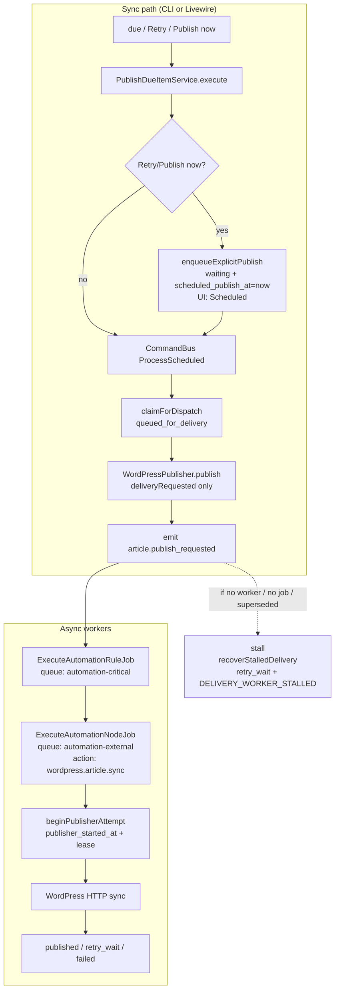
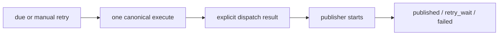

# Incident: Publishing dispatch stall (2026-08-05)

**Status:** READ-ONLY audit — no code changes in this phase.  
**Scope:** Production Publishing Queue stall after dispatch claim; sample item **441**.  
**Symptom cluster:**

1. “Retry now” → UI Scheduled (not immediate publish).
2. Scheduled past due stays stuck.
3. Rows show “Thử lại sau” (retry_wait).
4. Recover selected → “13 bài vẫn đang xuất bản”.
5. Row error: “Đã claim dispatch nhưng bộ xuất bản không khởi động trong thời gian cho phép.”

**Working hypothesis (NOT proven until Part 3 production IDs filled):**  
First broken boundary is **after sync `claimForDispatch` + `deliveryRequested` emit**, before async `beginPublisherAttempt` on `automation-external` / `automation-critical` workers. The stall message is written by recovery **after** the fact — it is not itself proof of which queue/job outcome occurred.

---

## PART 1 — Trace item 441 (read-only production probes)

Run on production host. Do **not** UPDATE/DELETE. Fill results into the evidence table below.

### 1.1 SEO task row (`omi_seo_ai.seo_project_tasks`)

```bash
$PHP_BIN artisan tinker --execute="
\$t = \\App\\Addons\\SeoContentAi\\Models\\SeoProjectTask::query()->with(['article','project'])->find(441);
if (!\$t) { echo \"NOT_FOUND\\n\"; return; }
\$tz = 'Asia/Ho_Chi_Minh';
\$fmt = function (\$v) use (\$tz) {
  if (\$v === null) return 'null';
  \$c = \$v instanceof \\Carbon\\CarbonInterface ? \$v->copy() : \\Carbon\\Carbon::parse((string)\$v);
  return 'UTC='.\$c->utc()->toIso8601String().' | HCM='.\$c->timezone(\$tz)->toIso8601String();
};
echo json_encode([
  'task_id' => (int)\$t->id,
  'article_id' => (int)\$t->article_id,
  'project_id' => (int)\$t->project_id,
  'publish_queue_status' => (string)\$t->publish_queue_status,
  'scheduled_publish_at' => \$fmt(\$t->scheduled_publish_at),
  'next_publish_retry_at' => \$fmt(\$t->next_publish_retry_at),
  'delivery_dispatched_at' => \$fmt(\$t->delivery_dispatched_at ?? null),
  'publisher_started_at' => \$fmt(\$t->publisher_started_at ?? null),
  'publishing_started_at' => \$fmt(\$t->publishing_started_at ?? null),
  'publish_lease_expires_at' => \$fmt(\$t->publish_lease_expires_at ?? null),
  'publish_claimed_at' => \$fmt(\$t->publish_claimed_at ?? null),
  'publish_claim_token' => (string)(\$t->publish_claim_token ?? ''),
  'publish_attempt_token' => (string)(\$t->publish_attempt_token ?? ''),
  'dispatch_count' => (int)(\$t->dispatch_count ?? 0),
  'publish_attempt_count' => (int)(\$t->publish_attempt_count ?? 0),
  'publish_operation_key' => (string)(\$t->publish_operation_key ?? ''),
  'last_publish_error_code' => (string)(\$t->last_publish_error_code ?? ''),
  'last_publish_error_message' => (string)(\$t->last_publish_error_message ?? \$t->last_publish_error ?? ''),
  'last_publish_attempt_at' => \$fmt(\$t->last_publish_attempt_at),
  'updated_at' => \$fmt(\$t->updated_at),
], JSON_UNESCAPED_UNICODE|JSON_PRETTY_PRINT);
"
```

Equivalent SQL (SEO DB):

```sql
SELECT id, article_id, project_id, publish_queue_status,
       scheduled_publish_at, next_publish_retry_at,
       delivery_dispatched_at, publisher_started_at, publishing_started_at,
       publish_lease_expires_at, publish_claimed_at, publish_claim_token,
       publish_attempt_token, dispatch_count, publish_attempt_count,
       publish_operation_key, last_publish_error_code, last_publish_error_message,
       last_publish_attempt_at, updated_at
FROM seo_project_tasks
WHERE id = 441;
```

### 1.2 CommandBus idempotency (`omi_seo_ai.seo_content_project_idempotency_keys`)

```sql
SELECT tenant_key, action, idempotency_key, status,
       LEFT(result_payload, 400) AS result_prefix,
       expires_at, created_at, updated_at
FROM seo_content_project_idempotency_keys
WHERE action = 'content_project.process_scheduled_publish'
  AND (
    idempotency_key LIKE CONCAT(
      (SELECT COALESCE(publish_operation_key,'') FROM seo_project_tasks WHERE id=441), '%'
    )
    OR idempotency_key LIKE '%:441:%'
    OR idempotency_key LIKE 'scheduler:441:%'
  )
ORDER BY updated_at DESC
LIMIT 20;
```

### 1.3 Business event + automation execution (automation connection — often core `mysql`)

```bash
$PHP_BIN artisan tinker --execute="
\$conn = \\App\\Support\\Automation\\AutomationConnection::name();
echo \"automation_connection=\$conn\\n\";
\$events = \\App\\Addons\\SeoContentAi\\Automation\\BusinessHook\\Models\\BusinessEvent::query()
  ->where('event_name','article.publish_requested')
  ->where(function(\$q){
    \$q->where('payload->task_id', 441)->orWhere('context->task_id', 441);
  })
  ->orderByDesc('id')->limit(10)->get(['id','event_uuid','event_name','status','created_at','payload']);
echo \$events->toJson(JSON_PRETTY_PRINT|JSON_UNESCAPED_UNICODE);
\$uuids = \$events->pluck('event_uuid')->filter()->all();
\$execs = \\App\\Addons\\SeoContentAi\\Automation\\BusinessHook\\Models\\AutomationExecution::query()
  ->whereIn('business_event_uuid', \$uuids)
  ->orderByDesc('id')->limit(20)
  ->get(['id','rule_id','status','idempotency_key','created_at','started_at','finished_at','context']);
echo \$execs->toJson(JSON_PRETTY_PRINT|JSON_UNESCAPED_UNICODE);
"
```

```sql
-- Adjust DB/schema to automation connection
SELECT id, event_uuid, event_name, status, created_at, payload
FROM business_events
WHERE event_name = 'article.publish_requested'
  AND (JSON_EXTRACT(payload, '$.task_id') = 441 OR JSON_EXTRACT(payload, '$.task_id') = '441')
ORDER BY id DESC LIMIT 10;

SELECT id, rule_id, status, idempotency_key, created_at, started_at, finished_at
FROM automation_executions
WHERE business_event_uuid IN (/* event_uuid from above */)
ORDER BY id DESC LIMIT 20;

SELECT id, automation_execution_id, node_key, node_type, action_code, status,
       attempt, created_at, started_at, finished_at, error_message
FROM automation_node_executions
WHERE automation_execution_id IN (/* execution ids */)
ORDER BY id DESC LIMIT 50;
```

### 1.4 Laravel `jobs` / `failed_jobs` (core queue DB — `QUEUE_CONNECTION`, default often `database`)

Search by automation execution / node execution id once known:

```sql
-- pending / reserved jobs that mention the execution id
SELECT id, queue, attempts, reserved_at, available_at, created_at,
       LEFT(payload, 500) AS payload_prefix
FROM jobs
WHERE payload LIKE '%ExecuteAutomationRuleJob%'
   OR payload LIKE '%ExecuteAutomationNodeJob%'
   OR payload LIKE '%"automationExecutionId":<EXEC_ID>%'
   OR payload LIKE '%"nodeExecutionId":<NODE_ID>%'
ORDER BY id DESC
LIMIT 50;

SELECT id, uuid, queue, failed_at, exception,
       LEFT(payload, 500) AS payload_prefix
FROM failed_jobs
WHERE payload LIKE '%ExecuteAutomation%'
   OR payload LIKE '%task_id\":441%'
   OR payload LIKE '%441%'
ORDER BY failed_at DESC
LIMIT 20;
```

### 1.5 Publish attempts / audit (if present)

```sql
-- name may vary; inspect schema first
SHOW TABLES LIKE '%publish%attempt%';
SHOW TABLES LIKE '%content_project%audit%';
```

### 1.6 Evidence table (FILL FROM PRODUCTION)

| Field | Value (UTC) | Value (Asia/Ho_Chi_Minh) | Notes |
|---|---|---|---|
| task_id | 441 | | |
| article_id | **FILL** | | |
| publish_queue_status | **FILL** | | |
| scheduled_publish_at | **FILL** | **FILL** | |
| next_publish_retry_at | **FILL** | **FILL** | |
| delivery_dispatched_at | **FILL** | **FILL** | |
| publish_attempt_token | **FILL** | | |
| publisher_started_at | **FILL** | **FILL** | Expect null if stall before worker |
| publish_lease_expires_at | **FILL** | **FILL** | |
| publish_attempt_count | **FILL** | | Must not increment on dispatch-only |
| publish_operation_key | **FILL** | | |
| last_publish_error_code | **FILL** | | Expect `DELIVERY_WORKER_STALLED` if recovered |
| last_publish_error_message | **FILL** | | Stall message |
| business_event_uuid | **FILL** | | |
| automation_execution_id | **FILL** | | |
| automation_node_execution_id | **FILL** | | |
| jobs.id | **FILL or NONE** | | Critical for Part 3 |
| jobs.queue | **FILL** | | Expect `automation-critical` / `automation-external` |
| jobs.reserved_at | **FILL or NULL** | | |
| failed_jobs.id | **FILL or NONE** | | |

---

## PART 2 — As-built call graphs (current code only)

### A. Scheduler

| Step | Class::method | Sync/async | Reads | Writes | Keys |
|---|---|---|---|---|---|
| 1 | `PublishScheduledArticlesCommand::handle` | sync CLI | — | — | — |
| 2 | `ScheduledArticlePublishRunner::run` → `dispatchDue` | sync | connection candidates | — | — |
| 3 | `ContentProjectPublishingQueueRunner::dispatchDue` | sync | due selector | health cache | log `queue_connection=sync-command-bus`, `queue_name=inline` |
| 4 | `PublishDueItemService::execute(..., scheduler)` | sync | task | releases sticky idempotency | bus key `{opKey}:due:scheduler:attempt:N:ref:HASH` |
| 5 | `ContentProjectCommandBus::dispatch(ProcessScheduledProjectItemPublishCommand)` | sync | idem store `site:{siteId}:actor:queue` | begin/complete idem | actor idempotencyKey |
| 6 | `ProcessScheduledProjectItemPublishHandler::processPublish` | sync | task, article | — | handler store `site:{siteId}:queue` + `{opKey}:attempt:N` |
| 7 | `ContentProjectPublishingQueueService::claimForDispatch` | sync TX | status, active lease | `queued_for_delivery`, `delivery_dispatched_at`, `publish_attempt_token`, `dispatch_count++`, clear lease; **no** `publish_attempt_count++` | attempt token ULID |
| 8 | `WordPressPublisher::publish` (actorUserId null) | sync | article | attempt row `requested` | returns `deliveryRequested=true` — **no HTTP WP** |
| 9 | `BusinessHookEmitter::emitWithOutcome(article.publish_requested)` | sync emit | rules | `business_events` | payload includes `task_id`, `publish_attempt_token` |
| 10 | `BusinessEventDispatcher` → `ExecuteAutomationRuleJob::dispatch` | **async** | rule | `automation_executions` pending | queue **`automation-critical`** |
| 11 | Worker → graph → `ExecuteAutomationNodeJob` for `wordpress.article.sync` | **async** | node | node exec | queue **`automation-external`** (`WordPressAutomationModuleProvider` defaultQueue) |
| 12 | `SyncArticleToWordPressHookAction::handle` | sync inside job | task_id, token | `beginPublisherAttempt` → `processing` + lease + `publisher_started_at` + attempt++ | supersede no-op if token mismatch |
| 13 | WP HTTP sync + later reconcile | sync in job / later | — | published / retry / failed | — |

**Lock:** `ContentProjectBusinessLock::itemPublish($itemId)` around processPublish.

### B. Retry now

| Step | Class::method | Notes |
|---|---|---|
| UI | `InteractsWithContentProjectPublishingActions::{bulkRetryPublish,retryPublishOne}` → `dispatchPublishingCommand` | sync HTTP/Livewire |
| Cmd | `RetryProjectItemPublishingHandler::handle` | |
| Service | `PublishDueItemService::executeMany(..., TRIGGER_RETRY_NOW)` | |
| **First write** | `ContentProjectPublishingQueueService::retry` → `enqueueExplicitPublish(asRetry:true)` | Sets **`publish_queue_status=waiting`**, **`scheduled_publish_at=now`**, clears `next_publish_retry_at` / errors, markerClearer |
| Then | Same as A steps 4–13 | claim → `queued_for_delivery` → emit → async jobs |

Presenter: `waiting` + `scheduled_publish_at` ⇒ **Scheduled** (`PublishingQueueScheduledDefinition`).

### C. Publish now

Same as Retry with `TRIGGER_PUBLISH_NOW` / `publishNow()` → same `enqueueExplicitPublish(asRetry:false)` Waiting+now, then processPublish.

### D. Schedule +5m

| Step | Class::method | Notes |
|---|---|---|
| UI | `bulkScheduleInMinutes` / `scheduleOneInMinutes` | |
| Cmd | `ScheduleProjectItemsHandler` → `scheduleWithReport` | |
| Writes | `scheduled_publish_at=now+N`, `publish_queue_status=waiting`, clear retry/error/markers | **No** publisher invoke |
| Skip | `isActivelyPublishing` → skipped_active | |

### E. Recover stuck

| Step | Class::method | Notes |
|---|---|---|
| UI | `PublishingQueueHub::recoverStuckSelected` / `forceRecoverStuckSelected` | |
| Cmd | `RecoverStuckPublishingHandler` | |
| Service | `PublishingStuckRecoveryService::recoverNow` → `recoverOne` | |
| Stall path | `recoverStalledDelivery` | Message: *Đã claim dispatch nhưng bộ xuất bản không khởi động trong thời gian cho phép.* → `supersedeDeliveryAttempt` → `markRetryWait` / failed; **preserves** attempt count when publisher never started |
| Skip path | `recoverNow` lines ~173–182 | `isActivelyPublishing` **OR** (`!force && !expired && !isStalled`) → `skipped++` |
| UI text | Recover handler | When recovered=0 and skipped>0: *“%d bài vẫn đang xuất bản”* — **labels all skipped as publishing**, including already-`retrying` / non-stuck rows |

---

## PART 3 — Where item 441 stopped (decision tree)

Complete after Part 1 fills. Map to **exactly one** outcome:

| # | Outcome | How to prove |
|---|---|---|
| 1 | No downstream task/job created | `business_events` missing for task 441 **or** event exists but no `automation_executions` / no `jobs` row |
| 2 | Job on wrong queue | `jobs.queue` ∉ {`automation-critical`,`automation-external`,`automation`} while worker only listens elsewhere |
| 3 | Job exists, `reserved_at` null | `jobs` row present, never reserved — worker not consuming that queue |
| 4 | Job reserved then failed | `failed_jobs` or node/execution status failed with exception |
| 5 | Job ran, no `publisher_started_at` | Node ran but skipped before `beginPublisherAttempt`, or superseded no-op (`publishing.wp_sync_noop_superseded`) |
| 6 | Publisher started, no WP HTTP | `publisher_started_at` set; sync service logs show no request |
| 7 | WP OK, callback/reconcile failed | WP evidence exists; task not `published` |
| 8 | Idempotency / superseded no-op | Token mismatch after recover/retry; log `publishing.wp_sync_noop_superseded` / attempt_superseded |

**Code fact (not yet production proof):**  
`WordPressPublisher::publish` for queue actor **never** starts the publisher lease. It only returns `deliveryRequested`. Real start is **only** in `SyncArticleToWordPressHookAction` after a worker runs `ExecuteAutomationNodeJob` on **`automation-external`**.

**Stall message alone:** proves recovery classified the row as delivery-stalled and wrote `DELIVERY_WORKER_STALLED` / retry_wait. It does **not** prove whether a job was created, reserved, or failed — that requires Part 1.6 IDs.

**FILL after probes:**

```text
Item 441 stopped at outcome: ___(1-8)___
Evidence IDs:
  business_event_uuid=
  automation_execution_id=
  automation_node_execution_id=
  jobs.id= / NONE
  jobs.queue=
  jobs.reserved_at=
  failed_jobs.id= / NONE
  publisher_started_at=
  publish_attempt_token (task) vs token in event payload:
```

---

## PART 4 — State disagreement (item 441)

Evaluate three systems **separately** (fill after Part 1).

### 4.1 Publishing Queue presenter

- Classifier order: published → failed → publishing (`processing` **and** non-null `publisher_started_at`) → **awaiting_delivery** (`queued_for_delivery` **or** `processing` with null `publisher_started_at`) → retry_wait (`retrying`) → scheduled (`waiting`/`none` + schedule) → needs_attention → unscheduled.
- After `recoverStalledDelivery`: status **`retrying`** + `next_publish_retry_at` → presenter **`retry_wait`**, label **“Thử lại sau …”**.

### 4.2 Action guard / `PublishingActiveProcessing::isActivelyPublishing`

Requires:

- `publish_queue_status === processing`
- `publisher_started_at` present and non-null (when column exists)
- non-expired lease (or legacy started TTL)

**`retrying` ⇒ false** (not actively publishing).

### 4.3 Recover stuck classifier (`recoverNow`)

Skipped when:

```text
isActivelyPublishing(task)                    → skipped  (true active)
OR (!force && !expired && !isStalled)         → skipped  (includes already retrying / scheduled / etc.)
```

For a row already in **`retrying`** (retry_wait UI):

- not Processing → not active
- not QueuedForDelivery → typically not stalled
- `isLeaseExpiredOrLegacyStuck` false for non-processing

⇒ counted **`skipped`**, then UI string:

```text
"Không có bài nào cần khôi phục. N bài vẫn đang xuất bản."
```

**Conflicting field / owner:**  
Not a second lease. **Misleading Recover copy** maps `skipped` → “đang xuất bản” even when presenter is `retry_wait`. Canonical owner for “active publish” should be `isActivelyPublishing`; Recover toast currently is not that owner.

| System | Expression | Item 441 (expected after stall recover) |
|---|---|---|
| Presenter | `retrying` → retry_wait | “Thử lại sau” |
| isActivelyPublishing | status≠processing or no publisher_started | false |
| Recover skip | !expired && !stalled | skipped → false “đang xuất bản” text |

---

## PART 5 — Why Retry now shows Scheduled

As-built order in `PublishDueItemService::execute` for `TRIGGER_RETRY_NOW`:

1. **`queue->retry()` / `enqueueExplicitPublish`** writes:
   - `publish_queue_status = waiting`
   - `scheduled_publish_at = now`
   - clear `next_publish_retry_at`, errors, markers  
2. **Then** CommandBus `ProcessScheduledProjectItemPublishCommand` (claim → emit → async).

If UI refreshes after step 1, or step 2 claim/emit fails / async never completes, row remains **Waiting + scheduled_publish_at** ⇒ presenter **Scheduled**.

Command: `content_project.retry_item_publishing` (via `RetryProjectItemPublishingCommand`).  
Structured result: handler summary toast (“Đã thử lại N bài…”) — does **not** force UI out of Scheduled if final DB status is still `waiting`.

`PublishDueItemService::execute` **is** called; publisher HTTP is **not** in that sync path.

---

## PART 6 — Worker / runtime requirements

| Stage | Proof | Not proof of |
|---|---|---|
| Scanner / due execute | `publishing.due_scan` / `publishing.due_item_outcome` | publisher start |
| Dispatch claim success | `publish_queue_status=queued_for_delivery`, `delivery_dispatched_at`, `publishing.dispatched` | WP HTTP |
| Emit success | `business_events` + `automation_executions` | job reserved |
| Rule job | `jobs` queue=`automation-critical`, class `ExecuteAutomationRuleJob` | WP sync |
| Sync action job | `jobs` queue=`automation-external`, class `ExecuteAutomationNodeJob` | WP success |
| Publisher start | `publisher_started_at` set / `publishing.publisher_started` | WP HTTP done |
| WP request | sync service / HTTP logs | published status |

**Required workers (as-built):**

```text
queue:work … --queue=automation-critical,automation-external,automation
```

(Exact supervisor/aaPanel program names: **FILL from production** — do not change in this audit.)

Heartbeat: `automation_scheduler_heartbeats` / process list / `queue:work` PIDs — **FILL**.

---

## PART 7 — Diagrams

### Diagram A — Current production / as-built



### Diagram B — Minimal intended flow (no new layers)



---

## PART 8 — Final diagnosis

### Primary root cause (pending Part 3 IDs — most consistent with symptoms + as-built)

**Broken boundary:** sync dispatch claim / event emit **→** async publisher worker (`beginPublisherAttempt` on `automation-external`).

Publisher never starts ⇒ `publisher_started_at` stays null ⇒ timeout recovery writes stall message and moves to `retry_wait`. Scanner/Retry can re-enter Waiting/Scheduled without completing the async leg.

### Contributing causes (code-proven, independent of 441 row)

1. **Retry/Publish now writes Scheduled (`waiting`+now) before claim/publisher** — explains “Retry → Scheduled”.
2. **Recover toast maps all `skipped` to “đang xuất bản”** — explains “13 bài vẫn đang xuất bản” while rows show retry_wait.
3. **`WordPressPublisher` queue path is emit-only** — scanner “success” ≠ WP publish.
4. Multiple recent patches (idempotency, projection, recovery) changed visibility/recovery labels without proving worker consumption of `automation-external`.

### Exact production evidence required (blockers)

- Item 441 field dump (Part 1.6).
- Matching `business_events` / `automation_executions` / `jobs` / `failed_jobs`.
- Proof whether any worker process listens to `automation-critical` and `automation-external`.

### Minimal patch proposal (DO NOT IMPLEMENT in this phase)

Address **only** the first broken boundary:

1. **Ops verify:** workers consuming `automation-critical` + `automation-external`; for one Retry on 441, assert `jobs` row appears and `reserved_at` becomes non-null within N seconds.  
2. **If jobs missing:** fix emit/dispatch failure (rule match / queue push) — not another status machine.  
3. **If jobs stuck unreserved:** fix worker queue list / connection — not Publishing Queue states.  
4. **Small product follow-ups (after boundary proven):**  
   - Retry must not leave user-visible Scheduled without an explicit outcome when claim/emit fails.  
   - Recover copy must say “skipped (not stuck)” instead of “đang xuất bản” for non-active rows.

### Do not change (until boundary proven)

- New publish_queue_status values / migrations.
- Broad rewrite of PublishDueItemService / claimForDispatch semantics.
- aaPanel cron rename.
- Clearing production markers blindly.
- Canonical `docs/modules/PUBLISHING.md` rewrite in this phase.

### One E2E verification case (after minimal fix)

```text
1. Pick task 441 (or one retry_wait overdue).
2. Note publish_attempt_count, publish_attempt_token.
3. Click Retry now.
4. Within 60s expect ALL of:
   - business_event article.publish_requested with task_id
   - automation_execution created
   - jobs row on automation-critical then automation-external with reserved_at set
   - publisher_started_at non-null
   - eventual published OR retry_wait with NEW structured WP/error (not only DELIVERY_WORKER_STALLED from empty worker)
5. Fail the case if row returns to Scheduled/waiting with no jobs.id.
```

---

## Appendix — Source anchors (as-built)

| Concern | Location |
|---|---|
| claimForDispatch | `ContentProjectPublishingQueueService::claimForDispatch` |
| Retry Waiting+now | `enqueueExplicitPublish` + `PublishDueItemService` TRIGGER_RETRY_NOW |
| deliveryRequested only | `Extension/Builtin/Wordpress/WordPressPublisher.php` (~48–60) |
| emit + stay queued_for_delivery | `ProcessScheduledProjectItemPublishHandler` (~262–328) |
| beginPublisherAttempt | `SyncArticleToWordPressHookAction` (~68–72) |
| Rule job queue | `ExecuteAutomationRuleJob` → `automation-critical` |
| WP sync node queue | `WordPressAutomationModuleProvider` → `automation-external` |
| Stall message | `PublishingStuckRecoveryService::recoverStalledDelivery` |
| Recover false “đang xuất bản” | `RecoverStuckPublishingHandler` + `recoverNow` skipped counter |

---

*End of read-only incident audit. No code was modified for remediation in this document’s phase; this file alone is the deliverable.*
